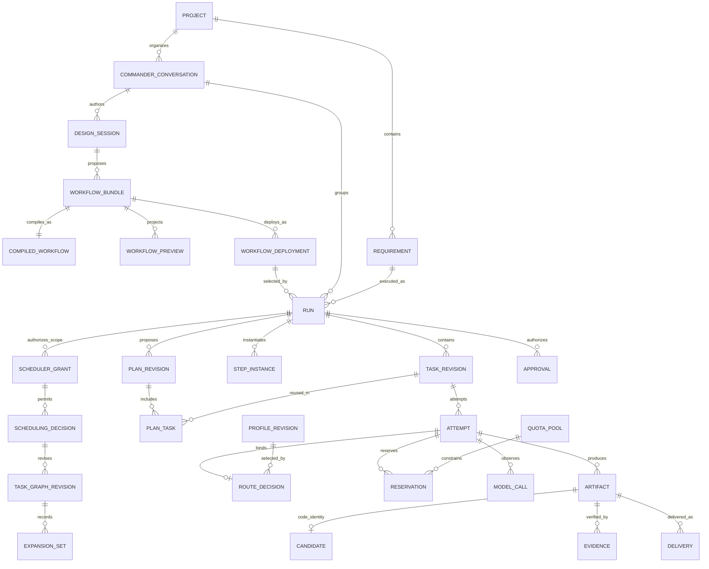
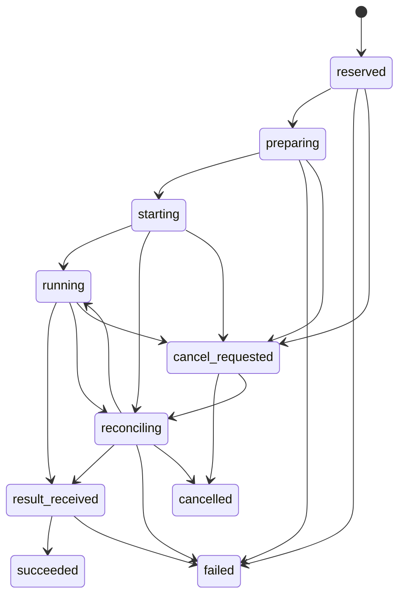

# 控制、数据与状态

2026-09-14 r8 规范性设计契约。本文说明目标数据模型和状态边界，不能据此推断已经实现。获权 Workflow 角色作业务拆分/调度决定，Karajan 是唯一可信状态写入与机械执行方；详见 [11](11-role-directed-scheduling.md) 和 [架构总览](README.md)。

自定义职责与步骤采用 [RoleDefinition / WorkflowDefinition](09-configurable-workflows.md)，模型来源采用 [外置 CLIProxyAPI](08-provider-gateway.md)。Designer 把文字需求写成真实配置包，可信服务从同一包生成图表，用户确认后由部署器和调度器完成实际加载与生效。定义发布、部署生效与 Run 执行各有持久事实，一次明确确认可组合这些动作；详细生命周期以 [对话与部署契约](10-conversational-workflow-deployment.md) 为准。

## 1. 状态权威与进程

| 状态 | 唯一拥有者 | 其他部分的角色 |
|---|---|---|
| Project、CommanderConversation、消息和草稿 | 认证的项目/会话记录 | 侧栏与 Hub 读取聚合；导航不改变执行生命周期 |
| Requirement、Plan、用户确认、授权 | 版本化 Planning / Policy 记录 | 设计 Agent 提交建议，或从既有 Workflow 直接实例化；Web 提交精确命令 |
| SchedulerGrant、SchedulingDecision、TaskGraphRevision、ExpansionSet | 用户授权与 Karajan 可信记录 | 角色按工作范围实际提交子图/依赖/绑定/优先级/派发；引擎校验/CAS/入队，范围内不逐节点人批 |
| RoleDefinition、WorkflowDefinition、CompiledWorkflow | 版本化 Workflow / Planning 记录 | 用户编辑职责和步骤；编译器解析确定版本；发布模板不启动执行 |
| Designer 创作会话、候选与创作预算 | 项目内持久创作记录及 Policy / Capacity | 可早于目标 Run；生成/修改调用先准入，保存或查看草稿不启动模型 |
| WorkflowBundle、WorkflowPreview、WorkflowDeployment | 受管配置产物与可信部署记录 | 准备 pending，调度器加载读回同摘要且就绪后 CAS 发布 active；准备期间旧 active 有效 |
| Run、StepInstance、Task、有效 Attempt、任务依赖 | Karajan Coordination | 执行器事件作为观测输入；角色名称不决定状态或权限 |
| 进程树、供应商会话、调用返回 | Execution 及具体执行器 | 协调器核对并更新业务记录 |
| Profile、Rulebook、本地预算/预留 | Karajan Policy / Capacity | 执行器只能使用已准入配置 |
| 服务端消费/配额报告 | 服务商 | 本地保存带来源和时间的观察 |
| Artifact、Candidate、Evidence、交付意图 | Karajan Artifacts / Delivery | 完成门绑定 report/patch/pr 目标；Agent 不能自签“验收通过” |
| 远端分支、PR、CI | Git 托管平台 | Delivery 查询并记录同步状态 |

一个本地后端进程持有协调器锁并处理状态转换；同进程 HTTP 接口通过命令处理器写入。Agent、测试、交付在独立执行环境中运行，不直接写业务数据库。第二个后端实例发现已有拥有者后拒绝接管；不能仅凭租约超时启动第二套 writer。

协调器把状态变化、领域事件和待执行副作用在同一短事务提交。后台派发器消费 outbox；事件接收器按来源和事件 ID 去重。采用关系状态表加持久事件记录，不采用必须重放全部事件才能启动的完整 event sourcing。

## 2. 核心实体与关系

图为目标关系示意，省略定义引用、批准及多对多关联。模板编译固定 compiler revision；部署加载的同一编译结果不因 Run 参数不同而改变。任务依赖、集成候选父候选、证据集、Profile 与配额池均使用关联表。确定性任务的 Attempt 没有模型 Profile 或 MODEL_CALL，仍占用对应本地资源；Designer 的 MODEL_CALL 绑定独立创作会话，不伪造目标 Run。

| 表/聚合 | 关键字段与约束 |
|---|---|
| `projects` | ID、受管仓库路径、remote 身份、允许目标分支、项目策略版本、检查配置版本 |
| `requirements` | project_id、目标、验收标准、用户输入引用；不混入供应商会话状态 |
| Designer 创作会话 | project/conversation、控制提交身份、Profile/ModelBinding、创作授权、预算和累计调用/修复/时间边界；新 proposal 或重启不清零 |
| `role_definitions` / `workflow_definitions` | 稳定 ID、不可变 revision/digest、职责提示、输入输出契约与能力/权限约束、参数化步骤图、产物与完成政策；显示名称不授予权限 |
| WorkflowBundle / CompiledWorkflow / WorkflowPreview | 文件清单与原始 byte digest、bundle_digest、compiler revision 与模板 compiled_digest、proposal revision、同源图表/差异及授权影响；可读图表不另存可执行图 |
| WorkflowDeployment / 部署槽位 | command/deployment ID、project、bundle/compiled digest、expected active revision、pending/active 引用、scheduler 加载/就绪回执与每步 intent/result；CAS 生效，不覆盖旧 Run |
| `runs` | project/conversation/requirement、所选 deployment 与定义/编译快照、input_digest、当前 Plan、delivery_kind/完成政策、状态、dispatch_enabled、协调器 generation、总预算引用、revision |
| `plan_revisions` | 初始计划/输入/授权及其后授权变更版本；不可改写原批准，不要求初始枚举全部动态任务 |
| SchedulerGrant / SchedulingDecision | 作用域、可委派范围、有效提交身份/任期、权限及累计边界；可明确授予重叠范围，图变更经 CAS；结构化决定、依据和幂等回执 |
| TaskGraphRevision / ExpansionSet | 运行图父版本/digest、决定与有效授权、任务/依赖/绑定/优先级/派发、扩展成员/封口与承诺义务；删图不免除义务 |
| StepInstance | run、固定 workflow step/role revision、execution_kind、条件/汇合裁决、依赖产物、累计返工义务和 Task revision；不按角色名推导流水线 |
| `tasks` / `task_revisions` | run_id、稳定 task_id、origin（planning/plan/pipeline/repair）、可空 origin_plan_revision_id；来源不表示当前计划成员关系；版本化角色、准备度、复杂度、风险、职责/路径、输入输出及完成条件 |
| `plan_tasks` / `task_dependencies` | plan_revision_id 与 task_revision_id 成员关系、required 标记；依赖边绑定计划版本及精确任务/产物；复用不改写旧计划 |
| `approvals` | 动作范围、project/conversation、bundle/compiled digest、目标槽位及 expected revision、授权摘要；包含 Run 时另固定具体 input/plan hash、预算/来源集合、用户时间和撤销记录；不得用布尔 approved 替代版本 |
| `authorization_envelopes` | 仓库/分支、读写范围、网络/工具能力、允许 Profile revision 集、预算与交付权限、有效状态 |
| `permission_requests` | 带类型的 ExecutionRef（Run Attempt 或 Designer execution）、fence/turn、原生请求身份、范围/摘要、授权版本、过期时间与单次裁决；旧 attempt 参数显式解析，迟到答复不能扩权 |
| `attempts` | task_revision_id、序号、execution_kind、适用时固定 Profile/ModelBinding revision、authorization_id、fence、runtime_ref、可空 workspace_id、状态、退出/消费是否已核对 |
| `route_decisions` | Rulebook revision、候选及淘汰原因、输入快照、评分/排序、请求配置与接受配置、observation provenance |
| `model_calls` | 明确的 Attempt 或 Designer 创作执行身份、调用序号、GatewayConnection/ModelBinding revision、实际来源回执（若可见）、额度租约、开始/结束、用量、计费路径；不可观测时保留明确 opaque 摘要 |
| `quota_pools` / `quota_observations` | 共享身份、单位、窗口、来源、观察时间/版本、新鲜度、服务报告值及覆盖范围 |
| `budgets` / `budget_allocations` | 平台/项目/Run 或独立 Designer 创作会话的本地消费限制与父子切片；与服务总额度分别准入，只扣自己的消费 |
| `capacity_policy_revisions` | 共享账户/池当前保护规则、安全余量、保守模式；全局唯一有效版本，准入时记录实际版本 |
| `repair_chains` / `repair_cycles` | run_id、根任务/集成验证目标、父链、validation_cycle_id、累计轮次、routing_stage；新 Task 不重置计数 |
| `reservations` / `usage_entries` | scope、pool/window、原生数量、phase、ExecutionRef/call、幂等键、已确认覆盖关系；详见配额文档 |
| `workspaces` | 独立路径、base SHA、写入 fence、隔离级别、活跃进程引用、清理状态 |
| Artifact | kind、内容/manifest digest、输入和产出身份、冻结状态及可用性；report/patch/code candidate 不强制共用 Git 身份 |
| `candidates` / `candidate_parents` | base SHA、tree SHA、补丁/文件 manifest hash、父候选、生成 attempt、冻结时间 |
| `evidence` | artifact/candidate 引用、验证政策和检查/独立审查配置 revision、输入 digest、环境 digest、status、报告引用、可用性/失效原因 |
| `deliveries` / `delivery_operations` | project/run、delivery_kind、冻结产物、目标/完成政策、每步 intent/result；PR 子类型另存 candidate、remote/head/base、分支、PR 身份和远端核对结果 |
| `blockers` | run/task、稳定 reason_code、原因证据、可行动选项、解除条件；可同时存在多个 |
| 调度提交任期（旧 `commander_terms` 兼容映射） | run/grant/scope、term、当前提交身份、委派/交接来源；同一 grant 或明确交接槽位仅当前任期，多有效 grant 可覆盖重叠范围 |
| 委派/交接记录（旧 `commander_handoffs` 兼容映射） | 原/新 scope/term、材料/图版本、父授予及决定；授权内委派可自动生效，超授权交接需用户决定 |
| `installation_epochs` | 当前安装/恢复 epoch 与来源快照；activation 绑定 epoch，历史恢复不继承可执行许可 |
| `events` / `outbox` / `inbox` | 单调事件序号、对象 revision、幂等键、payload schema_version；副作用执行在事务外 |

ID 使用应用生成的不透明唯一值；不依赖供应商 session ID 作为主键。时间保存 UTC，UI 按用户时区显示。金额使用整数最小货币单位或明确精度的十进制，禁止浮点累计。

关键约束：同一 Task 版本最多一个有效写入 Attempt、同工作区一个 writer、同一 grant/交接槽位仅当前任期，图修订 CAS、版本/序号/副作用键唯一，事件只应用一次。多个有效 grant 可授权重叠范围，冲突通过 CAS 处理；不限制全局/项目 coding Agent 数，用户政策或资源不足只背压，合法图留队。

Profile、ModelBinding、RoleDefinition、WorkflowDefinition、编译器、Rulebook 与验证政策采用不可变 revision。Run 固定版本；后续部署、模板或默认模型变更不回写旧 Run/批准/Attempt。Karajan 只保存所需凭据的 `secret_ref`，默认上游凭据由外置网关管理；密钥轮换不修改来源身份，账户、计费或路由变换变化形成新绑定并重新验收。

旧 planning-origin 表示保留兼容；Designer 独立创作授权可先于 Run，既有模板也可直接实例化。初始批准固定 Workflow/部署/定义、输入、允许来源和 SchedulerGrant；范围内后续任务由获权角色提交，不必逐项预列或再批。已启动 Attempt 保持原任务/图/来源/权限快照；动态 TaskGraphRevision 不改原定义或授权。

定义发布只登记不可变版本。部署先持久化 intent、物化完整 pending 包并校验，调度器准备加载并读回同摘要及 readiness，再以 expected active revision 条件发布 active 与部署结果；准备期间 pending 不可接新 Run，旧 active 保持有效。一次精确确认可同时登记并部署；若同时确认具体输入、Plan 与执行权限，可组合一个幂等 Run 启动命令。仅部署不启动 Run，也不授予未来无限执行权限。重启后须重新核对 active 的文件与实际加载事实，旧 ready 回执仅作历史。

## 3. 任务与尝试状态

业务任务状态：`draft → waiting → ready → active → validating → satisfied`。失败进入 `failed`，明确放弃进入 `cancelled`；重试创建新 Attempt 并回到 ready，不擦除历史。

- `draft`：简报或决定尚未完整，T0 在此处。
- `waiting`：依赖、批准、预算、人工决定等条件未满足；原因存 Blocker。
- `ready`：依赖产物和批准有效，可尝试准入；不表示已经获得资源。
- `active`：当前 Attempt 已准备或运行。
- `validating`：已有产物，正在检查任务完成条件。
- `satisfied`：当前任务版本的完成条件成立；修改输入会产生新版本和新的验证要求。

角色可依据实际结果提交分支/拆分/汇合安排，引擎按已批准规则机械核验。动态汇合还需 ExpansionSet 已封口且全部必需输入完成；unknown、未履行返工或承诺义务不等于跳过。静态条件与 not_applicable 分开留证，见 [09](09-configurable-workflows.md) 与 [11](11-role-directed-scheduling.md)。

`succeeded` 表示 Attempt 的结构化输出已接受，Task 仍可能等待验证。`result_received` 不表示进程树已经完全退出；是否允许释放本地槽位与接受工作区冻结须独立核对。服务端消费是否结算也是独立字段。

`starting/reconciling` 不能仅因过了超时就假定没有运行。需要 execution.inspect 的进程、启动回执和供应商观察判断。迟到事件可补充消费记录，但失效 fence 的产物不能满足任务或授权交付。

Run 保留 planning/awaiting_approval/executing/finalizing/completed/failed/cancelled；范围内图修订不使其逐次返回 awaiting_approval。completed 核对当前有效图、已封口扩展集合、全部承诺/返工义务和冻结产物政策；删节点或改可选不免除义务。report/patch 验其产物，pr 另需同候选 checks、独立 Review 和确认 PR；物理执行/消费仍核对，CI 按政策单列或入门。旧 delivery=none 不自动改义。

SchedulingDecision 不原地改图：核对提交者范围/任期、base revision、授权、无环/输入/义务，持久化影响和新 TaskGraphRevision。原授权内自动生效并入队，超授权部分等待用户批准；资源不足不删合法图。受影响未启动任务改用新版本，已启动 Attempt 不热改，按获准取消/收尾语义处理；复用和失效有证据，消费/进程核对不丢。

例如 v1 的 A 已完成，v2 只改 B：v2 新增指向原 A revision 的成员关系，并指向 B 的新 revision。A 的来源与证据不变；旧 B 迟到结果可记账，但不能满足 v2 的 B。新增权限不通过复用成员关系继承。

## 4. 一次派发的事务协议

1. 读取冻结定义/初始授权、当前已接受 TaskGraphRevision/派发决定、StepInstance、execution_kind 与资源；模型步骤才解析来源。新 Run 检查所选 active，既有 Run 用自身冻结部署及后续合法图，不追新 active。
2. 短事务重查图/任务 revision、决定范围/任期、授权、有效 Attempt 和池版本；变化重新校验，不自行重做业务拆分。
3. 同时检查并登记所有配额/并发/预算预留，分配 Attempt ID 和 fence；写 route decision 与 `StartAttempt` outbox。全部提交或全部回滚。
4. Execution 根据幂等键准备工作区和运行清单。支持无副作用 prepare 或受控只读预检的适配器可分阶段激活；其他适配器必须在启动前完成静态配置校验，不能为获得 session ID 先启动一个未受约束的 Agent。
5. 在任何模型请求或写入发生前，激活许可事务重查授权、fence、dispatch_enabled 与预留，作为启动与暂停/取消的排序点。许可之前到达的撤销阻止激活；之后到达的取消走停止流程，不能追称从未开始。启动回执记入 inbox，再核对执行器接受的配置；不符时停止并阻塞，不能静默改成另一配置。
6. 收到结果后先持久化产物，再接受完成事件。冻结候选和证据引用必须可验证；不能让数据库指向尚未落盘的临时文件。

默认网关路径的每次模型请求再取得消费租约，固定真实来源映射、变换配置和可观察回执；网关重试/轮换不能绕过批准和账本。显式原生兼容 Profile 无法逐调用控制时，仅可使用已经验收的有界 Attempt 语义并清楚报告观测限制，见 [执行契约](03-execution-and-delivery.md)。

## 5. 崩溃与取消

| 失败窗口 | 恢复动作 |
|---|---|
| 事务提交前崩溃 | 无已接受派发；未发布临时产物按保留规则回收 |
| 调度决定/扩展封口回执丢失 | 查原幂等键、图 revision 与接受回执；不再次询问模型重造图或重复派发，保留未封口/义务事实 |
| Designer 生成请求已发送、回执未知 | 按原调用身份核对并保留消费；不重新调用后假装同一次生成，不清零创作上限 |
| pending 物化/加载期间失败 | 查询原部署命令和完整文件/加载记录；未切 active 时保留旧 active，pending 不能接 Run |
| active 切换或复合启动回执丢失 | 查询槽位、部署结果及关联 Run 命令；未知先核对，不重复激活或创建 Run |
| 预留已提交，尚未启动 | outbox 重放同一键；先 inspect，避免重复 spawn |
| 已启动，回执未写入 | 查询 supervisor 的持久启动记录；无法确认则 reconciling，不创建第二 writer |
| 结果已落盘，业务事件未提交 | 校验 manifest 与 fence，再幂等接受结果 |
| 协调器失联、Agent 仍活着 | 禁止新任务；支持动态工具租约时到期拒绝新工具调用，否则由 supervisor 按既定边界停止进程；恢复先核对旧实例 |
| lease 过期、旧进程未停止 | 撤销旧结果有效性；保留并发/消费风险记录，禁止复用原可写工作区 |
| cancel 与完成同时到达 | 按已提交 revision 和撤销状态裁决；取消后不会新启动交付；已开始远端副作用仍核对 |
| push/PR 成功但应答丢失 | 查询指定分支与 PR 身份，确认后补记成功 |

Fencing 负责阻止旧结果覆盖新状态，**本身不会杀进程，也不会阻止磁盘写入**。真正禁止旧写入需工具代理拒绝过期授权，或确认终止进程树并隔离旧工作区。无此能力的适配器不得报告“安全接管成功”。

Run 暂停停止其新派发及新交付副作用，允许正在执行的工作报告结果。取消撤销该 Run 后续执行/交付权并请求停止；确认本地执行结束后进入 cancelled。它们不隐含撤销已部署 Workflow，也不暂停其他 Run。远程推理和本地进程是否停止分别记录；已产生的 PR 不因取消自动关闭或删除。部署撤销/回滚是绑定槽位当前版本的独立命令，新目标先读回就绪再条件生效，不修改旧 Run。

恢复先取单实例锁，加载 SchedulerGrant/任期、接受的图修订/扩展封口及义务，再枚举创作调用、部署、未完 Attempt/工作区/交付；核对文件/加载/执行/消费后恢复派发，不以新模型输出代替持久图。业务成功不排除活跃进程/消费；Web 可查看，不能跳过核对全部重试。

以上是同一安装内正常重启。历史备份恢复使用新的 installation/restore epoch，旧 activation 失效，恢复的 Run、创作调用及部署副作用默认冻结；旧 outbox 不自动重放。核对备份后可能发生的执行、部署切换、消费、撤销和远端结果，无法恢复的历史明确标 unknown；重新取得针对当前状态的用户继续决定后才可激活。新 epoch 不会杀死旧机器上的进程，必须另行确认旧执行停止或保持保守占用。

## 6. 文件存储与保留

SQLite 保存元数据、索引、账本与事件；真实 Workflow 配置包、大日志、报告、补丁、测试输出、上下文包保存于仓库外受管数据目录。配置 manifest 固定实际文件字节，图表与部署均从同一包编译。写入顺序为临时文件 → 完整性检查 → 原子发布 → 数据库引用；这只完成产物保存，部署成功还需调度加载与 active 回执。缺失已引用文件使相关证据或部署不可用。

工作区是可清理的运行材料，不是结果唯一副本。清理前必须确认无活跃进程、产物已冻结且保留期已到；仍被 active 部署、旧 Run、证据或恢复意图引用的配置/定义不得回收。只删除受管且真实解析后位于允许根目录内的路径，处理符号链接、junction 和路径大小写，避免根据模型提供的路径执行清理。

运行日志、模型输入输出与 Git diff 可能含项目敏感内容；保留期和导出由项目设置。审计保留路由、授权、候选摘要与消费记录，不要求保留或获取模型私有推理过程。

SQLite 使用本地磁盘，开启外键和短事务。WAL 允许读写并行但只有一个 writer，适合个人单机；不能放在网络共享目录。[SQLite WAL 官方说明](https://www.sqlite.org/wal.html)
