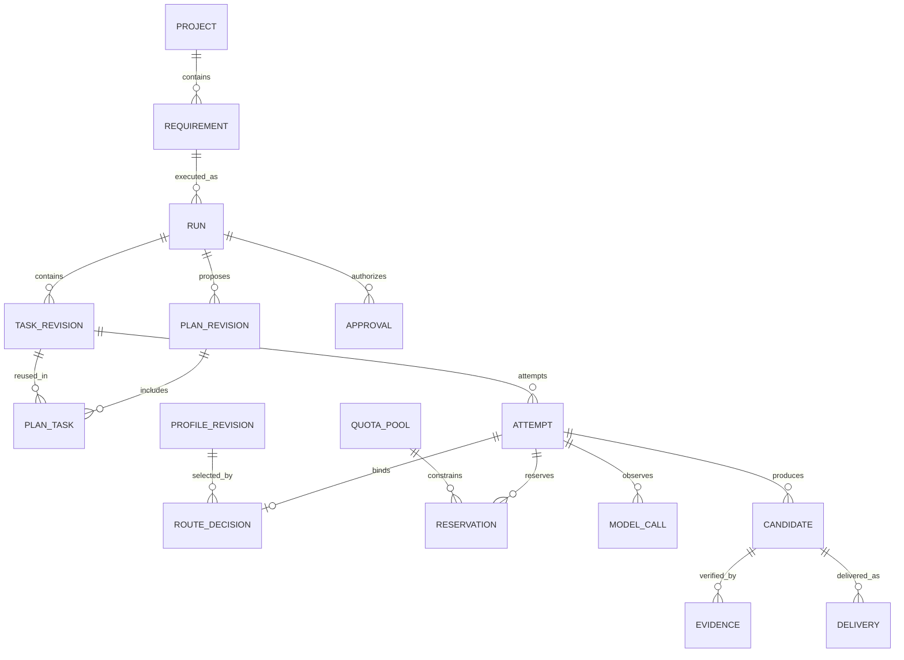
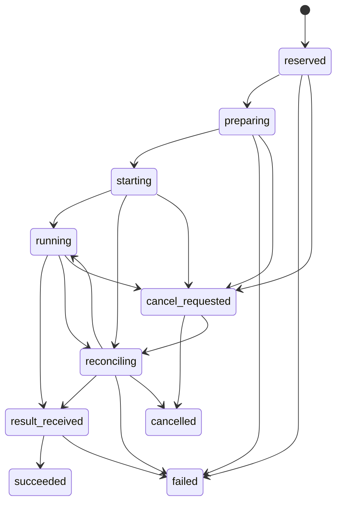

# 控制、数据与状态

本文定义 v1 的规范性设计契约；实现仍待完成。整体入口见 [架构总览](README.md)。

## 1. 状态权威与进程

| 状态 | 唯一拥有者 | 其他部分的角色 |
|---|---|---|
| Requirement、Plan、用户确认、授权 | Karajan Planning / Policy | Commander 提案，Web 发命令 |
| Run、Task、有效 Attempt、任务依赖 | Karajan Coordination | 执行器事件作为观测输入 |
| 进程树、供应商会话、调用返回 | Execution 及具体执行器 | 协调器核对并更新业务记录 |
| Profile、Rulebook、本地预算/预留 | Karajan Policy / Capacity | 执行器只能使用已准入配置 |
| 服务端消费/配额报告 | 服务商 | 本地保存带来源和时间的观察 |
| Candidate、Evidence、交付意图 | Karajan Artifacts / Delivery | Agent 不能自签“验收通过” |
| 远端分支、PR、CI | Git 托管平台 | Delivery 查询并记录同步状态 |

一个本地后端进程持有协调器锁并处理状态转换；同进程 HTTP 接口通过命令处理器写入。Agent、测试、交付在独立执行环境中运行，不直接写业务数据库。第二个后端实例发现已有拥有者后拒绝接管；不能仅凭租约超时启动第二套 writer。

协调器把状态变化、领域事件和待执行副作用在同一短事务提交。后台派发器消费 outbox；事件接收器按来源和事件 ID 去重。采用关系状态表加持久事件记录，不采用必须重放全部事件才能启动的完整 event sourcing。

## 2. 核心实体与关系

图简化多对多关系：任务依赖、集成候选父候选、证据集、Profile 与配额池均使用关联表。确定性任务的 Attempt 没有模型 Profile，也没有 MODEL_CALL；仍占用对应本地资源。

| 表/聚合 | 关键字段与约束 |
|---|---|
| `projects` | ID、受管仓库路径、remote 身份、允许目标分支、项目策略版本、检查配置版本 |
| `requirements` | project_id、目标、验收标准、用户输入引用；不混入供应商会话状态 |
| `runs` | requirement_id、当前计划版本、状态、dispatch_enabled、协调器 generation、总预算引用、revision |
| `plan_revisions` | run_id、version、规范化契约 hash、任务图、输入基准、主 Commander term；批准后不可原地修改 |
| `tasks` / `task_revisions` | run_id、稳定 task_id、origin（planning/plan/pipeline/repair）、可空 origin_plan_revision_id；来源不表示当前计划成员关系；版本化角色、准备度、复杂度、风险、职责/路径、输入输出及完成条件 |
| `plan_tasks` / `task_dependencies` | plan_revision_id 与 task_revision_id 成员关系、required 标记；依赖边绑定计划版本及精确任务/产物；复用不改写旧计划 |
| `approvals` | plan hash、授权摘要 hash、预算/来源集合、用户时间、撤销记录；不得用布尔 approved 替代具体版本 |
| `authorization_envelopes` | 仓库/分支、读写范围、网络/工具能力、允许 Profile revision 集、预算与交付权限、有效状态 |
| `permission_requests` | attempt/fence/turn、原生请求身份、范围/摘要、授权版本、过期时间、单次裁决；迟到答复不能扩大权限 |
| `attempts` | task_revision_id、序号、固定 Profile revision、authorization_id、fence、runtime_ref、workspace_id、状态、退出/消费是否已核对 |
| `route_decisions` | Rulebook revision、候选及淘汰原因、输入快照、评分/排序、请求配置与接受配置、observation provenance |
| `model_calls` | attempt_id、调用序号、provider request ID（若可见）、额度租约、开始/结束、用量、计费路径；不可观测时保留明确 opaque 摘要 |
| `quota_pools` / `quota_observations` | 共享身份、单位、窗口、来源、观察时间/版本、新鲜度、服务报告值及覆盖范围 |
| `budgets` / `budget_allocations` | 用户给平台/项目/Run 的本地消费限制与父子切片；与服务总额度分别准入，只扣自己的消费 |
| `capacity_policy_revisions` | 共享账户/池当前保护规则、安全余量、保守模式；全局唯一有效版本，准入时记录实际版本 |
| `repair_chains` / `repair_cycles` | run_id、根任务/集成验证目标、父链、validation_cycle_id、累计轮次、routing_stage；新 Task 不重置计数 |
| `reservations` / `usage_entries` | scope、pool/window、原生数量、phase、attempt/call、幂等键、已确认覆盖关系；详见配额文档 |
| `workspaces` | 独立路径、base SHA、写入 fence、隔离级别、活跃进程引用、清理状态 |
| `candidates` / `candidate_parents` | base SHA、tree SHA、补丁/文件 manifest hash、父候选、生成 attempt、冻结时间 |
| `evidence` | candidate_id、check/reviewer revision、输入 digest、环境 digest、status、报告引用、可用性/失效原因 |
| `deliveries` / `delivery_operations` | project/run、candidate、目标 head/base、分支、PR 身份、每步 intent/result 与远端核对结果 |
| `blockers` | run/task、稳定 reason_code、原因证据、可行动选项、解除条件；可同时存在多个 |
| `commander_terms` | run、term、主 Profile/Attempt、有效提交者、交接包引用；旧 term 不可覆盖新计划 |
| `commander_handoffs` | 原 term、检查点/候选/授权版本、用户选择及状态；未决定前不能启动替任者 |
| `installation_epochs` | 当前安装/恢复 epoch 与来源快照；activation 绑定 epoch，历史恢复不继承可执行许可 |
| `events` / `outbox` / `inbox` | 单调事件序号、对象 revision、幂等键、payload schema_version；副作用执行在事务外 |

ID 使用应用生成的不透明唯一值；不依赖供应商 session ID 作为主键。时间保存 UTC，UI 按用户时区显示。金额使用整数最小货币单位或明确精度的十进制，禁止浮点累计。

关键数据库约束：同一 Task 同时最多一个具有有效写入权的 Attempt；同工作区最多一个 writer；同任务版本与序号唯一；同 delivery operation 幂等键唯一；同已接受事件只应用一次。业务引用使用外键，更新使用对象 revision 比较。

Profile、Rulebook、检查配置采用不可变 revision。Run 固定版本；凭据只保存 `secret_ref`，密钥轮换不会修改已记录的模型/通道身份。账户或计费身份发生变化时创建新 Profile revision。

首次规划 Task 属于 Run，但尚无 Plan revision；其授权来自用户已配置的规划策略/预算，只能读取获准材料并产出提案。用户批准后，plan-origin 实现任务及必需 pipeline 任务才可激活。范围内修复由已批准的修复策略生成 repair-origin Task，继承原授权和验收；因此不能借“系统自动生成任务”绕过审批。

## 3. 任务与尝试状态

业务任务状态：`draft → waiting → ready → active → validating → satisfied`。失败进入 `failed`，明确放弃进入 `cancelled`；重试创建新 Attempt 并回到 ready，不擦除历史。

- `draft`：简报或决定尚未完整，T0 在此处。
- `waiting`：依赖、批准、预算、人工决定等条件未满足；原因存 Blocker。
- `ready`：依赖产物和批准有效，可尝试准入；不表示已经获得资源。
- `active`：当前 Attempt 已准备或运行。
- `validating`：已有产物，正在检查任务完成条件。
- `satisfied`：当前任务版本的完成条件成立；修改输入会产生新版本和新的验证要求。

`succeeded` 表示 Attempt 的结构化输出已接受，Task 仍可能等待验证。`result_received` 不表示进程树已经完全退出；是否允许释放本地槽位与接受工作区冻结须独立核对。服务端消费是否结算也是独立字段。

`starting/reconciling` 不能仅因过了超时就假定没有运行。需要 execution.inspect 的进程、启动回执和供应商观察判断。迟到事件可补充消费记录，但失效 fence 的产物不能满足任务或授权交付。

Run 保存 `planning / awaiting_approval / executing / finalizing / completed / failed / cancelled` 生命周期；暂停派发是独立开关，Blocker 为独立集合。Run `completed` 按当前批准计划的 `plan_tasks.required` 成员和当前有效的必需 pipeline/repair 义务判断，并要求 PR 交付已确认；旧计划已移除/替换任务与可选顾问不再阻塞完成。远端 CI 默认另外展示；若项目事先配置 CI 通过才算完成，则成为显式交付门。

计划修订不原地修改已批准 DAG。先形成新 revision 和影响清单，标明新增/修改/删除任务、授权差异及依赖产物失效范围；批准生效时停止受影响任务的新派发，按明确选择取消旧尝试或允许其收尾但不自动采用产物。未变的 task revision 及其有效证据可复用；输入/接口变更沿依赖传递失效，旧授权不能满足新增范围。执行中的进程停止与资源核对仍按原 Attempt 处理，不随新计划切换被丢弃。

例如 v1 的 A 已完成，v2 只改 B：v2 新增指向原 A revision 的成员关系，并指向 B 的新 revision。A 的来源与证据不变；旧 B 迟到结果可记账，但不能满足 v2 的 B。新增权限不通过复用成员关系继承。

## 4. 一次派发的事务协议

1. 读取待派发 Task、授权、Rulebook、资源观察，计算候选；计算期间不持有写事务。
2. 开始短写事务，重读任务 revision、有效 Attempt、授权有效性与池版本。版本变化则重新求解。
3. 同时检查并登记所有配额/并发/预算预留，分配 Attempt ID 和 fence；写 route decision 与 `StartAttempt` outbox。全部提交或全部回滚。
4. Execution 根据幂等键准备工作区和运行清单。支持无副作用 prepare 或受控只读预检的适配器可分阶段激活；其他适配器必须在启动前完成静态配置校验，不能为获得 session ID 先启动一个未受约束的 Agent。
5. 在任何模型请求或写入发生前，激活许可事务重查授权、fence、dispatch_enabled 与预留，作为启动与暂停/取消的排序点。许可之前到达的撤销阻止激活；之后到达的取消走停止流程，不能追称从未开始。启动回执记入 inbox，再核对执行器接受的配置；不符时停止并阻塞，不能静默改成另一配置。
6. 收到结果后先持久化产物，再接受完成事件。冻结候选和证据引用必须可验证；不能让数据库指向尚未落盘的临时文件。

执行器支持的隐藏内部调用必须受同一 Profile/授权约束。可逐次控制的 API runner 每次 model call 再取得消费租约；无法观测的订阅执行器使用有界 Attempt 预算模式并清楚报告观测能力，见 [执行契约](03-execution-and-delivery.md)。

## 5. 崩溃与取消

| 失败窗口 | 恢复动作 |
|---|---|
| 事务提交前崩溃 | 无已接受派发；未发布临时产物按保留规则回收 |
| 预留已提交，尚未启动 | outbox 重放同一键；先 inspect，避免重复 spawn |
| 已启动，回执未写入 | 查询 supervisor 的持久启动记录；无法确认则 reconciling，不创建第二 writer |
| 结果已落盘，业务事件未提交 | 校验 manifest 与 fence，再幂等接受结果 |
| 协调器失联、Agent 仍活着 | 禁止新任务；支持动态工具租约时到期拒绝新工具调用，否则由 supervisor 按既定边界停止进程；恢复先核对旧实例 |
| lease 过期、旧进程未停止 | 撤销旧结果有效性；保留并发/消费风险记录，禁止复用原可写工作区 |
| cancel 与完成同时到达 | 按已提交 revision 和撤销状态裁决；取消后不会新启动交付；已开始远端副作用仍核对 |
| push/PR 成功但应答丢失 | 查询指定分支与 PR 身份，确认后补记成功 |

Fencing 负责阻止旧结果覆盖新状态，**本身不会杀进程，也不会阻止磁盘写入**。真正禁止旧写入需工具代理拒绝过期授权，或确认终止进程树并隔离旧工作区。无此能力的适配器不得报告“安全接管成功”。

暂停：停止新派发及新交付副作用，允许正在执行的工作报告结果。取消：撤销后续执行/交付权并请求停止；确认本地执行结束后进入 cancelled。远程推理是否停止与本地进程是否停止分别记录。已产生的 PR 不因取消自动关闭或删除。

恢复流程先获取单实例锁，枚举业务非终态、退出未确认、资源未结算或 RunnerHost 仍报告存活的全部 Attempt，以及未关闭工作区和未完成交付意图；核对执行器和远端事实，再对账资源，最后开启派发。业务成功不能把仍活跃的进程/消费排除在恢复集合之外。恢复期间 Web 可显示状态，不能跳过核对直接“全部重试”。

以上是同一安装内正常重启。历史备份恢复使用新的 installation/restore epoch，旧 activation 失效，恢复 Run 默认禁止派发；旧 outbox 不自动重放。核对备份后可能发生的执行、消费、撤销和远端结果，无法恢复的历史明确标 unknown；重新取得针对当前状态的用户继续决定后才可激活。新 epoch 不会杀死旧机器上的进程，必须另行确认旧执行停止或保持保守占用。

## 6. 文件存储与保留

SQLite 保存元数据、索引、账本与事件；大日志、补丁、测试输出、上下文包保存于内容寻址文件目录。写入顺序为临时文件 → 完整性检查 → 原子发布 → 数据库引用；孤立文件可回收，缺失的已引用文件导致证据不可用并阻止交付。

工作区是可清理的运行材料，不是结果唯一副本。清理前必须确认无活跃进程、候选已冻结且保留期已到；只删除受管且真实解析后位于允许根目录内的路径。处理符号链接、junction 和路径大小写，避免根据模型提供的路径执行清理。

运行日志、模型输入输出与 Git diff 可能含项目敏感内容；保留期和导出由项目设置。审计保留路由、授权、候选摘要与消费记录，不要求保留或获取模型私有推理过程。

SQLite 使用本地磁盘，开启外键和短事务。WAL 允许读写并行但只有一个 writer，适合个人单机；不能放在网络共享目录。[SQLite WAL 官方说明](https://www.sqlite.org/wal.html)
