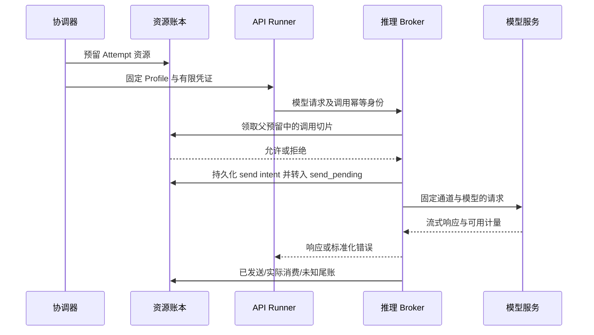

# 执行、上下文、验证与交付

统一的是任务契约和证据，底层保留不同来源真实的认证、协议与执行语义。所有能力声明都必须绑定具体版本、操作系统和验收记录。

## 1. 推荐执行路径

| 来源 | v1 路径 | 准入粒度与限制 |
|---|---|---|
| ChatGPT 订阅 | 官方 Codex app-server，由用户官方登录；每 Attempt 独立受控会话 | 默认按 Attempt 准入；是否可逐调用控制不能从 app-server 存在推断 |
| Claude 订阅 | 官方 Claude Code `-p` / 结构化事件；Windows 上优先验收 WSL2 工具沙箱路径 | 默认按 Attempt 准入；认证环境隔离，避免 API key 改变计费方式 |
| DeepSeek 官方 API | API Agent 执行器 → Karajan 推理 broker → 官方 API | broker 可逐模型请求准入；工具由本地受限执行环境运行 |
| OpenCode Go | 同一 API Agent 执行器 → broker → Go 公布的对应模型协议 | 保留工具标识/session header；订阅额度和额外余额路径分别控制 |
| 第三方 API | 同一 broker 下的独立 provider adapter | 逐个验证工具协议、模型身份、上下文、计费与取消语义 |

API Agent 执行器优先复用固定版本 OpenCode headless server 的工具循环、事件和会话能力；其权限配置不等同于 OS 沙箱。它必须运行在每 Attempt 隔离环境内，且全部模型请求经 broker。不能满足可控调用和配置锁定时，该版本不准入，选择其他经过相同接口验证的 API runner，不把差异推给业务调度。[OpenCode server](https://opencode.ai/docs/server/)、[permissions](https://opencode.ai/docs/permissions/)

OpenCode 管理接口只能由 RunnerHost 使用：配置、认证、会话创建等端点不能被工具进程访问，管理凭据也不进入工具环境。仅把 server 与工具放在同一容器不足以证明这一点；必须验收监听端点、进程身份和凭据继承，不能做到的部署不获得自主执行资格。

官方订阅登录只供相应官方执行端使用；不抽取订阅 token 建成通用兼容 API。Codex、Claude 的订阅授权、API 计费与工具权限分别核验。[Codex 认证](https://learn.chatgpt.com/docs/auth)、[Claude 认证](https://code.claude.com/docs/en/authentication)

Go 不同模型可使用 Responses、Chat Completions 或 Messages 形态；DeepSeek/第三方的兼容接口也不意味着全部参数和会话能力兼容。Adapter 必须拒绝无法兑现的必需参数，不能静默忽略。[Go](https://opencode.ai/docs/go/)、[DeepSeek Responses](https://api-docs.deepseek.com/guides/responses_api/)

## 2. RunnerHost 与执行适配器

RunnerHost 是执行管理内部的受信任进程管理模块，保存最小持久启动登记：`attempt_id / start_key / profile_digest / process_identity / session_ref / last_seq / exit_status`。它负责防止重复启动、转发事件、核对进程树、强制已支持的限制，不负责业务任务重试或选模。

启动顺序必须是排他接受 start_key → 持久化 accepted/start-intent → 取得有效 activation → spawn → 持久化进程身份/回执。spawn 与记录不可能靠普通文件事务天然原子化；崩溃后处于“已接受但是否启动未知”的键不得自动重新 spawn，需通过唯一启动身份与 supervisor 核对。查不到一个 PID 不证明没有子进程。协议保证不在未知时盲目重复，而不虚构 OS spawn 的 exactly-once。

接口协议必须区分“命令已接受”“已启动”“正在运行”“结果已收到”“进程已退出”“消费已结算”。CLI 返回 0、server session idle 或 HTTP abort 成功都不能替代所有这些事实。

可恢复的同一次执行仅允许在原 Profile、基准、输入和有效授权不变，且执行器能证明 session/进程连续性时恢复。重新发起推理或重建执行上下文默认是新 Attempt；旧消费保留。

内部 fallback、模型自动切换、原生子 Agent 和未计入限制的插件默认关闭。无法关闭也无法覆盖的执行路径不满足严格 Profile 契约。普通工具调用可在一个 Attempt 内多次发生，但新增的独立工作必须返回协调器。

## 3. 推理 broker

Broker 仅用于允许 API 接入的渠道，持有实际 provider keys。API runner 拿到短期、仅属于一个 Attempt 的能力凭证，不能读取真实 key。



Broker 校验有效 fence、Profile digest、模型 ID、请求上界、授权数据去向和预算。调用方不能传任意目标 URL；endpoint 来自受信任注册表。协议转换由具体 provider adapter 完成；不声称能无损转译所有厂商参数。

同一调用键重复到达时先查询已知状态；服务商若不支持请求幂等，已发送但结果未知的调用不能直接重发当作“同一次”。产生新请求时使用新 call ID 并继续占账。

Broker 为每次 HTTP 接收生成 receipt_id；客户端 logical_call_id 是另一个可选字段。只有固定 transport 已证明跨重传保持稳定 ID 时才按它去重。缺少该能力时，每次接收均作为新调用重新准入、计账，不能因 prompt/body 相同合并。OpenCode/SDK 自动重试是否能关闭、是否保持逻辑 ID 属于 M0 兼容性探针；不假定已有原生支持，也不因此先重写整个 Agent 循环。

Runner 的网络仅允许 broker 和经许可的依赖来源；无法绕过 broker 直接带 key 调用厂商。Broker 凭证被该任务代码读取的风险通过限定用途、额度、模型、有效期与来源隔离减小；它不能授予项目外权限或其他任务的预算。

## 4. 隔离与信任模型

威胁范围：模型错误、仓库代码/依赖的非预期行为、上下文中的越权指令、失控子进程及凭据误继承。可信部分是用户、宿主 OS、Karajan 控制程序及已验证执行器控制进程；首版不承诺抵御已控制宿主管理员的攻击者。

| Karajan 隔离等级 | 可承诺的范围 | 对应工作 |
|---|---|---|
| `local_guarded` | 独立目录、显式权限、清理环境；仍可能有当前用户读权限 | 人工陪同或只使用提供输入包的工作；不授予无人值守仓库工具资格 |
| `tool_sandboxed` | 命令与子进程受 OS 约束；非命令工具受可信执行器权限/路径守卫约束；不能读取平台/Git/认证秘密或访问交付入口 | 可信仓库的自主实现、测试与带工具审查最低要求 |
| `attempt_isolated` | 每次执行独立文件/进程空间，无用户主目录、host socket、共享 Git 权限 | API Worker 推荐目标；进一步降低任务间相互影响 |

这些是设计分类，不是已通过认证的产品标签。要求相应等级的任务不会匹配 unknown 能力；订阅执行器可接入账户但尚不能执行无人值守工具任务，两者在 UI 分开显示。

每条工具路径记录 `os_enforced / trusted_runtime_enforced / unavailable` 及具体证据。内置文件工具可能运行在持有认证的可信控制进程中，其守卫因此属于可信计算基；不能把它说成与 shell 同样的 OS 边界。需要所有工具都受 OS 隔离的更严格任务使用另一个能力要求，当前订阅 Profile 未验证前不满足它。

Codex Windows 文档区分 elevated/unelevated sandbox；推荐优先验收其受限用户与网络约束路径。`workspace-write` 不能被解释为“工作区外的秘密绝对不可读”。[Codex Windows sandbox](https://learn.chatgpt.com/docs/windows/windows-sandbox)

Claude 当前文档没有原生 Windows Bash sandbox，WSL2/Linux 路径可用；它覆盖 Bash 及子进程，不自动覆盖所有内置工具、MCP 和 hooks。必须检查所有启用工具，禁用无沙箱回退，测试 WSL 互操作和 `/mnt/c` 等出口。[Claude sandbox](https://code.claude.com/docs/en/sandboxing)

订阅 CLI 的控制进程需要认证，工具进程不能因此继承读取认证的能力。仅更改 HOME、清空某个环境变量、禁用 `git push` 字符串或写提示词均不足以证明隔离。使用假 secret canary 验收文件工具、shell、子进程、环境、credential helper 和网络。

交付进程放在独立身份/隔离域；其 Git token、SSH agent、credential helper、配置文件和通信端点对 Worker、Reviewer、测试进程均不可达。工具沙箱网络拒绝访问控制 HTTP 接口和交付端点。平台配置、Rulebook、数据库和启动清单只由控制程序写入。

## 5. 工作区、代码基准与并行

每个可写 Attempt 使用独立 clone 或代码快照，需要 Git 时拥有自己的 `.git`。优先不使用共享 `.git` 的 linked worktree 作为隔离边界；Claude 的 worktree 沙箱行为可允许共享主仓库 Git 元数据写入，必须考虑任务间影响。[Claude worktree 行为](https://code.claude.com/docs/en/sandboxing)

可信 materializer 从已登记 remote/base SHA 生成执行副本；不修改用户原工作区、不依赖用户未提交变更。若用户明确选择包含本地改动，先保存可追溯输入快照并在计划里显示。Git LFS、submodule、依赖锁文件和外部生成输入也必须有版本或内容摘要。

同一工作区只有一个 writer。任务可并行的条件包括接口已确定、修改职责可独立、依赖输入完整、资源足够；文件不重叠只是一个信号。共享缓存按只读依赖缓存或隔离写入设计，不能让安装脚本改其他任务的依赖。

任务候选在进程停止写入后由平台提取，检查路径范围、符号链接/junction、异常文件和基准。未经授权的修改使候选失败；不靠 Agent 自报 touched_files 决定。

Collector 不以可信特权身份加载 Worker 的 `.git/config`、filters、fsmonitor、hooks 或插件。它读取经过路径/大小/类型校验的文件或受控对象包，导入全新的可信仓库后计算候选；必要的 Git 操作在不受信环境内执行并核验结果。LFS/submodule 的 URL、协议与取回凭据独立限制，不能让仓库配置把可信 materializer 引向任意远端。

集成按固定依赖/任务顺序在新快照中进行。冲突不得静默选择一侧；可在原范围内生成有界冲突解决任务，涉及接口/范围变化则回到 Commander。后续任务需要前置实现时读取其已接受的候选快照，不与前置任务共写同一目录。

## 6. 上下文与 Commander 交接

Handoff Pack 最少包括：用户目标与已确认决定、任务简报 revision、授权摘要、代码基准、依赖候选、相关接口/文件引用、验收/停止条件、已知失败、剩余预算与下一步。每个材料有来源和摘要；可按需读取完整文件。

跨模型不搬运私有推理、原始工具调用 ID 或不透明 session 对象。压缩摘要不能替代验收标准、权限和源代码；新执行者可核对原始材料。仓库文档、模型返回和网页都作为输入材料，不能覆盖可信策略。

主 Commander 有单一有效 term。顾问可以并行产出建议，平台只接受当前主 Commander 对该计划版本的提案；顾问不能创建第二份已获授权任务图。换负责人先保存交接包并更新 term，旧负责人返回仅作为材料保留。

用户在审阅 Q7 确认：每次主 Commander 换人都由用户决定。平台可准备交接包、合格候选和预算影响，创建 `COMMANDER_HANDOFF_PENDING`，但不会提前启动替任模型。用户选择后重查 term、授权/预算和材料版本，才撤销旧提交权并激活新 term。等待期间，已批准且不依赖新 Commander 决策的任务可继续；需要新设计或范围决定的任务等待。普通 session 重连不等于换负责人，但是否属于同一 Attempt 仍按执行连续性判断。

Reviewer 使用独立上下文，只获得需求/简报、最终 diff、可信检查结果和必要源文件，不默认输入作者的论证过程。它可以提出结构化 finding；修复由新的 Worker Attempt 完成，不让 Reviewer 直接改被审候选。

## 7. 候选与证据

Candidate 身份包含 `repo identity + base SHA + tree SHA + input manifest digest`。集成候选记录所有任务父候选与集成步骤。只要代码、基准、依赖输入或相关执行条件改变，就重新确定哪些证据有效；首版对最终候选重新运行全部必需 gate，先保证语义简单可靠。

Evidence 至少绑定 candidate、检查/审查配置 revision、输入/环境摘要、执行者及退出结果。证据状态包括 `passed / failed / inconclusive / unavailable / invalidated`；日志缺失或结果无法解释不能算 passed。

检查入口来自用户认可的项目检查配置和可信基准，不能让候选自行删掉检查项后宣布成功。项目中的测试、构建和安装代码在隔离测试环境运行；新增测试可以成为证据的一部分，但不能替代原先要求的检查。涉及检查配置修改时同时审查修改本身。

推荐验证顺序：输入/路径与基准检查 → 必需确定性测试/类型检查/lint → 最终候选独立 review → gate 汇总。可并行运行互不冲突的检查。工具执行产生 scratch 文件不修改冻结候选；必须修改代码时产生新候选。

Reviewer finding 包含严重性、文件位置、具体行为、触发条件、验收依据、是否阻断。无结构化结果、超时或“无法判断”均不自动通过。模型结论由可信 gate 依照规则解释；T3 默认要求不同模型家族，信息未知不假装满足独立性。

## 8. 交付协议

Delivery 是远端写入的唯一入口，输入固定为候选、有效证据集、授权和目标；不接受模型提供的任意 shell 命令。内部 Git 命令禁用项目 hooks 和不受信配置，发布过程不运行候选构建脚本。

```text
planned → preparing_commit → commit_ready → pushing → pushed → creating_pr → pr_open
                  任一有外部副作用的阶段可进入 reconciling 或 failed
```

每步先持久化 intent，再执行，再记录 result。`publish(run_id, candidate_id, delivery_revision)` 幂等；分支固定使用受管命名（建议 `codex/karajan-<run-short-id>`），同一 Run 更新同一 PR。复用已有非平台分支或同名 PR 前必须核验归属，不根据标题相似认领。

每次 push、创建或修改 PR 都有独立 activation：短事务重查当前授权、候选/证据、暂停/取消、delivery fence 与分支锁，写入该步骤许可后才发出请求。许可之前的取消阻止该步；许可之后的取消只能停止后续步骤并核对已开始结果。例如 push 后用户取消，尚未获得许可的 create-PR 不能继续。远端结果查询和消费核对不属于新增交付副作用，取消后仍允许执行。

`(repo, managed_branch)` 同时只有一个有效交付操作，跨 revision 也互斥。远端更新绑定明确的 expected_old_sha（初建分支要求原 ref 不存在）；使用经过验收的 Git ref 比较更新语义，拒绝不匹配，且首版仅接受受管分支的正常内容更新。某次请求结果未知时，后续 revision 必须等待核对，不能越过它继续 push。

受管分支更新保留旧 head 为祖先；目标基准更新时由可信集成步骤处理其祖先关系，再固定候选树和提交。Git 实现可使用显式 `<ref>:<expect>` 的 lease 比较，同时由交付门独立检查祖先关系；不依赖会被后台 fetch 改变的隐式 remote-tracking 期望，也不把 lease 当作允许任意改写历史的授权。[Git push 的显式 lease 语义](https://git-scm.com/docs/git-push)

发布前检查：当前 Run 没有禁止交付的暂停/取消/撤销；候选与证据匹配；目标 remote/branch 获准；受管分支 head 与已记录 head 一致；当前目标基准是否符合策略。目标分支变化时默认重新集成和验证，避免把旧基准证据当成当前结果。

目标基准分支可能在检查后继续被外部更新，本地锁无法冻结它。发布后再次核对并标记 tested_base_sha 与当前 base；变化时重新集成/验证，PR 显示待更新。若要求原子保持合并基准，需托管平台的当前合并结果检查或合并队列能力，首版不声称提供该保证。

提交固定内容树；如检查依赖 commit 元数据，则在检查前固定最终提交。push 后以实际 commit SHA 关联远端 CI。创建 PR 后等待 CI 与 PR 已创建是不同状态，用户在 UI 可以分别看到。

对于“push 成功但响应丢失”，先比较远端分支 SHA。对于“PR 创建成功但响应丢失”，按 repo/head/base 与平台运行标记查询现有 PR；查询不足以消除歧义时保持 reconciling，不盲目再建。外部修改受管分支时不强推覆盖，形成 blocker。

自动交付范围到 PR；平台不自动合并。用户手动修改 PR 后，原 Evidence 只对应原 SHA；新的审查、修复与更新作为明确的新交付 revision 处理。
