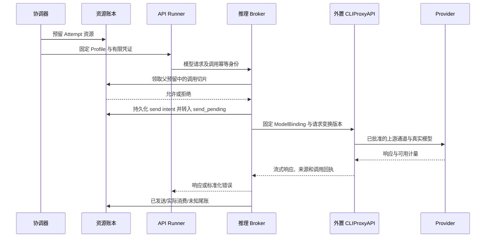

# 执行、上下文、验证与交付

2026-09-14 r8 设计契约。获权 Workflow 角色按实际任务作业务调度决定，Karajan 机械校验/执行并保存唯一状态，见 [11](11-role-directed-scheduling.md)。来源差异仍由外置网关或显式兼容适配器处理；能力绑定版本/OS/证据，不表示目标路径已实现或通过。

## 1. 默认网关路径与原生兼容路径

默认使用 `受控 Runtime → Karajan 调用授权/账本 → 外置 CLIProxyAPI → Provider`。CLIProxyAPI 负责上游凭据与协议转换；Karajan 管理工具循环、隔离、批准、资源和产物交付。角色与步骤来自 [Workflow 定义](09-configurable-workflows.md)，网关路由、请求变换、重试和真实来源验收以 [网关契约](08-provider-gateway.md) 为准。Designer 创作调用也走已获准来源，但拥有目标 Run 之外的独立创作执行身份。以下表格保留旧接入设计及显式兼容 Profile，不表示默认继续逐 provider 自建集成，也不构成网关路径已通过。

| 来源 | 原生兼容路径 | 准入粒度与限制 |
|---|---|---|
| ChatGPT 订阅 | 官方 Codex app-server，由用户官方登录；每 Attempt 独立受控会话 | 默认按 Attempt 准入；是否可逐调用控制不能从 app-server 存在推断 |
| Claude 订阅 | 官方 Claude Code `-p` / 结构化事件；Windows 上优先验收 WSL2 工具沙箱路径 | 默认按 Attempt 准入；认证环境隔离，避免 API key 改变计费方式 |
| DeepSeek 官方 API | API Agent 执行器 → Karajan 推理 broker → 官方 API | broker 可逐模型请求准入；工具由本地受限执行环境运行 |
| OpenCode Go | 同一 API Agent 执行器 → broker → Go 公布的对应模型协议 | 保留工具标识/session header；订阅额度和额外余额路径分别控制 |
| 第三方 API | 同一 broker 下的独立 provider adapter | 逐个验证工具协议、模型身份、上下文、计费与取消语义 |

受控 Agent Runtime 按执行契约选用并验收，固定版本 OpenCode headless server 是历史复用候选之一；其权限配置不等同于 OS 沙箱。使用它时，每 Attempt 的工具环境必须隔离，全部模型请求经 Karajan 调用授权层与批准的网关绑定。不能满足可控调用和配置锁定时不准入；选择其他已通过相同契约的 Runtime 不改变业务调度。[历史复用依据：OpenCode server](https://opencode.ai/docs/server/)、[permissions](https://opencode.ai/docs/permissions/)

OpenCode 管理接口只能由 RunnerHost 使用：配置、认证、会话创建等端点不能被工具进程访问，管理凭据也不进入工具环境。仅把 server 与工具放在同一容器不足以证明这一点；必须验收监听端点、进程身份和凭据继承，不能做到的部署不获得自主执行资格。

旧官方执行器路径的登录仍供其原端使用；默认外置 CLIProxyAPI 的认证/转换由网关自身管理。Karajan 不实现订阅 token 提取，分别核验所选通道的授权、计费和工具权限，不把原生登录资格转移给网关。[ADR 0005](../adr/0005-external-model-gateway.md)

历史直接 API 兼容设计需要逐一核对 Go、DeepSeek/第三方的协议与参数，兼容接口名称不证明全部会话能力可用。默认网关路径则按 GatewayConnection/ModelBinding 与协议版本验收；Karajan 拒绝网关不能兑现的必需能力，不另建隐式 provider 回退。[历史接入依据：Go](https://opencode.ai/docs/go/)、[DeepSeek Responses](https://api-docs.deepseek.com/guides/responses_api/)

## 2. RunnerHost 与执行适配器

RunnerHost 是执行管理内部的受信任进程管理模块，保存最小持久启动登记：`ExecutionRef / start_key / manifest_digest / process_identity / session_ref / last_seq / exit_status`。ExecutionRef 是 [04](04-api-and-workbench.md#2-执行管理接口) 定义的带类型身份：Run 步骤绑定 Attempt，独立 Designer 绑定创作 execution；启动、inspect/events/cancel/collect 与权限请求都使用同一归属。它负责防止重复启动、转发事件、核对进程树、强制已支持的限制，不负责业务重试或选模。职责名不选择执行器，execution_kind 只能引用已注册能力。

启动顺序必须是排他接受 start_key → 持久化 accepted/start-intent → 取得有效 activation → spawn → 持久化进程身份/回执。spawn 与记录不可能靠普通文件事务天然原子化；崩溃后处于“已接受但是否启动未知”的键不得自动重新 spawn，需通过唯一启动身份与 supervisor 核对。查不到一个 PID 不证明没有子进程。协议保证不在未知时盲目重复，而不虚构 OS spawn 的 exactly-once。

接口协议必须区分“命令已接受”“已启动”“正在运行”“结果已收到”“进程已退出”“消费已结算”。CLI 返回 0、server session idle 或 HTTP abort 成功都不能替代所有这些事实。

可恢复的同一次执行仅允许在原 Profile、基准、输入和有效授权不变，且执行器能证明 session/进程连续性时恢复。重新发起推理或重建上下文默认创建新执行身份：Run 路径为新 Attempt，Designer 为新创作 execution；旧消费与各自累计界限保留。

绕过 Karajan 的隐藏 fallback、原生子 Agent 或未计账插件不允许；这不禁止 Workflow 中获权角色创建独立子任务。角色经 SchedulingDecision 提交子图/委派/绑定/派发，引擎验证原授权后分配独立 Attempt/工作区/账本；无需逐任务人批。换源仅用获准集合，先核对旧执行再新建 Attempt，不热切换或暗增来源。

## 3. 推理 broker

调用授权模块服务外置网关路径，持有网关数据面客户端凭据，供应商 keys/OAuth 留在 CLIProxyAPI；它不复制 provider 适配。Runtime 只拿绑定获准 Attempt 或 Designer 创作执行身份的短期能力凭证。下图以 Run Attempt 为例，Designer 使用自己的父预算遵守同一发送账本协议；旧直接 API Profile 的凭据处理保留其原隔离域。



Broker 校验有效 fence、Profile/ModelBinding digest、GatewayConnection revision、模型映射、请求上界、授权数据去向和预算。调用方不能传任意目标 URL，endpoint 来自受信任注册表。默认路径由外置 CLIProxyAPI 转换 provider 协议；公开 alias 不构成真实模型证明，任何影响工具、提示或计费的变换必须固定并获准。

同一调用键重复到达时先查询已知状态；服务商若不支持请求幂等，已发送但结果未知的调用不能直接重发当作“同一次”。产生新请求时使用新 call ID 并继续占账。

Broker 为每次 HTTP 接收生成 receipt_id；客户端 logical_call_id 是另一个可选字段。只有固定 transport 已证明跨重传保持稳定 ID 时才按它去重。缺少该能力时，每次接收均作为新调用重新准入、计账，不能因 prompt/body 相同合并。Runtime/SDK 与网关的重试、账号轮换和 fallback 均要核验；默认严格单一绑定，未经批准的隐藏调用路径不能获得资格。网关已经发送但结果未知时保留未知尾账，不能以 HTTP 重试掩盖新的上游消费。

Runner 的网络仅允许 broker 和经许可的依赖来源；无法绕过 broker 直接带 key 调用厂商。Broker 凭证被该任务代码读取的风险通过限定用途、额度、模型、有效期与来源隔离减小；它不能授予项目外权限或其他任务的预算。

## 4. 隔离与信任模型

威胁范围：模型错误、仓库代码/依赖的非预期行为、上下文中的越权指令、失控子进程及凭据误继承。可信部分是用户、宿主 OS、Karajan 控制程序及已验证执行器控制进程；首版不承诺抵御已控制宿主管理员的攻击者。

| Karajan 隔离等级 | 可承诺的范围 | 对应工作 |
|---|---|---|
| `local_guarded` | 独立目录、显式权限、清理环境；仍可能有当前用户读权限 | 人工陪同或只使用提供输入包的工作；不授予无人值守仓库工具资格 |
| `tool_sandboxed` | 命令与子进程受 OS 约束；非命令工具受可信执行器权限/路径守卫约束；不能读取平台/Git/认证秘密或访问交付入口 | 可信仓库的自主实现、测试与带工具审查最低要求 |
| `attempt_isolated` | 每次执行独立文件/进程空间，无用户主目录、host socket、共享 Git 权限 | 带工具的 Agent 步骤推荐目标；进一步降低任务间相互影响 |

这些是设计分类，不是已通过认证的产品标签。要求相应等级的任务不会匹配 unknown 能力；订阅执行器可接入账户但尚不能执行无人值守工具任务，两者在 UI 分开显示。

每条工具路径记录 `os_enforced / trusted_runtime_enforced / unavailable` 及具体证据。内置文件工具可能运行在持有认证的可信控制进程中，其守卫因此属于可信计算基；不能把它说成与 shell 同样的 OS 边界。需要所有工具都受 OS 隔离的更严格任务使用另一个能力要求，当前订阅 Profile 未验证前不满足它。

历史 Codex Windows 兼容设计据其 elevated/unelevated sandbox 区分，要求验收具体版本的受限用户与网络约束路径。`workspace-write` 不能被解释为“工作区外的秘密绝对不可读”。[历史设计来源](https://learn.chatgpt.com/docs/windows/windows-sandbox)

历史 Claude 兼容设计优先考察 WSL2/Linux Bash sandbox；具体支持以固定版本资格记录为准。Bash 及子进程的边界不自动覆盖所有内置工具、MCP 和 hooks。必须检查所有启用工具，禁用无沙箱回退，测试 WSL 互操作和 `/mnt/c` 等出口。[历史设计来源](https://code.claude.com/docs/en/sandboxing)

订阅 CLI 的控制进程需要认证，工具进程不能因此继承读取认证的能力。仅更改 HOME、清空某个环境变量、禁用 `git push` 字符串或写提示词均不足以证明隔离。使用假 secret canary 验收文件工具、shell、子进程、环境、credential helper 和网络。

交付凭据和管理端点对工具/测试进程不可达，数据库、部署槽位和启动清单只由可信程序写入。Designer 通过受限工具提交配置；获权调度角色通过绑定范围/任期的窄命令接口提交决定。普通工具无控制接口访问权，调度凭证不能调用管理或交付入口；提示不等于权限。

## 5. 工作区、代码基准与并行

本节适用于读写仓库或产出代码候选的步骤。纯报告等步骤按已批准输入/产物契约分配所需环境，不为每个 Workflow 强制建立 Git 候选。是否需要 writer 槽位由执行能力与路径授权决定，不按 Worker 字符串决定。

每个可写 Attempt 使用独立 clone 或代码快照，需要 Git 时拥有自己的 `.git`。优先不使用共享 `.git` 的 linked worktree 作为隔离边界；Claude 的 worktree 沙箱行为可允许共享主仓库 Git 元数据写入，必须考虑任务间影响。[Claude worktree 行为](https://code.claude.com/docs/en/sandboxing)

可信 materializer 从已登记 remote/base SHA 生成执行副本；不修改用户原工作区、不依赖用户未提交变更。若用户明确选择包含本地改动，先保存可追溯输入快照并在计划里显示。Git LFS、submodule、依赖锁文件和外部生成输入也必须有版本或内容摘要。

同一工作区只有一个 writer。拆分及并行安排由获权角色按实际职责/依赖决定，引擎验证独立工作区、完整输入和资源；不固定前后端，也不内置全局/项目 coding Agent 数量或新默认人数。用户明确数量政策和真实宿主/来源容量形成背压，合法图留队。文件不重叠不单独证明可并行，共享缓存保持只读或隔离写入。

任务候选在进程停止写入后由平台提取，检查路径范围、符号链接/junction、异常文件和基准。未经授权的修改使候选失败；不靠 Agent 自报 touched_files 决定。

Collector 不以可信特权身份加载 Worker 的 `.git/config`、filters、fsmonitor、hooks 或插件。它读取经过路径/大小/类型校验的文件或受控对象包，导入全新的可信仓库后计算候选；必要的 Git 操作在不受信环境内执行并核验结果。LFS/submodule 的 URL、协议与取回凭据独立限制，不能让仓库配置把可信 materializer 引向任意远端。

代码集成按当前已接受图及 SchedulingDecision 固定的输入集合/顺序在新快照中进行；动态集合先封口并收齐必需产物。冲突不得静默选边，角色可在授权内安排有界解决子图，超范围才请求批准。后续任务读取接受产物，不共写目录；图变化不删除已承诺义务，集成输入变化重新固定候选并验证。

## 6. 上下文、控制提交身份与独立审查

Handoff Pack 最少包括：用户目标与已确认决定、角色/步骤/简报 revision、配置与编译摘要、授权摘要、输入和依赖产物、相关材料引用、验收/停止条件、已知失败、剩余预算与下一步；代码步骤另含基准 SHA。每个材料有来源和摘要，可按需读取完整文件。

跨模型不搬运私有推理、原始工具调用 ID 或不透明 session 对象。压缩摘要不能替代验收标准、权限和源代码；新执行者可核对原始材料。仓库文档、模型返回和网页都作为输入材料，不能覆盖可信策略。

Workflow/SchedulerGrant 指定有效调度身份，可委派子范围，也可明确允许多个 grant 覆盖重叠范围，重叠图变更经 CAS。同一 grant 或明确交接槽位只有当前任期，不设全 Run 单一 Commander 独占拆分。角色提交真实业务决定，Karajan 仍唯一写状态；Designer 若承担调度须另获授予。

替换用户选定主 Commander 仍由用户决定，原 Q7 见 [06](06-review-and-decisions.md)；该要求不扩大为所有调度角色限制。其他角色按明确授予的委派/交接规则自动执行，超授权才请求批准。交接保存图/义务/材料并 CAS 更新相应 grant/槽位任期；旧执行仍核对，独立工作继续，session 重连不重新授予。

独立审查步骤使用独立上下文，只获得需求/简报、冻结产物、可信检查结果和必要来源，不默认输入作者论证。它可提出结构化 finding；修复由新的获准实现 Attempt 完成，审查者不能同时修改被审产物。独立性按真实来源、作者关系、上下文和职责校验，自定义角色无需名为 Reviewer，名为 Reviewer 也不会自动合格。

## 7. 候选与证据

Artifact 保存 report/patch/code candidate 等冻结产物的类型、内容摘要与来源。Evidence 绑定产物、验证政策、执行身份和环境；不同目标的完成条件从批准快照读取。以下 Candidate/最终代码验证规则适用于代码产物，PR 必须全部满足，不能因为重命名或删除 Reviewer 节点而绕过。

Candidate 身份包含 `repo identity + base SHA + tree SHA + input manifest digest`。集成候选记录所有任务父候选与集成步骤。只要代码、基准、依赖输入或相关执行条件改变，就重新确定哪些证据有效；首版对最终候选重新运行全部必需 gate，先保证语义简单可靠。

Evidence 至少绑定 candidate、检查/审查配置 revision、输入/环境摘要、执行者及退出结果。证据状态包括 `passed / failed / inconclusive / unavailable / invalidated`；日志缺失或结果无法解释不能算 passed。

检查入口来自用户认可的项目检查配置和可信基准，不能让候选自行删掉检查项后宣布成功。项目中的测试、构建和安装代码在隔离测试环境运行；新增测试可以成为证据的一部分，但不能替代原先要求的检查。涉及检查配置修改时同时审查修改本身。

默认 PR 模板的验证顺序为输入/路径与基准检查 → 必需确定性测试/类型检查/lint → 最终候选独立 review → gate 汇总。Workflow 可并行安排互不冲突的检查，但不能削弱 PR 的同候选 checks 和独立审查门。report/patch 采用各自冻结的产物验证政策；工具 scratch 文件不修改冻结产物，需要修改时形成新产物和相应新证据。

独立审查 finding 包含严重性、产物/文件位置、具体行为、触发条件、验收依据、是否阻断。无结构化结果、超时或“无法判断”均不自动通过。模型结论由可信 gate 依照规则解释；代码 PR 的 T3 审查默认要求不同模型家族，信息未知不假装满足独立性。

## 8. 交付协议

Run 的 `delivery_kind` 与完成政策在批准时固定。report 交付要求可读取的冻结报告及其验收，patch 要求固定补丁、基准与相应验证；它们不强制创建 PR。PR 目标另需当前候选 checks、独立审查、有效远端授权和确认的 PR 事实。旧 `delivery=none` 不能直接冒充 report/patch 完成。

以下是 PR 子类型的远端协议。Delivery 是远端写入的唯一入口，输入固定为候选、有效证据集、授权和目标；不接受模型提供的任意 shell 命令。内部 Git 命令禁用项目 hooks 和不受信配置，发布过程不运行候选构建脚本。

```text
planned → preparing_commit → commit_ready → pushing → pushed → creating_pr → pr_open
                  任一有外部副作用的阶段可进入 reconciling 或 failed
```

每步先持久化 intent，再执行，再记录 result。`publish(run_id, candidate_id, delivery_revision)` 幂等；分支固定使用受管命名（建议 `codex/karajan-<run-short-id>`），同一 Run 更新同一 PR。复用已有非平台分支或同名 PR 前必须核验归属，不根据标题相似认领。

每次 push、创建或修改 PR 都有独立 activation：短事务重查当前授权、候选/证据、暂停/取消、delivery fence 与分支锁，写入该步骤许可后才发出请求。许可之前的取消阻止该步；许可之后的取消只能停止后续步骤并核对已开始结果。例如 push 后用户取消，尚未获得许可的 create-PR 不能继续。远端结果查询和消费核对不属于新增交付副作用，取消后仍允许执行。

`(repo, managed_branch)` 同时只有一个有效交付操作，跨 revision 也互斥。远端更新绑定明确的 expected_old_sha（初建分支要求原 ref 不存在）；使用经过验收的 Git ref 比较更新语义，拒绝不匹配，且首版仅接受受管分支的正常内容更新。某次请求结果未知时，后续 revision 必须等待核对，不能越过它继续 push。

受管分支更新保留旧 head 为祖先；目标基准更新时由可信集成步骤处理其祖先关系，再固定候选树和提交。Git 实现可使用显式 `<ref>:<expect>` 的 lease 比较，同时由交付门独立检查祖先关系；不依赖会被后台 fetch 改变的隐式 remote-tracking 期望，也不把 lease 当作允许任意改写历史的授权。[Git push 的显式 lease 语义](https://git-scm.com/docs/git-push)

发布前检查：当前 Run 没有禁止交付的暂停/取消/撤销；候选与证据匹配；目标 remote/branch 获准；受管分支 head 与已记录 head 一致；当前目标基准是否符合策略。目标分支变化时默认重新集成和验证，避免把旧基准证据当成当前结果。

目标基准分支可能在检查后继续被外部更新，本地锁无法冻结它。发布后再次核对并标记 tested_base_sha 与当前 base；变化时重新集成/验证，PR 显示待更新。若要求原子保持合并基准，需托管平台的当前合并结果检查或合并队列能力，首版不声称提供该保证。

提交固定内容树；如检查依赖 commit 元数据，则在检查前固定最终提交。push 后以实际 commit SHA 关联远端 CI。创建 PR 后等待 CI 与 PR 已创建是不同状态，用户在 UI 可以分别看到。

对于“push 成功但响应丢失”，先比较远端分支 SHA。对于“PR 创建成功但响应丢失”，按 repo/head/base 与平台运行标记查询现有 PR；查询不足以消除歧义时保持 reconciling，不盲目再建。外部修改受管分支时不强推覆盖，形成 blocker。

PR 目标的自动交付范围到 PR，平台不自动合并。用户手动修改 PR 后，原 Evidence 只对应原 SHA；新的审查、修复与更新作为明确的新交付 revision 处理。

## 9. Workflow 部署与产物交付的边界

Designer 写出的配置先由可信服务校验并保存真实不可变文件；图、表、diff 都从该包和固定编译器生成。用户的一次精确确认可发布定义并部署；可信部署器先准备 pending，调度器加载读回同摘要且就绪后再 CAS 发布 active，旧 active 在准备期间继续有效。仅写文件或登记定义不算部署成功。

部署面向 Karajan Workflow 引擎，不等于 Run 或远端交付。复合确认绑定具体输入/初始 Plan、执行与调度授权，不要求预枚举后续子任务。新 active/回滚不改旧 Run 冻结定义、初始授权或已启动 Attempt；授权内后续图修订可正常推进。丢回执先查原部署/Run/调度命令，恢复核对文件、图链与执行；见 [10](10-conversational-workflow-deployment.md)。
