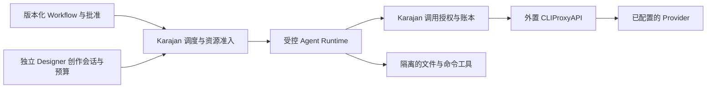

# 外置模型网关

修订：2026-09-14。状态：按用户要求采用外置 CLIProxyAPI 的设计方向；适配、部署和真实资格尚未实现或验收。决定见 [ADR 0005](../adr/0005-external-model-gateway.md)。

## 1. 职责与调用路径

Karajan 的默认多来源模型接入路径为：

CLIProxyAPI 独立部署和升级，负责上游登录、凭据刷新、供应商协议转换及已允许路由内的请求转发。Karajan 保存网关连接与模型绑定，使用统一模型接口，不在业务模块复制各供应商 OAuth 和协议适配。

Karajan 仍拥有 Workflow、Run/Task/Attempt、用户批准、工具权限、工作区、资源预留、逐调用记录、候选、检查和交付。调用授权模块只负责这些约束与协议归一化，不成为第二套 provider 网关。模型返回的 tool call 由受控 runtime 校验并在本机隔离环境执行；提供 tool calling 的 HTTP 网关不等于 Agent Runtime，也不提供代码执行沙箱。

旧 Codex/Claude 原生执行器、Go relay 和 DeepSeek adapter 保留为兼容实现及历史证据；不再要求每新增供应商都在 Karajan 新写专用通道。未能通过网关验收的来源明确未启用；如需原生专属能力，作为显式选择的独立 Profile 保留，不能自动回退。

## 2. 统一连接与模型绑定

以下是拟实现的领域契约，不是 CLIProxyAPI 已提供的管理 schema。

| 对象 | 关键内容 | 约束 |
|---|---|---|
| GatewayConnection revision | 稳定 ID、允许的 base URL、客户端协议、网关客户端 `secret_ref`、固定版本、路由/请求变换策略摘要、能力证据引用 | 地址与配置由所有者登记；模型和工具不能修改；连接测试与正式启用分开 |
| ModelBinding revision | connection revision、公开 model ID/alias、允许的真实模型/provider、账户或明确账户集合、计费通道、共享池、必需参数 | alias 不是来源身份；未知项如实保存，不能用自报 model 补齐 |
| Execution Profile revision | ModelBinding + Runtime revision + 参数与已验收能力 | Runtime 与模型通道独立组合；换网关/模型/映射后重新评估能力 |
| ModelCall receipt | call/Attempt 身份、请求摘要、已批准绑定/变换策略、实际 route/用量/时间/错误来源、结果与核对状态 | 实际元数据仅在可关联且可信时采信；缺失不是零用量或成功 |

第一版客户端优先覆盖 OpenAI-compatible 的模型发现、非流式/流式生成与 function calling；具体采用 Chat Completions，Responses 作为单独协商的能力。不能仅因网关暴露多个兼容端点就宣称不同端点的工具、结构化输出、上下文和会话语义等价。`GET /v1/models` 只产生可选目录；连接可达、模型可见、角色所需能力通过、资源可准入分别展示。

网关客户端密钥只存于 Karajan 受信调用层；runtime 使用有期限且绑定 Attempt 的凭证。供应商凭据留在外置网关。网关管理面与推理面分开，管理凭据不进入模型、工具、工作区或浏览器；第一版配置/登录在外置网关完成，Karajan 不依赖管理写接口。单机默认回环连接；远程网关须显式登记 TLS 地址与允许的数据去向。

统一协议也不等于请求透明转发。网关可应用 payload override/filter、system prompt 改写与托管工具注入。绑定必须包含经批准的请求变换策略；第一版禁用未批准的职责/提示、参数、tools 变换和上游托管工具，能力测试核对实际发往受控上游的语义，而非仅检查客户端请求。改变这些策略需要重新评估受影响资格；无法观察实际转发语义时不能声明职责/工具约束已验证。[固定配置中的请求变换](https://github.com/router-for-me/CLIProxyAPI/blob/7fa443dc8bf8ca2f1ffd81c2472deb31b097b697/config.example.yaml)

## 3. 路由与重试的责任

Karajan 批准的是实际允许的来源范围，不能只批准一个会变的别名。默认使用严格绑定：固定模型、provider、计费通道及所需账户身份；网关不得在额度不足、错误或流开始前静默改模型、改账户集合或使用现金后备。

CLIProxyAPI 的路由能力不天然满足这一点。当前核查发现：默认使用 round-robin；`request-retry: 0` 只关闭额外轮次，首轮仍可能尝试多个凭据；session affinity 的失效转移不是硬绑定。模型别名与映射也可能隐藏真实模型。因此单独设置重试次数、粘性会话或 model prefix 均不能当作严格资格通过。[固定配置](https://github.com/router-for-me/CLIProxyAPI/blob/7fa443dc8bf8ca2f1ffd81c2472deb31b097b697/config.example.yaml)

首个适配切片验证可控的单路由部署：仅暴露批准的目标集合，关闭会改变来源或计费的后备，并核对实际请求数。若共享网关的通用 HTTP 接口不能强制所需账户/模型，可使用独立实例/受控路由投影；仍不能证明时，该 Profile 保持 unsupported 或 blocked。SDK 能力不能直接假定为 HTTP 能力；需要额外 bridge 时单独记录实现与验收。

用户今后明确选择“网关池”时，批准版本必须固定池成员与映射 revision、计费边界、重试总量、资源合并与可观察范围。账户轮换只能在此已批准集合内；不能把严格单一绑定自动升级成池。第一版以严格绑定为验收起点。

Karajan 持久化每次调用意图；只有明确未发送的失败可在原规则内重试。发送后响应丢失、流中断或网关重启先标记结果/消费待核对，不因客户端幂等键而假设上游恰好执行一次。不确认网关内部重试数量时，不能声称严格逐调用现金上限。有限重试必须纳入同一预算，避免 runtime、Karajan、网关叠加放大。

## 4. 额度、反馈与取消

网关统一传输，不统一账户额度。两个连接或模型若消耗同一上游账户/订阅，必须引用同一资源池，不能重复预留。网关报告、服务配额观察、平台预算与本地估算分开保存；未提供实际账户身份时不能声称按该账户完成精确结算或保护。

每个响应的 usage、可验证的请求级观察可作为账本输入；网关进程内计数和第三方统计面板不作为 Karajan 的唯一持久账本。缺少 usage、重试观测或取消确认时保留 unknown，并按既有有限保守授权处理。模型流事件只表示已观察到的输出，连接心跳不证明任务成功。

取消先停止新调用和工具执行，终止/隔离原 runtime 并请求中断原 HTTP 流。连接已关闭不证明供应商已停止或不再计费；无法确认的远端状态仍为 unknown。网关配置/版本/路由映射变化须使受影响绑定重新评估，不将旧资格直接继承到新连接。

## 5. 接入验收与未覆盖范围

| ID | 公开行为验收 |
|---|---|
| GW-AC01 | 登记外置网关、读取模型目录、选择两种已配置 provider；未知/未通过能力的模型保持可解释的不可执行状态 |
| GW-AC02 | 固定输入验证流式/非流式、完整 tool-call ID/参数、工具结果续接和结构化输出；核对受控上游实际收到的职责/参数/tools，不发生未批准变换或托管工具注入，不支持的参数明确拒绝 |
| GW-AC03 | 人为触发配额、错误、别名冲突和配置变化；严格绑定不得出现未批准的 provider/model/account/收费后备，记录实际发送数 |
| GW-AC04 | 并发、重复命令、丢响应、重启和取消均保持原调用身份；未知不自动重发或归零；共享账户不因多个连接重复记可用额度 |
| GW-AC05 | 工具无法读取上游/网关密钥、管理接口或绕过调用授权；新 Profile 分别取得 runtime 隔离与真实来源证据 |

迁移优先建立网关连接与可验证绑定，再接现有 Planning/Execution 的调用 seam，最后接工作台选择与实际 Workflow。现有 Go 固定场景、官方执行器和离线候选只证明原通道，不能转移为 CLIProxyAPI 路径资格。本设计不包含安装、登录、付费调用、自动升级或外部发布。

## 6. 外部事实与设计推断

只读核查日期 2026-09-14，CLIProxyAPI 固定提交为 `7fa443dc8bf8ca2f1ffd81c2472deb31b097b697`。项目 README 声明兼容模型接口、OAuth、流式和 tools，以及多账户路由；这些是网关功能声明，不是本项目实测结果。[固定 README](https://github.com/router-for-me/CLIProxyAPI/blob/7fa443dc8bf8ca2f1ffd81c2472deb31b097b697/README.md)

统一连接/绑定对象、独立部署、调用账本和严格绑定接入门是 Karajan 的设计决定。具体 HTTP 账户锁定、逐请求来源凭据、完整计量和停止保证仍须按固定部署验证，不推断 CLIProxyAPI 已替本项目兑现这些保证。

已核查的具体接口：生成/模型目录路由见 [server_routes.go](https://github.com/router-for-me/CLIProxyAPI/blob/7fa443dc8bf8ca2f1ffd81c2472deb31b097b697/internal/api/server_routes.go)；SDK 的账户 pin 见 [handlers_context.go](https://github.com/router-for-me/CLIProxyAPI/blob/7fa443dc8bf8ca2f1ffd81c2472deb31b097b697/sdk/api/handlers/handlers_context.go)，不能视为通用 HTTP 字段。管理 usage queue 是短期内存且读取会 pop，见 [usage.go](https://github.com/router-for-me/CLIProxyAPI/blob/7fa443dc8bf8ca2f1ffd81c2472deb31b097b697/internal/api/handlers/management/usage.go)。管理隔离须覆盖实际路由；OAuth callback 使用 pending state/provider 校验，不是所有路径都经过管理 key 中间件，见 [server_management.go](https://github.com/router-for-me/CLIProxyAPI/blob/7fa443dc8bf8ca2f1ffd81c2472deb31b097b697/internal/api/server_management.go)。
