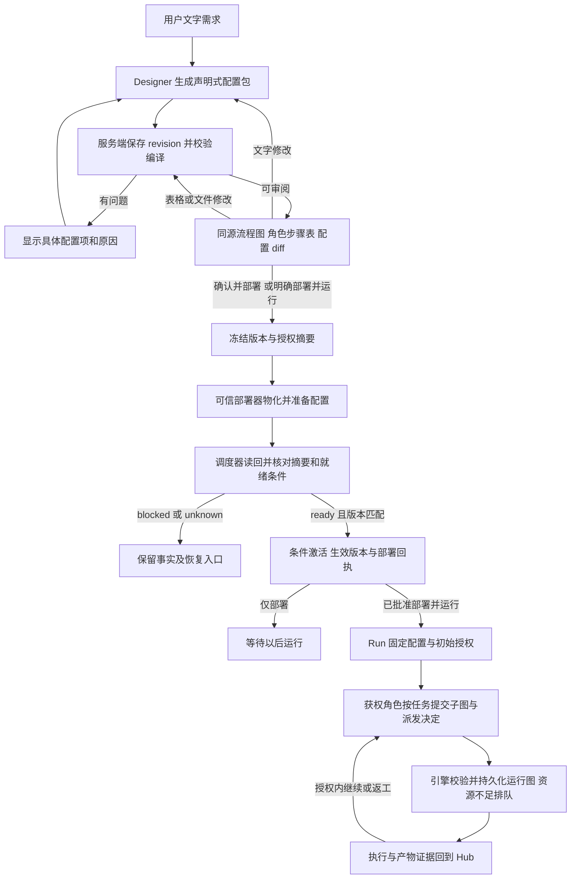

# 对话式 Workflow 设计、配置与部署契约

修订：2026-09-14，工作台 r8。状态：**未来产品契约，尚不代表已实现、验收或部署。** r7 的对话、真实配置、同源图表和 pending/readback/active 规则保留；r8 允许部署的 Workflow 授予角色按实际任务动态拆分与业务调度，详细见 [11](11-role-directed-scheduling.md)。

本契约承接 [可定制角色与 Workflow](09-configurable-workflows.md)，对应活动 PRD 的 FR24/FR25、UX-AC19–22。它将主入口收敛为文字需求、真实配置文件、同源图表确认和真实部署；已有定义 API、表单、运行授权、角色边界与 report/patch/pr 质量门继续适用。

## 1. 用户主路径与 Designer 身份

用户在 Hub 说明“两个研究者比较方案，编辑者整理报告”或“先设计接口，再并行实现，审查后建 PR”。Designer Agent 编写可保存、查看、校验和运行的声明式配置包；服务端编译后显示流程图、角色/步骤表及配置差异。用户可以继续说“把文档编辑放到审查之前”，也可编辑表格；两种动作都产生新的配置版本和预览，随后确认并部署。

Designer 是 Hub 设计模式，可独立选择模型/来源/职责并使用创作预算，也可由 Commander 或其他角色承担/委派。创作身份不自动获得运行调度权；SchedulerGrant 定义有效身份、范围及委派，可明确授予重叠范围并以图 CAS 处理竞争，同一 grant/交接槽位仅当前任期。用户保留授予/扩权及其选定主 Commander 交接决定；Karajan 独占状态和副作用，角色提交真实业务调度。

首次创作从项目内已授权的 Hub 设计会话启动，独立于将要创建的目标 Run；不要求用户先部署一个 Workflow，才能调用 Designer 编写这个 Workflow。创作调用有自己的身份、预算和事实记录，配置草稿不会因此取得目标流程的执行授权。

`design_session_id` 固定本次创作身份、来源和规划预算；每个生成/修订命令另有幂等身份及输入摘要。会话明确约束累计模型调用、输入输出、耗时、自动配置修复次数和基础设施重试；服务端校验失败只在这些已批准界限内返回 Designer 自动修复。新 proposal、重新绘图、重启或来源重试不清零计数；已发送结果未知先核对，不能重复调用。用户后续文字修改沿当前有效余额继续，达到界限则保留草稿/问题并等待新的明确决定，不形成无限“生成→校验失败→生成”循环。

Agent 负责产生配置内容与修改建议。可信配置服务校验、存储和编译；可信部署器物化 pending 包，调度器准备加载并读回就绪后，部署器才条件发布 active 版本供新 Run 使用。Agent 输出“部署完成”、页面出现图表或文件保存成功，都不能替代部署回执。

这里的部署目标是 Karajan Workflow 引擎，不包括安装或部署 CLIProxyAPI、发布网站或修改外部服务。默认不创建定时器、自动触发器或无限重复运行授权；这些需要独立、明确的产品需求与许可。

## 2. 从文字到运行的闭环



部署回执、运行与产物是三种结果。ready 只证明当时配置已加载并就绪；后续准入仍可能排队或阻塞。图中的角色循环仅适用于获准动态调度，并受累计预算/时间/终止规则限制；静态 Workflow 可直接执行已声明步骤，不必调用调度模型。授权内决定无需逐节点人批，超授权才请求用户决定。

## 3. 配置包是实际运行输入

`WorkflowBundle` 是真实配置文件与固定依赖清单的整体。所有内嵌文件和外部定义引用都可追溯；外部引用必须固定 revision/digest，不能在部署时解析成不同的 latest。

拟议配置包包含 `manifest.json`、`workflow.yaml`、`roles/*.yaml`，以及需要固定保存的非秘密说明模板。它们是供未来实现收敛的路径与格式，不表示当前存在解析器；文件路径必须来自受控包布局，禁止绝对路径、路径穿越、任意导入或自由脚本。配置引用 `profile_ref`、网关连接引用、检查配置和 secret_ref，不包含实际密钥、OAuth token 或网关管理凭据。

| 内容 | 最小身份与用途 |
|---|---|
| Manifest | `bundle_id/revision/schema_version`、文件路径及各自 byte digest、固定输入契约/角色/Workflow/执行种类引用 |
| 文件摘要 | 对将被物化的原始文件字节求 hash；服务端先规范化保存格式再提供预览，批准后不再重排或改写 |
| `bundle_digest` | 对规范化 manifest 内容与排序后的文件摘要求 hash；摘要字段自身不参与自引用计算 |
| `compiled_digest` | 参数化初始图、扩展点/调度授权规则、符号输入/契约、输出与定义/compiler revision 的摘要；不含某次 Run 动态子任务，可读图表不是 hash 输入 |
| `input_digest` / `run_plan_digest` | 具体输入及初始实例计划/授权摘要；绑定部署 ID、bundle/compiled digest，不要求预枚举全部后续任务 |
| TaskGraphRevision 摘要链 | 在冻结定义和初始授权内演进的实际运行图，绑定父版本、SchedulerGrant、SchedulingDecision 与 ExpansionSet；不覆盖初始计划/模板或已启动 Attempt |
| 编译结果 | 初始步骤/扩展点、调度角色与可委派范围、来源/参数/产物政策、授权影响及 readiness；无内置 coding Agent 数量限制 |
| 审阅身份 | Project/Conversation、proposal revision、bundle/compiled digest、目标部署槽位及其 expected revision |

配置包在仓库外受管数据根保存不可变版本，遵循路径/链接/权限校验，客户端不能指定任意宿主路径。文件是真实执行定义，编译图是其派生产物；动态运行图可存在，但必须由该定义、有效授权和有回执的 SchedulingDecision 派生，不能另存无来源运行 JSON。

引擎从部署记录校验并加载不可变配置及初始图/扩展规则。编译缓存绑定原包、编译器和摘要；不一致则阻塞。每个 Run 的后续图修订独立持久化，继续/返工读取自己的冻结部署和已接受图，不追逐新 active。

deploy_only 不需要具体业务输入。模板可声明合法的动态扩展点及获准角色/能力/契约，而非以未知角色或执行种类占位。创建 Run 校验输入并形成初始图/授权与摘要；后续子图由获权角色按实际任务提交，不要求预枚举。实例/图摘要不同于模板是正常现象，模板完整性仍按相同包/编译器核验。每个 Run 都需初始授权和实际准入。

## 4. 一份紧凑配置示意

以下为单文件内容示意，真实包由 manifest 固定其字节与相关角色定义；引用均为已登记的版本，不携带秘密。

```yaml
schema_version: workflow.v1
id: compare-options
revision: 3
input_contract: comparison-request@1
delivery_kind: report
roles:
  researcher: role:source-researcher@2
  editor: role:technical-editor@1
bindings:
  researcher: profile:research-default@4
  editor: profile:writing-default@2
steps:
  - id: option-a
    kind: agent_task@1
    role: researcher
    inputs: { topic: requirement.option_a }
    output_contract: sourced-notes@1
  - id: option-b
    kind: agent_task@1
    role: researcher
    inputs: { topic: requirement.option_b }
    output_contract: sourced-notes@1
  - id: comparison
    kind: agent_task@1
    role: editor
    depends_on: [option-a, option-b]
    join: all_required
    inputs: { notes: [option-a.output, option-b.output] }
    output_contract: comparison-report@1
completion:
  required_steps: [option-a, option-b, comparison]
  artifact: comparison.output
```

此例是用户明确选择两份比较输入的静态流程，不是默认人数。Designer 可改为含调度角色/扩展点的配置，在获准范围内按实际问题决定研究子任务数量和依赖；具体命令见 [11](11-role-directed-scheduling.md)。可运行仍需合格能力和有效授权，YAML 本身不证明通过。

## 5. 图、表、文件与文字修改同源

`WorkflowPreview` 是编译器从同一 WorkflowBundle 生成的审阅投影。流程图展示步骤、分支、并行汇合、人工节点、返工边界和完成目标；角色/步骤表展示职责、输入输出、模型来源、工具要求、依赖和必需性。每个图节点与表格行携带 `step_id/role_ref` 及配置定位，例如 `workflow.yaml#/steps/id=comparison/depends_on`，用户可直接查看对应文件片段。

设计文字形成新配置 proposal，表格/文件修改直接回写并确定性编译，无需模型调用；旧预览过期，不准旧画面对应新文件。设计图显示配置及扩展边界；运行图显示引擎接受的 TaskGraphRevision，二者标明来源。运行中角色改图走 SchedulingDecision 的授权/CAS/义务校验，不直接改冻结文件或由前端另建状态。

预览生成不启动 Workflow、不预留执行资源。语法正确但缺配置、能力或部署条件时，仍可查看图表与原因；“可以审阅”与“已经可执行”分别显示。图表中不得隐藏阻塞或把未知来源标为合格。

## 6. 确认、部署与可选运行

`WorkflowDeployment` 记录具体 WorkflowBundle 的物化、调度器准备加载/读回、条件激活与结果；它不是新建 Run，也不是只有模板引用的一条登记记录。

确认绑定包/模板摘要、Project/Conversation、目标槽位 revision 与动作范围。部署并运行另固定具体输入、初始 Plan/执行授权、SchedulerGrant 和累计边界；无需列出未来所有子任务，但必须让用户看到可动态决定/委派的范围。缺业务输入不妨碍 deploy_only，含糊部署不授权未来任意运行。

用户可明确用一句话确认当前完整预览，由 UI/命令服务转换为带当前身份的结构化命令；保存普通聊天文本本身不产生批准。过期或同时存在多个待确认版本时，服务端拒绝猜测目标并返回需确认的具体版本。

一次确认可组合定义登记、物化、实际激活及具体 Run，单独登记不称部署。初始输入/计划/授权被改动时拒绝旧复合命令；Run 启动后由有效授权覆盖的动态图修订自动校验执行，不把正常 SchedulingDecision 当成需要用户重复确认的部署变更。超授权变化才另批。

文件写入、数据库与调度进程之间没有天然原子事务。可信部署器先持久化 intent，在受控临时目录写入并校验完整包，再登记不可变版本。槽位分别记录 pending deployment 和 active revision；以 expected active revision 绑定待部署请求，调度器先准备并加载 pending 包，期间它不接受新 Run，旧 active 仍是生效入口。取得同摘要的加载/就绪回执后，再以条件更新原子发布 active revision 与部署结果；并发槽位变化则拒绝切换。调度器每次接收新 Run 都核对 active revision 与已加载摘要，不能凭内存中曾准备过的包执行。

部署器验证执行种类、配置、扩展/调度授权结构与适用资格，引擎读回同摘要且 active 发布成功才 ready。准备失败保留旧 active，切换未知先核对。旧 Run 固定原定义/初始授权及已启动 Attempt，同时允许在该边界内形成后续图修订；新 active 不重写它们。

readiness 使用有效配置、已存在的资格记录和获准的无消费检查；未明确授权时不自动发起付费探针。缺少必须的真实资格时如实 blocked，不为了给出绿色回执临时消费。ready 记录的是当时加载与能力条件，后续 Run 仍重新执行当前授权、资格、容量与预算准入。

## 7. 回执、幂等与恢复

| 事实/状态 | 用户可见结果与后续行为 |
|---|---|
| `ready` | 回执含 command/deployment ID、Project、槽位 revision、bundle/compiled digest、scheduler 加载身份、时间及 readiness 证据；此时才称部署成功 |
| `blocked / failed` | 显示具体配置项、原因及已完成副作用；未生效登记不称可执行，不自动启动 Run |
| `deploying / unknown` | 展示最后持久步骤和待核对对象；先读回文件、槽位与调度事实，不盲目重做激活或运行 |
| `rolled_back` | 保存被回退版本、目标版本、原因与条件更新回执；新目标通过读回与就绪核验后才重新显示 ready |

相同主体、操作、目标与 Idempotency-Key 的相同载荷返回同一命令结果；同 key 不同载荷拒绝。每个部署命令最多关联一个明确的后续 Run 创建命令，Run 命令独立幂等；部署请求重传不能多开 Run。旧槽位 revision、过期 bundle 或预览摘要不一致时返回冲突，不覆盖更新后的有效版本。

响应丢失时按 command/deployment ID 查询同一结果；重启先恢复 intent、pending/active 与已执行步骤，核对完整文件并重新取得 active 的调度加载事实后才接受新 Run。旧 ready 回执保留为历史，在新进程未读回前显示恢复核对中。重开页面可查看生效配置、原始文件、图表、diff 与回执，不能仅展示最后一次草稿。缺文件、字节变化或编译不一致时阻塞，绝不重新生成“差不多”的配置继续执行。

激活前失败保留原有效版本；激活是否发生不明确时先核对，不直接宣称回退。回滚是绑定目标 revision 和当前槽位 expected revision 的受控命令，重新核验目标文件与 readiness，不能覆盖并发的新部署。回滚只切换未来 Run 的入口，不撤销旧 Run 的执行、消费、产物或 PR；需要取消旧 Run 时按其独立生命周期执行。

## 8. 产品完成与验收

| ID | 验收动作 | 必须取得的可观察结果 |
|---|---|---|
| WD-AC01 文字产出配置 | 在 Hub 要求研究报告流程及一种不同拓扑的 patch 流程 | Designer 生成两个完整、可保存的真实配置包；不是仅图表、说明或固定模板标题 |
| WD-AC02 同源修改 | 用文字改分工，再从表格改依赖，最后编辑配置文件 | 每次产生新 revision；文件、图、表与 diff 可相互定位，全部对应同一编译摘要，旧预览不能批准 |
| WD-AC03 精确部署 | 确认当前版本部署，并提交一次过期确认与重复请求 | 只有当前版本实际物化、经调度器读回核对后激活；过期拒绝，重复返回同一 ready 回执 |
| WD-AC04 真正运行 | 分别部署并执行 WD-AC01 的两个配置 | Run 读取相应文件/bundle/compiled digest，按不同角色与依赖产生所需 report/patch；不是测试中另写固定运行图 |
| WD-AC05 重开与故障 | 刷新、重启、丢弃部署响应，并注入配置缺失或调度加载失败 | 可重新打开真实生效版本；恢复不重复激活/Run，缺口明确 blocked/unknown，不伪称已部署 |
| WD-AC06 一次复合确认 | 分别选择仅部署、部署并运行，并改变一次输入或权限 | 仅部署不启动；复合动作在原明确授权内一次确认完成，变化拒绝旧命令，不扩成未来无限运行许可 |
| WD-AC07 回滚与并发 | 部署新版后回滚，期间存在旧 Run 和一次并发新部署 | 条件更新拒绝覆盖新版本；合法回滚经过读回核验，旧 Run 身份和事实保留 |
| WD-AC08 权限与 PR | 让 Designer 自报部署成功、请求秘密/任意脚本，或删 PR 必需 gate | 模型文本不改变部署状态，越权配置拒绝；PR 仍需同候选机器 checks、独立 Review 与有效交付授权 |
| WD-AC09 参数化模板 | 无业务输入部署模板，再以两组符合契约的不同输入创建 Run | 部署的 bundle/compiled digest 相同，各 Run 的 input/run_plan digest 分别固定；输入变化不覆盖模板或旧批准，非法输入拒绝 |
| WD-AC10 创作循环有界 | 持续产生校验错误，期间重启、创建新 proposal 并丢弃一次生成回执 | 自动修复/调用/耗时/预算累计不清零；未知不重复发送，达到界限保留配置并等待决定，不自动部署 |

C/U 证明文字配置、图表、批准和回执界面；P 证明真实文件物化、调度加载、两个可执行流程及重启恢复；S 另行证明 Designer 与执行角色使用对应真实合格模型完成过程。离线 fixture 可证明其实际覆盖的 C/P，不能冒充真实 Designer 或来源资格；PR 目标还需要相应 G 证据。ready 部署与实际 Run 成功分别记录，任一缺项不算完整产品闭环。

实现可按配置/编译、对话/确认、部署/readback、Run 消费与恢复切片交付，注明各自边界。r8 动态角色调度另按 [RS-AC](11-role-directed-scheduling.md) 验收，不回填旧 WD/P3/已发布证据；设计修订不表示已完成部署、真实调度或新增账户消费授权。
