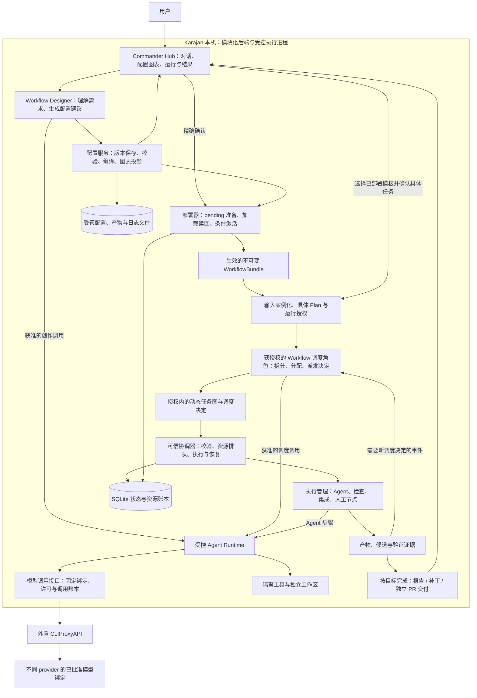
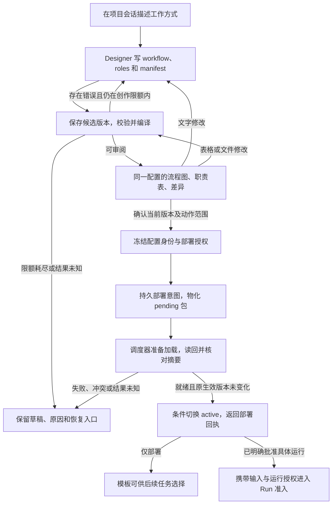
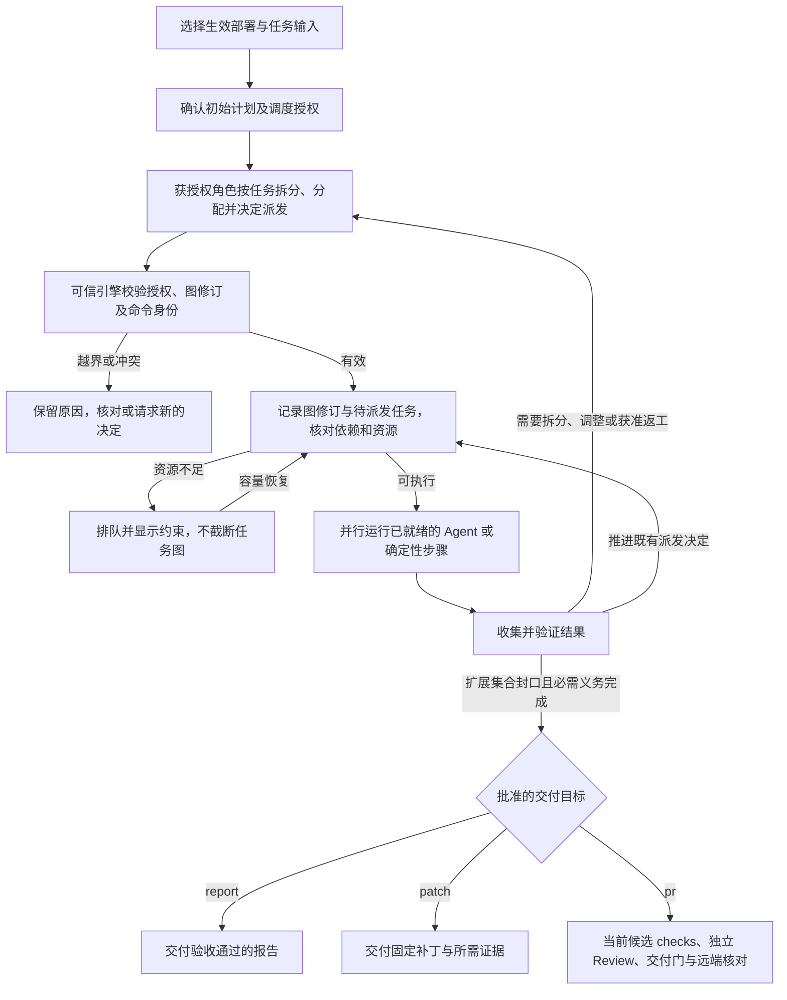

# Karajan 架构与完整流程

修订：2026-09-14 r8，角色驱动调度版。本文是当前架构的解释与导航入口；详细行为和验收由 [工作台 PRD](../prd/commander-workbench.md)、[产品 PRD](../prd/karajan-v1.md) 及下方契约定义。**图中是目标设计，不能据此认定新模块已经实现。** 文档分类见 [文档导航](../README.md)。

Karajan 是个人使用、以仓库项目为上下文的多来源 Agent 工作流平台。用户通过对话定义工作方式、角色及调度权限，审阅同源配置与图表后部署。Workflow 中的 Commander、调度器或其他获授权角色根据实际工作拆分任务、建立依赖、分配执行者并决定并行规模。Karajan 不内置 coding Agent 人数上限，不按固定前后端或三角色流程切分任务；报告、补丁和代码到 PR 使用各自完成条件。

## 1. 总体架构：谁设计、谁执行、谁调用模型

Designer 把人的意图和授权规则写成配置，可信配置服务把文件变成可校验的执行定义。运行中的获授权调度角色负责业务决策，包括任务粒度、职责、依赖、优先级与派发；引擎校验这些决定，在资源可用时机械执行并记录事实。部署器负责哪个配置版本实际生效。Agent Runtime 组织模型响应与工具调用，CLIProxyAPI 承担上游认证、协议转换和允许范围内的转发。

所有模型调用，包括 Designer 创作和调度角色判断，都使用各自已授权的预算、来源与调用记录。任务完成、失败或新输入等有业务意义的事件才需要新判断；测试、校验、资源队列与状态刷新由可信程序完成。图只画默认网关路径；原生 CLI/API 适配器保留为显式兼容 Profile，不是网关失败时的隐式后备。

Karajan 本机采用 Python/FastAPI、React/TypeScript、SQLite 和受管文件存储；执行与交付使用独立进程。图中的模块不要求拆成多个网络服务。详细进程、事务和隔离契约见 [01](01-control-and-state.md)、[03](03-execution-and-delivery.md)、[05](05-build-and-validation.md)。

## 2. 设计与部署：从一句话到生效配置

配置文件是运行依据。流程图与表格由编译器从同一文件版本生成；改一句话、一个表格字段或配置文件，都产生新候选并重新绘图。用户不需要手写 YAML，也不会看到一张与实际执行配置脱节的图。

“部署成功”意味着完整配置已经落盘、被调度器加载核对，并通过版本条件检查切换为生效入口。准备新版本期间旧版本仍可服务新任务；切换只影响之后明确采用该版本的 Run。回执未知时先核对实际状态；回滚也要校验目标版本，不能覆盖并发的新部署。

仅部署允许保留有输入契约的参数化模板，例如先部署“按资料拆分研究任务并汇总”，以后才填写具体材料。一次“部署并运行”可同时确认输入、初始计划和调度授权，不必预先列出所有未来子任务。配置预览展示允许动态扩展的区域，运行视图再展示实际图修订；不能把尚未生成的节点伪装成已确定工作。部署就绪、Run 启动和业务结果通过分别记录；见 [10](10-conversational-workflow-deployment.md) 与 [11](11-role-directed-scheduling.md)。

## 3. 实际运行：授权角色决定拆分与调度

用户可以把任务拆分、子范围委派、依赖调整和派发权授予任意合格角色。授权内决定经校验即可生效，不逐个子任务重新问用户；超出工作范围、来源或预算许可时才形成新授权请求。普通依赖无环，动态扩展集合封口且必需成员完成后才能汇合，不能通过删图绕过承诺的结果与质量门。

Karajan 没有“最多两个/四个 coding Agent”的内置产品限制。角色可按需求产生任意有限规模的任务集；执行时受真实主机/来源能力、用户明确配置的政策与当前资源制约。不足就排队或背压，不能把任务集裁剪成固定 K 个。大任务图可以分页/分批物化；协议单包大小和存储边界不能变成业务总任务数上限。一工作区一个 writer 是避免互相覆盖的局部约束，不限制拥有独立工作区的 Agent 总数。

固定的是部署定义、初始授权和已启动 Attempt；运行任务图可在授权内不断形成 TaskGraphRevision。改派产生新 Attempt，保留旧结果与消费；编辑模板或发出新调度决定不会热改已启动任务。PR 仍要求同候选检查、独立审查及远端权限；报告/补丁按各自标准完成。详见 [角色调度契约](11-role-directed-scheduling.md)。

## 4. 配置定义与运行实例

| 对象 | 解决的问题 | 版本关系 |
|---|---|---|
| RoleDefinition | 谁负责什么、要求何种输入输出、工具约束和完成标准 | 可自定义；角色名不授予权限 |
| WorkflowDefinition / SchedulerGrant | 静态步骤、动态扩展规则及谁可拆分、调整和派发哪些工作 | 定义与初始授权固定；角色名不自带权限 |
| WorkflowBundle / Preview | 保存了哪些真实文件，用户审阅的是哪个执行定义 | 文件与模板编译摘要固定；图表为派生视图 |
| WorkflowDeployment | 哪个配置包已在目标槽位加载并激活 | pending 与 active 分开；回执可恢复 |
| Plan / Run / TaskGraphRevision | 本次输入、初始计划、授权内动态子图及执行过程 | 初始输入/计划摘要与后续图修订分别留存，旧 Attempt 不热改 |
| Task / Attempt | 一份工作与它的每次实际执行 | 重试/改派产生新 Attempt，旧事实保留 |
| Artifact / Candidate / Evidence | 结果是什么，针对哪个确定版本完成了验证 | Candidate 是代码产物的一种，Evidence 不跨版本冒用 |

完整术语见 [CONTEXT.md](../../CONTEXT.md)。保存定义不等于部署，部署不等于创建 Run；运行也不要求额外调用一次 Commander 来重新设计已存在的流程。

## 5. 模块职责与详细契约

| 模块 | 负责的复杂性 | 详细入口 |
|---|---|---|
| Workbench / Hub | 项目会话、命令、同版预览、缩略卡与可恢复详情 | [工作台 PRD](../prd/commander-workbench.md)、[04](04-api-and-workbench.md)、[07](07-commander-workbench-backend-contract.md) |
| Designer / Planning | 文字创作、受预算约束的修订、具体计划建议与交接 | [09](09-configurable-workflows.md)、[10](10-conversational-workflow-deployment.md) |
| Workflow 调度角色 | 按任务作拆分、分工、依赖、优先级、派发及授权内调整决定 | [11](11-role-directed-scheduling.md) |
| Configuration / Deployment | 不可变文件、编译、同源图表、精确确认、加载激活与恢复 | [10](10-conversational-workflow-deployment.md) |
| Coordination / Policy | 校验角色调度决定、唯一业务状态提交、依赖/资源队列、恢复 | [01](01-control-and-state.md)、[02](02-routing-and-quota.md)、[11](11-role-directed-scheduling.md) |
| Capacity / Inference | 多池预算、准入与对账；固定网关绑定和逐次调用许可 | [02](02-routing-and-quota.md)、[08](08-provider-gateway.md) |
| Execution / Artifacts | 受控执行、独立工作区、可信采集与产物/候选证据 | [03](03-execution-and-delivery.md) |
| Delivery | 按产物类型验收；PR 凭据隔离、幂等与远端核对 | [03](03-execution-and-delivery.md)、[09](09-configurable-workflows.md) |

外置网关不替 Karajan 决定业务重试或换源。公开模型别名不足以证明真实账户、计费路径和来源固定；不同来源的预算仍独立保留原生单位。网关隐藏的重试、请求变换、用量与取消语义须按部署版本验收。依据与限制见 [08 网关契约](08-provider-gateway.md) 和 [来源记录](sources.md)。

## 6. 两种流程，使用同一套引擎

| 用户要求 | 配置的角色和依赖 | 完成结果 |
|---|---|---|
| “按提供的材料分工研究并汇总” | 调度角色根据材料产生研究子任务 → 动态汇合 → 编辑汇总；材料数量不由模板固定 | 符合引用/内容契约的报告 |
| “迁移仓库里需要升级的接口并交付 PR” | 调度角色分析耦合与影响范围，决定任务粒度、先后及并行组 → 组合候选 → checks/独立审查 → 交付 | 固定候选、证据和受管 PR |

这些是配置例子，不是两套硬编码引擎。角色职责、模型绑定、依赖和完成目标都进入版本化配置；新增业务角色无须修改引擎代码，但引入一种尚不存在的工具能力或执行种类仍需实现与验收。

旧“两 writer”设计初值由 r8 撤销；两任务并行只保留为原 P3 验收规模。预算和有界返工/重试政策仍按实际批准执行，不转换成隐含 coding Agent 数量限制。PR 独立审查仍适用 T1/T2 新上下文及 T3 不同家族等质量规则；具体见 [03](03-execution-and-delivery.md)。

## 7. 实现顺序与状态边界

在网关、配置/部署闭环中接入 SchedulerGrant、有效调度命令和运行图修订；用不同任务输入证明角色产生不同粒度和规模，并以真实资源背压控制同时执行。再接通候选集成与产物交付。复用已有会话/批准/执行基础，范围与任务依赖以 [当前业务顺序](../planning/business-first.md) 和 [治理矩阵](../planning/design-governance-20260909.md) 为准。

P1–P4 是工程承接顺序，M0–M4/DG 是历史验收映射，均不规定用户 Workflow 的运行拓扑。保留 [A01–A26](05-build-and-validation.md)、原 FR/AC、来源资格和历史失败，按各自范围补齐；新设计不会自动完成旧 Issue。

当前实现已有会话、草稿、规划/批准、资源账本及部分执行和验证基础，新增网关、配置 Designer、通用编译与部署、授权内动态任务调度仍待开发和验收。具体已有行为见 [实现导航](../implementation/README.md)，决定沿革见 [ADR](../adr/README.md) 与 [审阅记录](06-review-and-decisions.md)。个人单机、Web 工作台、Windows/WSL2 的环境边界继续适用；自动合并、多用户权限、多机队列、通用插件市场和任意脚本引擎不在当前范围。
