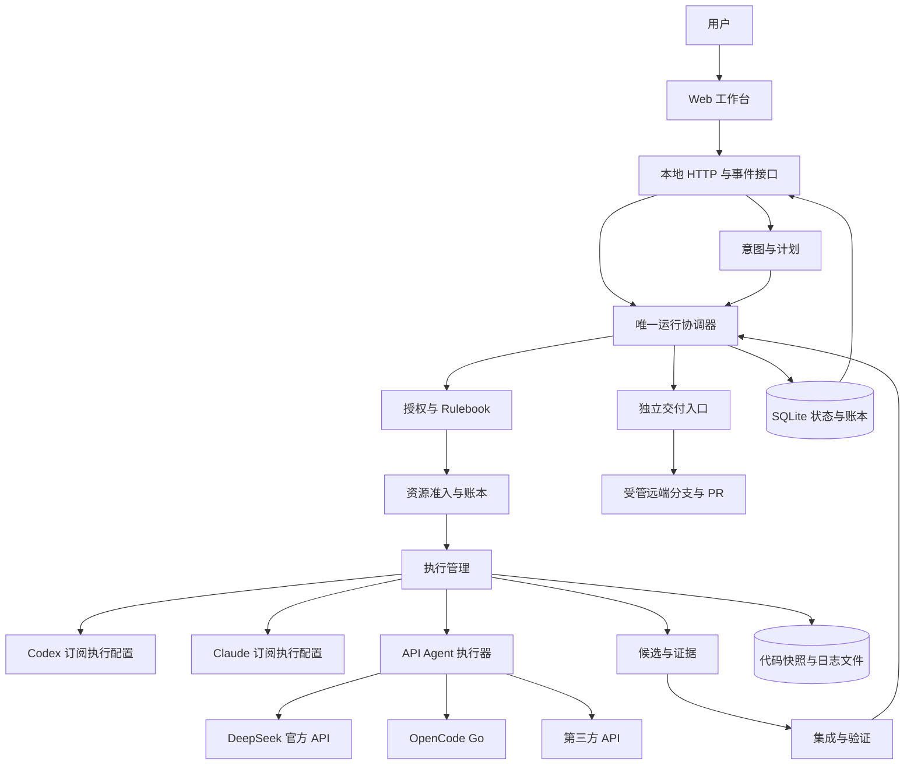

# Karajan Commander Workbench 架构

修订：2026-09-09。状态：**以 [Commander Workbench PRD](../prd/commander-workbench.md) 为当前规格；历史 v1 基线与 A01–A26 保留，真实接口/账户尚未验收。** 逐项决定和修正见 [审阅记录](06-review-and-decisions.md)。

Karajan 是个人使用的多来源 Agent 代码交付平台。用户从仓库会话选择主 Commander 并持续对话；Toil 式 Commander 主导拆解、判断、升级和验收建议。用户编辑任务、角色和模型并批准精确版本后，可信协调器只做硬约束准入、机械调度和状态落盘；Worker、独立 Reviewer 完成代码、检查、审查和 PR，合并由用户决定。

本目录是当前设计依据，收敛并替代 `outputs/` 中两份初步设计草案；原始调研仍作为选型材料。术语的唯一入口是 [CONTEXT.md](../../CONTEXT.md)。

## 1. 设计阅读顺序

| 文档 | 回答的问题 |
|---|---|
| 本文 | 产品边界、架构全貌、关键选择与完整工作样例 |
| [控制、数据与状态](01-control-and-state.md) | 谁拥有状态；实体、状态机、持久化、重启与取消 |
| [Rulebook 与配额](02-routing-and-quota.md) | 如何选模型；多窗口预留、保留量、计费与换源 |
| [执行、验证与交付](03-execution-and-delivery.md) | 不同服务如何工作；隔离、上下文、候选、测试和 PR |
| [接口与 Web 工作台](04-api-and-workbench.md) | 适配接口、HTTP 接口、事件与用户操作 |
| [实施与验收](05-build-and-validation.md) | 技术组合、目录、分阶段交付、故障验收和部署 |
| [来源与未决事实](sources.md) | 哪些是用户决定、官方事实、设计推断和待验证事项 |
| [Rulebook 示例](examples/rulebook.v1.json) | 规则如何表达；示例未绑定真实账户或型号 |
| [资源配置示例](examples/resources.v1.json) | 五类来源、Profile、共享池、保护规则和预算的对象结构 |
| [本轮审阅与决定](06-review-and-decisions.md) | 已确认选择、修正记录、剩余基线及待实测项 |

## 2. 产品边界与已确认默认值

**用户已确定：**个人单机、Web 工作台、已有仓库代码开发、允许复用底座、计划确认后自动到 PR、多来源模型协作、用户自定义 Rulebook、跨服务配额协调。首个真实验收需求能拆成 2–3 个任务。

接入目标包括 ChatGPT 订阅、Claude 订阅、DeepSeek 官方 API、OpenCode Go 订阅和第三方算力 API。一个项目不绑定一个供应商；Commander 的来源不限制 Worker 的来源。

2026-09-05 设计审阅已确认下列策略与可调初值。实际账户、金额和能力仍需接入/实测，不与设计确认混同。

| 事项 | 设计值 | 状态/调整位置 |
|---|---|---|
| 底座职责 | Commander 主导工作流；协调器机械调度；Bernstein 通过受控接口验收后复用 | 2026-09-09，审阅记录 |
| 多 Commander | 一个主 Commander；顾问提交意见；主 Commander 汇总 | 已确认，项目协作规则 |
| 资源目标 | 满足能力下限，保护主 Commander 余量，再平衡配额、费用与速度 | 已确认，资源策略 |
| 自动换源 | 默认不换源；仅用户显式 opt-in 的合格集合可自动替代，且不得扩权/涨价 | 2026-09-09，路由规则 |
| Commander 交接 | 平台准备检查点和候选交接方案，每次换人由用户决定 | 已确认，协作规则 |
| 本机执行环境 | 接受 Windows＋WSL2，必要时使用容器；具体路径先验收 | 已确认，部署配置 |
| 并行写入 | 单项目最多 2 个独立 writer，每个独占工作区 | 已确认，可调初值 |
| 质量修复 | 每 Run 最多 2 轮；每根任务最多 2 次基础设施重试，均计入总预算 | 已确认，可调初值 |
| Reviewer | 每个 PR 必须独立 Review；T1/T2 可同型号新上下文；T3 不同家族，无合格者等待 | 已确认，质量规则 |
| 计费 | 现金默认要求可约束上限；订阅允许保守估算；未填写现金预算不启用现金调用 | 已确认，资源设置 |

具体模型 ID、订阅档位、第三方厂商、金额、保留量、目标仓库/分支、测试命令属于接入配置。未填写配置阻止相应执行，不阻止架构设计。示例配置不表示购买、授权新服务或执行模型调用。

首版不纳入自动 merge、多用户权限体系、多机队列、通用插件市场、自学习路由和可视化工作流编程。配置矩阵与配额协调属于首版核心。

## 3. 总体架构

Commander、Worker、Reviewer 都通过执行管理调用；图中的“意图与计划”也走统一路由和资源准入。测试与 Git 集成属于确定性任务，不需要为了运行命令再调用一个模型。

v1 采用模块化 Python/FastAPI 后端、React/TypeScript Web 前端、SQLite，以及独立执行进程和交付进程。后端承载唯一协调器；长时间模型调用和测试不会占住数据库事务。不同职责模块共享明确的领域对象，不能相互直接修改对方负责的表。

## 4. 最重要的架构决定

### 4.1 Commander 主导，程序机械调度

Commander 负责澄清意图、设计接口、拆任务、提出角色/模型绑定、解释失败和验收建议。它不直接创建有权限的子进程、不改预算或凭据。可信程序不构成第二个模型主控：它只校验批准版本、依赖图、项目风险下限、授权和预算，并机械启动/暂停/核对 Attempt。

用户确认的是计划版本、显式角色/Profile 绑定和授权范围。显式绑定优先于 Rulebook；只有批准版本开启高级 opt-in 时，平台才可在给定集合内替代。范围、来源、计费路径、成本或权限扩大必须重新确认。

### 4.2 一个任务可以换执行者，一个 Attempt 固定配置

`Execution Profile = 模型 + 调用通道 + 账户 + 执行器 + 原生设置 + 已验证能力`。

同名模型经官方 API、Go 或第三方服务访问，是不同 Profile。角色不是模型品牌；能力分类不是厂商的 `high/xhigh` 字符串。换源创建新 Attempt，并携带平台交接包，不假定能搬运供应商私有会话。

### 4.3 受控底座，避免两套模型主控

**Commander 拥有需求级拆解、判断和验收建议；Karajan 协调器拥有批准版本、Attempt 有效性、预算与交付状态。执行器拥有它能观察到的进程、会话和模型调用事实。** 执行器的完成事件是输入，不能直接把业务任务标记成功或创建 PR。

这比初稿“底座拥有整个任务图”更收敛：最新核查表明 Bernstein 普通 plugin hooks 并不是通用的强制阻断点，部分路由设置还存在适配器差异。因此不把严格 Rulebook 建立在未经证明的插件拦截上。[集成依据](sources.md#bernstein)

首个可实现路径采用 Codex、Claude 和 API Agent 的具体执行适配器。Bernstein 保留为优先核验的复用候选，只有能以受控执行模式满足统一接口时才接入；不同时启用其自治任务图、路由和远端交付。这个选择与原因记录在 [ADR 0001](../adr/0001-single-coordinator.md)。

### 4.4 配额是多种约束，不能合并成一个余额

一次调用可能同时受账户共享池、模型池、5 小时/周/月窗口、并发限制和现金预算约束。每种资源保留原生单位。预留原子地约束 Karajan 自身；无法锁住用户在官方客户端的手动消费。

对外明确区分已报告、估算、未知。不能精确观测的订阅额度可以做保守分配，不能承诺精确剩余任务数。不能逐次限定开销的执行器不能宣称提供严格现金硬上限。

### 4.5 代码产物、检查结论和远端副作用分别管理

Worker 产出候选；验证绑定确定候选；交付入口只接受当前候选的有效证据。模型说“完成”不等于测试通过，测试通过不等于 PR 创建成功。交付凭据不进入项目代码和测试环境。

## 5. 职责模块与最小公开接口

| 模块 | 负责的复杂性 | 主要接口 |
|---|---|---|
| Planning | 意图、版本化计划、主 Commander 任期、反馈与交接 | `propose_plan`、`revise_plan` |
| Policy | 范围/风险校验、能力匹配、授权与撤销 | `compile_plan`、`evaluate_route` |
| Capacity | 多池观察、预算、原子预留、消费对账 | `admit`、`settle`、`observe` |
| Coordination | 依赖推进、业务状态、有效 Attempt、暂停/取消/重试 | `handle_command`、`handle_event` |
| Execution | 固定配置启动、工具运行控制、进程查询和停止 | `prepare`、`start`、`inspect`、`cancel` |
| Artifacts | 工作区、不可变候选、交接包和证据关系 | `capture`、`integrate`、`record_evidence` |
| Delivery | 交付门、受管分支、PR 幂等与远端核对 | `publish`、`reconcile` |
| Workbench | 用户命令、可恢复状态视图、路由解释 | HTTP commands、snapshot、events |

这些接口的失败语义及输入契约见后续文档。首版不把每个模块拆成网络服务；执行器差异集中在适配器，不能散落进 Rulebook 或 Web 页面。

## 6. 完整工作样例

需求：给已有应用增加 CSV 导出。此处仅是设计示例。

1. 用户选择仓库、验收标准和规划预算。入口规则选一个高级 Commander；需要时在预算内调用顾问。两者都经过资源准入。
2. Commander 明确字段与 API 契约，形成后端导出、前端按钮两个实现任务和最终验证任务。缺失产品决定保持 T0，解决后才形成可派发简报。
3. 平台校验任务图和修改范围，计算允许配置、费用估计与可约束上限、检查项目和 PR 权限。用户确认具体版本。
4. Worker A 经 DeepSeek 官方 API 实现导出，Worker B 经 Go 实现前端，各自使用受管独立工作区。平台原子预留各自相关池，不让它们挤占配置的 Commander 余量。
5. B 命中明确配额耗尽。平台暂停并核对旧尝试和消耗；只有用户已在此版本明确允许的替代集合可创建新 Attempt，否则在会话中提出改派并等待批准。
6. 平台冻结 A、B 的任务候选，串行集成，执行可信检查。Reviewer 从独立上下文读取最终候选、验收要求和证据，不承接作者的私有会话。
7. 若审查发现字段转义缺陷，协调器创建有界修复任务；新代码形成新候选并重新取得必需证据。超出原需求则返回计划变更。
8. 交付入口检查候选、证据、授权、远端基准和取消状态，生成受管提交、push、创建 PR。请求超时先查询真实结果，不能重复创建另一条 PR。
9. Web 展示 PR、证据、每次选路原因，以及已知与未结算费用。远端 CI 是否完成单独显示；用户决定合并。

## 7. 实施顺序

当前首演先做开仓库选 Commander 的持续会话、可编辑显式分工、批准后的两个 Worker 真并行、组合 checks/review 与同一 PR；广来源、复杂规则 UI、自动替代和恢复随后扩展。全部来源仍须通过相同能力验收，不能把“支持一种请求协议”写成“可以承担所有 Agent 角色”。

旧 M1/M2 等里程碑及其逐项通过标准只保留为历史范围与 A01–A26 映射，见 [实施与验收](05-build-and-validation.md)；它们不覆盖当前 PRD 的路线。架构文档完成不意味着 Bernstein、实际订阅额度、Windows 隔离或付费上限已经验证。
