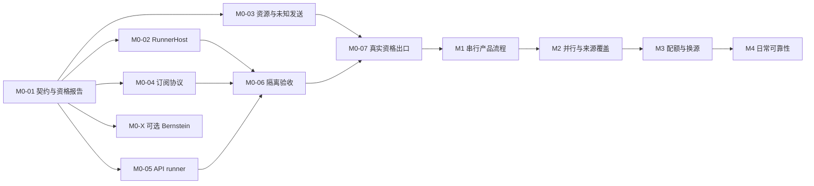

# Karajan v1 实施路线图

日期：2026-09-05。依据：[PRD v1](../prd/karajan-v1.md)、[已确认架构](../architecture/README.md)和[实施与验收矩阵](../architecture/05-build-and-validation.md)。

已发布 [PRD 父任务 #1](https://github.com/zhouy1017/Karajan/issues/1) 与 8 个 M0 Issues，并核对原生子任务关系和 10 条阻塞依赖。尚未实施平台、安装执行环境或进行真实订阅/API 测试；本文中的验收都是待执行标准。M0-01 等是规格标识，#2 等是实际 GitHub 编号。

## 1. 路线与完成语义

先证明一个订阅端和一个 API 端能按统一契约受控执行，再构建需求到 PR 的产品流程。Karajan 始终拥有唯一业务协调器；探针复用真实执行器，但不同时启用另一个平台的自治任务图、选路、业务重试或交付。

M0 建立有界探针、脚本化假 provider、测试进程和最小资源记录，不要求完整 Web、完整 DAG 平台、全部来源接通或真实 GitHub PR。M1–M4 暂保留阶段范围，等前置接口和计量事实明确后再拆成适合独立上下文完成的任务。

必须分别记录两种状态：

- **任务工作完成：**探针可重复运行，问题已调查，证据与结论完整。结论为 failed 或 unsupported 的研究任务也可以关闭。
- **能力或阶段通过：**对应必需行为在指定版本、账户形态、操作系统与隔离环境中得到证据。关闭探针 Issue 不会自动把能力标为 passed，也不会自动放行后续阶段。

假环境的通过只证明所覆盖的协议行为。真实来源缺少登录、预算或隔离证据时保持 not_run；unsupported 不计为 passed。Axx 是完整产品验收编号，M0 只覆盖其中明确列出的原语或路径，不能据此宣称完整 Axx 已通过。

## 2. M0 依赖图

主线依赖是 `01 → 02/03/04/05`、`02+04+05 → 06`、`03+06 → 07`。M0-X 只依赖 M0-01，不是 M0-07 或 M1 的前置条件。M0-06 的两个执行环境可以分别调查，但主线出口必须有一个合格订阅路径和一个合格 API 路径。

这里的阶段箭头表示退出门的依赖，不禁止后续工作提前做独立设计或基于假环境开发；不能提前宣称阶段完成，也不能让尚未验收的真实来源开始自主执行。

## 3. M0 可执行任务

具体范围、fixture 和验收标准见各任务文档；下表只保留产物、依赖与覆盖摘要。

| 标识 / GitHub | 有界产物 | 必需前置 | 无实账号可完成的范围 | 验收关联 |
|---|---|---|---|---|
| [M0-01](m0/issues/01-contract.md) / [#2](https://github.com/zhouy1017/Karajan/issues/2) | 契约验证器、固定 fixture、资格报告格式 | 无 | 全部 | 为 M0 各项提供证据格式，不单独宣称通过 Axx |
| [M0-02](m0/issues/02-runnerhost.md) / [#3](https://github.com/zhouy1017/Karajan/issues/3) | 本机启动、取消、重连与不确定窗口探针 | M0-01 | 全部，使用真实测试进程 | A09、A10 的执行原语 |
| [M0-03](m0/issues/03-budget-broker.md) / [#4](https://github.com/zhouy1017/Karajan/issues/4) | 单 Attempt 资源切片、窄 broker、假 provider | M0-01 | 全部 | A19、A26 的计量与发送子集 |
| [M0-04](m0/issues/04-subscription.md) / [#5](https://github.com/zhouy1017/Karajan/issues/5) | 一个订阅端的协议探针与候选能力描述 | M0-01 | schema/版本检查、协议回放、权限竞态 | A12、A23 的协议子集 |
| [M0-05](m0/issues/05-api-runner.md) / [#6](https://github.com/zhouy1017/Karajan/issues/6) | 固定 API runner 到假 provider 的请求/工具循环 | M0-01 | 全部，限定无秘密测试输入 | A12、A26 的 runtime 子集 |
| [M0-06](m0/issues/06-isolation.md) / [#7](https://github.com/zhouy1017/Karajan/issues/7) | 订阅/API 两条选定路径的隔离与凭据 canary | M0-02、04、05 | 假秘密、本地端点、测试进程；真实工具覆盖不足则记 not_run | A13、A14；A10 的隔离子集 |
| [M0-07](m0/issues/07-live-exit.md) / [#8](https://github.com/zhouy1017/Karajan/issues/8) | 一个真实订阅端＋一个真实 API 端的组合资格报告 | M0-03、06 | 组合脚本及 dry-run；不能替代真实出口 | 合成上述 M0 子集，不替代完整产品用例 |
| [M0-X](m0/issues/08-bernstein-optional.md) / [#9](https://github.com/zhouy1017/Karajan/issues/9) | 固定 Bernstein 的单 Attempt seam 结论 | M0-01 | 源码、假 adapter、假 provider | B1–B8 已覆盖部分逐项记录；可选 |

## 4. M0 出口检查

M0 主线完成需要以下事实同时成立，而不是只检查七个 Issue 是否关闭：

1. 共用契约、资格报告和假环境故障探针可重复运行，结果与覆盖范围明确。
2. 一个订阅端和一个 API 端在固定版本、真实认证及指定隔离环境中通过必需启动、配置、取消、核对与工具约束。
3. 最小资源记录和发送不确定性协议经假故障及真实组合路径验证；未知订阅消费按能力报告。
4. 所有 M0 必需项有 passed 证据，或通过替代合格路径解决；not_run/unsupported 不被当作成功。
5. M1 的实际启用 Profile、接口限制、候选底座采用决定和未完成来源清单已记录。

M0 不要求 A01–A26 全通过。A09/A10 的完整业务竞态、A12/A13 的其余来源、A19/A26 的多池产品集成，以及其他产品用例仍须在后续阶段验收。

## 5. M1–M4 阶段范围与后续拆分

M1 从第一次真实模型调用起就必须使用合格 Profile、固定且获批的规则/来源集合、原币硬预算、明确有界的 unknown 处理和必需权限隔离；这些不等待 M3。规划与顾问调用也经过相应准入。M1 同时提供最小可操作的人工 Commander 交接：用户能查看当前提案的检查点、指定候选与资源影响，并确认或拒绝；未确认不启动替任，旧 term 或失效提案的迟到确认被拒绝。每一次换人均由用户决定，不依赖新决定的已批任务可继续。

M3 完善的是规则编辑/模拟、配额平衡、自动 Worker/Reviewer 换源和完整交接工作台。M1 可以采用较少的固定配置和简洁交接界面，但不能缺少查看并决定当前提案的操作，也不能削弱上述执行底线，或用“稍后完善资源功能”放行无边界消费。

| 阶段 | 用户可观察范围 | 阶段验收门 | 何时细化 |
|---|---|---|---|
| M1 第一条串行产品流程 | 薄 Web 登记项目、规划与批准、固定矩阵/来源集合、原币硬预算及有界未知处理、跨来源串行实现、检查/独立审查、同一 PR；提供最小可操作的人工 Commander 交接 | A01 的串行部分；A11、A15、A16、A17、A20、A22 的对应路径；PRD-AC01/02/04/05/06。实际调用必须具备资格/隔离和预算边界；失败检查、旧计划、未知发布不能误放行；交接覆盖不答复、拒绝、有效确认及迟到确认，未确认不启动替任 | M0-07 明确接口和真实 Profile 后，按“用户输入→业务状态→产物/PR”纵向拆票 |
| M2 并行与来源覆盖 | 2–3 个任务独立执行、串行集成与重新验证；其余选定来源逐一接入 | 完整 A01/A02；A12/A13 对新增 Profile/OS 重跑；A16/A22 的并行与计划修订组合路径。组合候选必须重新取得必需证据 | M1 的单任务候选、验证和交付契约稳定后，按并行流程及每个新增来源分别拆票 |
| M3 配额、换源与规则产品化 | 共享多窗口池、主 Commander 保护量、外部用量、未知模式、规则编辑/模拟、自动 Worker/Reviewer 换源；完成人工 Commander 交接工作台 | A03–A08、A11、A18/A19、A24–A26；PRD-AC03/04。换源或 repair Task 不重置根链上限；新增 Run 规则不能绕过当前 CapacityPolicy | 已接入来源的计量/价格事实明确后，按独立资源规则、故障行为与用户决定路径拆票 |
| M4 日常可靠性 | 完整平台崩溃恢复、取消与发布竞态、历史备份恢复、升级和保留策略 | 在完整产品中重跑 A09/A10/A17/A20/A23，完成 A21；核对 A01–A26 与 PRD-AC01–06 的适用用例均有实际证据，并进行真实连续运行复盘 | 故障 fixture 从 M0 持续积累；待 M1–M3 有真实业务路径后拆跨模块故障与维护票据 |

各阶段细化时把 Axx/PRD-AC 的具体输入、可观察结果、证据和剩余覆盖范围写入对应任务。一个纯账本单元测试或协议回放不能替代整个产品场景。M4 是整体验收门，不是把必要的启动安全、取消或交付核对延后到最后才实现。

M1 的 PR 核对、M2 的候选集成、M3 的确定性资源规则可以在接口明确后并行工作。未通过资格的来源保持不可启用；其失败不能悄悄缩减五类来源的 v1 目标，需明确未完成项或通过变更流程调整范围。

## 6. 输入缺口与真实测试前置条件

| 输入或事实 | 由谁提供/如何确定 | 阻塞范围 |
|---|---|---|
| 固定 Python、数据库、CLI/runtime、协议 schema 版本 | 实现任务核对可用版本并保存 lock/manifest | 相应真实探针；不阻塞使用样例开展契约工作 |
| 一个优先订阅端、订阅档位及官方登录 | 用户选择已有账户，通过官方支持的登录方式接入 | M0-07 真实订阅资格；不阻塞 M0-04 协议回放 |
| 一个优先 API 通道、实际 endpoint/model 与密钥引用 | 用户指定通道，官方协议核对；密钥保存受限存储 | M0-07 真实 API 资格；不阻塞假 provider |
| 探针允许的订阅占用、原币现金限额、请求/时间/输出上限 | 用户填写测试配置；程序验收上限能否兑现 | 所有真实消费；未填不视为无限额度 |
| 认证与计费优先级、价格版本、额外余额/现金路径 | 固定 Profile 并核对实际接入语义 | 对应 Profile；价格/收费路径未知不能放行硬预算请求 |
| native/WSL2/容器路径、进程控制、隔离与 IPC | 在目标机器做 M0-02/06，逐工具留证 | 自主工具资格；安装存在不代表隔离已通过 |
| 无生产秘密的测试仓库、可信 base、允许文件和检查命令 | 用户指定或在获准测试目录创建明确 fixture | M0-06/07；不能替代后续真实需求验收 |
| 首个真实产品需求、仓库/分支与到 PR 权限 | 用户确定实际基准与具体授权 | M1 及 A01；不阻塞 M0 的本地候选探针 |
| GitHub 交付身份、受管分支与 PR 核对配置 | 交付任务按独立权限域配置并验收 | M1 真实交付；M0 不需要生产远端写凭据 |
| 其余订阅/Go/第三方厂商、型号与账户 | 用户逐项配置，沿同一资格标准验收 | M2 对应来源，不阻塞已选 M0 双来源路径 |

真实测试启动前必须拥有具体版本、Profile、官方登录或 API secret_ref、明确预算和时间上限、允许输入/工具范围、隔离方案及证据保存位置。凭据和原始认证材料不写进 PRD、Issue、Rulebook、资格报告或导出日志。生产仓库、生产秘密或新的收费通道不会因本路线图发布而自动获得测试授权。

## 7. 跟踪与变更

PRD #1 是父级需求，M0 的 8 个 Issue 均通过原生子任务关系关联；正文保留 Parent 与 Blocked by 链接。全部已标记 ready-for-agent，表示规格完整，执行仍须满足依赖和配置。发布编号与关系核验见 [发布清单](m0/github-publication.json)，任务状态以 GitHub 为准。M1–M4 当前只有阶段范围，前置结果到位后再创建具体实现任务。

每次 runtime、操作系统、认证方式、计费通道或关键工具边界变化，相关资格需重新验收。范围或用户行为变化更新 PRD 和设计决定；探针发现事实差异则先记录限制与影响，再决定替换适配器或修改接口。发布规划、关闭调查任务、能力通过和 v1 完成是四个不同事实。
