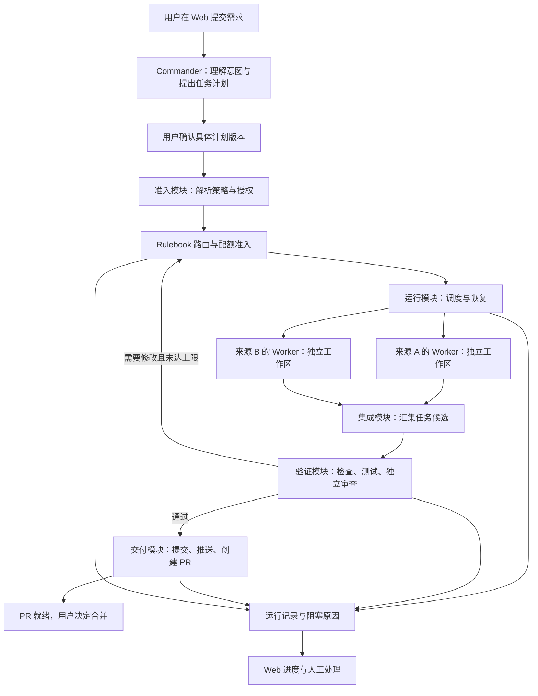

# Karajan：从需求到 PR 的第一版设计草案

> 本文保留前期访谈与设计过程。2026-09-05 的 [完整架构设计 v1](../docs/architecture/README.md) 已成为当前依据，尤其收敛了唯一业务协调器、执行器能力分级和交付契约；下文旧的状态所有权建议不再作为实现规范。

日期：2026-09-05。状态：已纳入多来源接入、Commander、Rulebook 与配额分配要求；架构、默认参数和里程碑为设计建议，尚未成为实现规格。

依据：[底座调研报告](toil-like-heavy-framework-report.md)。术语见 [CONTEXT.md](../CONTEXT.md)。

模型接入、规则矩阵与资源分配的详细设计见 [多来源路由与配额设计](karajan-routing-and-quota-design.md)。该文是这些主题的当前设计依据，并已纳入对 ai7-harness 本地 `dev` dispatch runbook 的原则提取与适配。

## 1. 已确定的产品目标

> 我在 Web 工作台提交已有仓库中的一个小功能，查看并确认任务计划；平台组织多个 Agent 完成实现、测试和独立审查，最后交付 PR。是否合并由我决定。

| 决定 | 用户已确认的选择 |
|---|---|
| 首要场景 | 代码开发：需求到 PR |
| 使用者与部署 | 个人使用，先在一台机器运行 |
| 自有与复用 | 自己定义产品和规则，允许复用现成运行底座 |
| 人工介入 | 先确认计划，随后自动推进到 PR；合并由用户决定 |
| 首个验收任务 | 已有仓库中验收标准明确、可拆成 2–3 个子任务的小功能 |
| 操作入口 | 简洁 Web 工作台：提交需求、看计划、看进度、处理阻塞、打开 PR |
| 模型来源 | 初步计划接入 ChatGPT/Claude 订阅、DeepSeek 官方 API、OpenCode Go 订阅与第三方算力 API |
| 协作模式 | 一个或多个高级 Commander 负责意图与设计，向 Worker/Reviewer 派发任务 |
| 资源分配 | 用户配置 Rulebook，按任务难度等条件选模，并协调不同服务的配额 |

第一版的成功标准是稳定完成这条流程，并在失败时给出可理解、可恢复的状态。Agent 数量和适配器数量属于实现手段。

## 2. 如何使用原报告

保留报告的三项设计依据：复用运行底座；自有策略集中在独立扩展层；通过真实故障验收判断底座能否采用。

调整报告的实施范围：第一版覆盖到 PR，并将多来源协作、基础 Rulebook、可解释路由和配额协调列为核心。完整自动 merge、merge queue、多机调度、多租户和签名证据体系可随产品需要增加。

Bernstein 是首选资格测试对象。官方当前 README 声明它采用确定性调度、支持隔离工作区及验证流程，同时仍处于 beta，小版本可能改变接口，应固定版本。[官方 README](https://github.com/sipyourdrink-ltd/bernstein)

原报告记录的基线为 `3.19.1 / 3596346879c3ea26505273248eaa240aa7342c69`。本轮没有重新取得该提交的完整材料，也没有运行资格测试；当前文档不能证明该固定版本满足全部要求。复用方案必须通过第 7 节的验收后才正式确定。

报告中三个概念需要收紧：

- **规划与授权分开。** 模型提出任务计划和权限需求；受信任程序根据项目策略与用户确认计算实际权限。授权摘要绑定记录，执行环境与交付入口负责真正限制操作。
- **执行与交付分开。** `apply` 是可选本地交付路径，不能当作 commit、push、PR 的必经前置状态。第一版只实现“受管分支 → PR”路径。
- **调度确定性有明确范围。** 相同已接受计划和事件应得到一致的调度决策；模型重新生成计划、代码或 review 不保证相同结果。

## 3. 先画完整流程，再划分模块

这些是职责模块。单机首版可放在一个后端应用中；Agent 以隔离的子进程或工作环境执行。具体隔离方式由资格测试确定。图中所有模型执行，包括独立 Reviewer、修复与重试，都经过统一的 Rulebook 与配额准入；Commander 规划调用使用预先设置的规划规则与预算。

| 模块 | 对外职责与关键约束 | 复用与自有建议 |
|---|---|---|
| 需求与规划 | 把需求转成有版本的任务图、修改范围、预算和验收标准 | 自有产品契约；规划可调用 Agent |
| 策略与准入 | 接受或拒绝计划，产生执行授权，返回清晰原因 | 自有规则；与运行底座的实际权限机制衔接 |
| 路由与配额 | 执行用户 Rulebook，选择模型与通道，预留资源，解释选择与换源原因 | 自有核心；运行底座必须在派发前接受此准入决定 |
| 运行 | 启动、观察、暂停派发、取消、恢复；管理任务依赖和执行尝试 | 优先复用 Bernstein；通过其实际接口完成控制 |
| 候选与验证 | 提取确定版本变更、集成任务结果、运行检查并绑定证据 | 复用工作区与 gate；自有候选和验收契约 |
| 交付 | 检查授权及证据，幂等推进到 PR，处理未知远端结果 | 自有统一入口；底层 Git 与托管平台操作可复用 |
| Web 与运行视图 | 展示阶段、产物、阻塞原因，接收用户决定 | 自有薄版工作台；任务状态读取运行模块 |

实现时先接通具体需要的接口。保留自有需求、计划与候选语义，避免把 Bernstein 的全部配置和数据结构直接变成 Web 产品契约。

**各类状态有明确的权威来源。** Karajan 拥有规则、模型选择和本地配额预留；运行底座拥有任务依赖、执行生命周期与恢复；服务商报告其实际计量状态。派发必须取得有效资源预留并绑定执行配置。自有记录关联底座 run/task/attempt ID，Web 展示这些记录的视图。底座内置自动路由、子 Agent 派发和 fallback 必须服从相同规则，避免出现两套相互竞争的选模逻辑。

## 4. 一次真实工作如何经过系统

示例：给一个已有 Web 项目增加 CSV 导出能力。实际验收仓库与需求尚未选择。

1. 用户提供目标、验收标准、允许修改的范围。系统记录仓库身份和基准提交。
2. Commander 先明确导出字段和接口约定，提出“后端导出”“前端入口”“集成验收”三个任务及依赖。每个可派发任务形成版本化简报，说明目标、修改范围、验收标准和停止条件；未决事项先留在设计流程。无法独立修改的工作顺序执行。
3. Web 展示计划、修改范围、验收命令、预算上限、Rulebook 版本、允许的模型/通道与换源范围，以及自动交付到 PR 的权限。用户确认后，系统保存具体计划版本和授权范围。
4. 依赖满足后，Rulebook 按角色、难度、风险与能力要求选出合格执行配置，配额模块批准资源预留，运行模块再派发。建议最多两个 writer 并行，可来自不同服务；每个使用独立工作区和明确的交接产物。
5. 平台提取各任务候选，检查路径范围，并在受管集成工作区汇集变更。路径互不重叠只能降低冲突概率，不能证明组合行为正确。
6. 对集成候选执行可信的测试、类型检查或 lint，并让使用新鲜上下文的独立 reviewer 审查最终变更。
7. 检查失败则生成明确修改任务；建议自动修复最多两轮。每次变更产生新候选，重新验证受影响的结果；最终交付只接受当前候选的完整必需证据。
8. 交付模块在授权范围内 commit、push，并创建或更新同一个 PR。其凭据不进入 writer、reviewer 或项目测试进程。
9. Web 显示 PR 链接、测试和审查证据。PR 已创建与远端 CI 已通过分别展示；用户在托管平台决定是否合并。

计划确认后，范围内的既定动作自动执行。增加目录权限、提高预算、改变目标仓库或扩大需求时形成新计划版本，再取得对应确认；普通重试沿用仍然有效的原授权。

## 5. 必须先说清楚的运行语义

| 情况 | 建议的首版行为 |
|---|---|
| 依赖未完成 | 任务等待；前置失败时显示原因，不把“当前无任务可执行”当作运行完成 |
| 模型限额耗尽 | 执行 Rulebook 允许的换源或等待策略；没有合格目标时阻塞受影响任务，其他独立任务可继续 |
| 用户暂停 | 暂停新任务派发；正在执行的任务显示“进行中”，不声称已经冻结 |
| 用户取消 | 请求终止相关进程树；确认退出后标记已取消。终止不确定时阻止集成和交付 |
| Agent 超时或退出异常 | 当前 attempt 记录失败；在重试限额内创建新 attempt，保留历史结果 |
| 后端崩溃 | 恢复后先核对存活进程、底座记录和已有副作用，再决定接续或重试 |
| 旧 Agent 迟到返回 | 根据当前 attempt/有效执行权校验，过期结果不能覆盖新结果或推进交付 |
| 候选在验证后发生变化 | 旧证据不能授权新候选；创建新版本并重跑所需检查 |
| 集成基准或 PR head 改变 | 标记结果需要重新验证；未经核对不覆盖远端变更 |
| push 或 PR 请求超时 | 标记交付结果未知，先查询分支 SHA 和现有 PR，核对后继续 |
| 用户修改计划 | 保存新版本并重新评估受影响任务；已在运行的旧任务明确取消或允许收尾 |

设计时分别记录：

- **执行进度**：等待、运行、验证、成功、失败或取消。
- **阻塞原因**：等待计划确认、配额、权限变化或人工处理。
- **交付结果**：尚未交付、提交完成、推送完成、PR 已创建、失败或结果未知。

这三者通过规则关联。任务执行成功不直接表示 PR 已创建，暂停派发也不直接表示所有进程已停止。

上下文采用任务说明、版本化代码基准、依赖产物和结果摘要交接；原始会话按需查看。审查者读取验收标准、最终候选和检查证据，使用独立上下文作判断。

## 6. Web 首版：工作流页面与资源设置

| 页面 | 用户要完成的事 | 必须能看见的信息 |
|---|---|---|
| 项目与需求 | 选择已登记仓库，提交小功能 | 目标、验收标准、约束 |
| 计划确认 | 修改或确认拆分方案 | 任务依赖、修改范围、检查项、预算、Rulebook 版本与换源范围、到 PR 的权限 |
| 运行详情 | 理解进度，暂停派发、取消或处理阻塞 | 各任务状态、当前执行者、候选版本、已知费用与费用是否完整、失败原因 |
| 交付结果 | 检查产物并打开 PR | 最终 diff、测试及 review 结果、PR 链接、远端 CI 状态 |
| 资源与 Rulebook 设置 | 登记服务来源、配置角色矩阵和配额策略 | 模型与通道、能力、配额窗口、已报告/估算/未知标记、规则模拟结果 |

需要人工处理时展示具体原因和有效动作，例如“提高预算”“调整计划”“恢复运行”。每个任务能查看“为什么选择这个模型与服务”，运行视图显示配额压力及换源原因。后端重启后页面能重新读到同一运行。流式日志是辅助信息，运行状态来自持久化记录。

## 7. 底座资格测试应围绕这个产品范围

先用一个受控仓库验证至少两种真实接入形态：一个订阅 Agent 执行器与一个 API 模型执行器，证明同项目协作及受控换源。再逐一对其他计划使用的来源执行相同能力验收。完整接入目标包含全部已选来源，阶段样例不代表其他来源从需求中删除。

| 资格问题 | 可以采用的证据 | 不通过时的处理 |
|---|---|---|
| 在目标机器上执行和取消是否可靠 | 真正启动任务并终止其进程树，重启后状态可核对 | 更换受支持执行路径或先解决底座缺陷 |
| 关键规则能否在所有启用入口生效 | 故意让测试失败、修改越界，确认无法继续 push/PR | 收敛启用入口；若仍可绕过，增加必要 seam 或否决底座 |
| 能否隔离 worker 和 delivery 凭据 | 检查环境变量、用户凭据目录、Git helper、挂载及工具可达路径；实际越权尝试失败 | 调整隔离执行环境；仅删除环境变量不算通过 |
| 能否验证最终候选 | 验证后修改产物，旧证据不能继续授权交付 | 补足候选冻结、摘要绑定和重新验证契约 |
| 恢复与交付是否可协调 | 在任务完成、push 完成和 PR 创建后的记录空窗中终止后端，恢复不重复交付 | 增加 intent/result 记录及远端核对机制 |
| 能否供自有 Web 操作 | 提交、观察、暂停派发、取消、恢复的必需能力可用且语义清楚 | 使用已有稳定接口或最小扩展；避免 UI 直接改底座状态文件 |
| 自有 Rulebook 能否控制每次派发 | 真实订阅与 API 混合任务遵循指定模型、通道、资源预留及换源规则 | 若底座绕过或无法承载规则，调整 seam 或重新选底座 |

当前环境是 Windows。本轮只检查了命令可发现性：找到 Git、Codex、Claude、Node 和 WSL；当前 PATH 未找到 Python、uv、Docker 和 OpenCode。这不等于它们完全未安装，也不代表找到的 CLI 已认证或可运行。

官方当前安装文档声明支持原生 Windows，并列出 Python 3.12+ 和近期 Git 的要求；adapter 行为与固定版本仍需实测。应先确定原生 Windows 或 WSL/Linux 中哪条路径能满足取消和凭据隔离，再决定依赖安装与部署方式。[官方安装要求](https://bernstein.readthedocs.io/en/latest/getting-started/install/#requirements)

官方文档描述了能阻断完成的 required evidence 和 scheduler gate，但本轮未证实自定义插件可统一拦截所有远端交付入口。这是采用 Bernstein 的关键未决项。[官方能力说明](https://github.com/sipyourdrink-ltd/bernstein/blob/main/docs/reference/capabilities.md)

## 8. 按能演示的完整行为分阶段建设

| 阶段 | 建设内容 | 完成条件 |
|---|---|---|
| A：确认接入与底座 | 固定版本、订阅执行器与 API 执行器混合探针、取消/隔离/gate/恢复、路由准入 | 第 7 节形成实际通过、失败或未覆盖记录，并作采用决定 |
| B：第一条完整流程 | 薄版 Web 与资源设置、Commander、基础 Rulebook、配额预留、实现/审查和 PR | 用户确认计划后拿到跨来源协作生成的 PR；能解释每次选模，失败原因清楚 |
| C：多 Agent 协作 | 2–3 个子任务、依赖调度、最多两个 writer、多个来源、集成候选、组合验证 | 真实小功能完成并行实现；同池任务不会被重复分配同一份本地预留额度 |
| D：可反复日常使用 | 其余来源接入验收、配额协调与换源、有界修复、恢复、迟到结果拒绝、交付核对 | 计划使用的全部来源各自通过验收；故意中断和重复操作不丢任务、不误用证据、不重复交付 |

A 阶段提前验证关键恢复语义，D 阶段把这些语义完整接入产品。每个阶段都延伸同一条需求到 PR 的流程。生产凭据和日常仓库的使用以相关隔离、验证和交付验收通过为前提。

首版暂缓：自动合并、多租户、多机 worker 池、通用任务市场、可视化工作流编辑器、自学习路由优化器、完整离线签名证明体系。用户可配置的规则矩阵和跨来源配额协调属于首版。

## 9. 接下来按什么顺序作决定

采用 ask-matt 的建议路径：先用设计访谈明确产品契约；必须运行才能判断的问题做有界原型；收敛后形成 spec，再拆成能独立验收的实现任务。若后续扩大到多机、团队治理等跨领域问题，再用 wayfinder 管理决策地图。

先确定多 Commander 的决策方式、配额优化目标和允许的换源范围，再选**一个真实仓库和一个真实小功能**。围绕它完成：

1. 一页验收说明：输入、预期代码行为、成功标准和失败示例。
2. 一份计划样例：2–3 个任务、依赖、产物、修改范围和检查方式。
3. 一个策略与 Rulebook 样例：角色/难度/风险对应的执行配置、配额分配、换源范围、允许目录和到 PR 的权限。
4. 一份资格测试结果：用样例证明选定 runtime 和 adapter 能执行产品契约。
5. 一份实现规格和分阶段任务：将已验证的行为写清楚，再确定具体后端、存储与前端技术组合。

仍待细化的值：具体订阅档位与第三方服务商、获准使用的模型与执行配置、实际仓库和功能、单次现金预算与超时、检查命令、PR 目标分支，以及通过资格测试的隔离方式。本文的两个并行 writer、两轮修复是建议默认值。

本轮只进行了材料阅读、当前官方文档核对和命令可发现性检查；没有安装依赖、运行 Agent 工作流或验证 Bernstein。草案中的验收条件均是待执行工作，不能当作已通过的测试报告。
