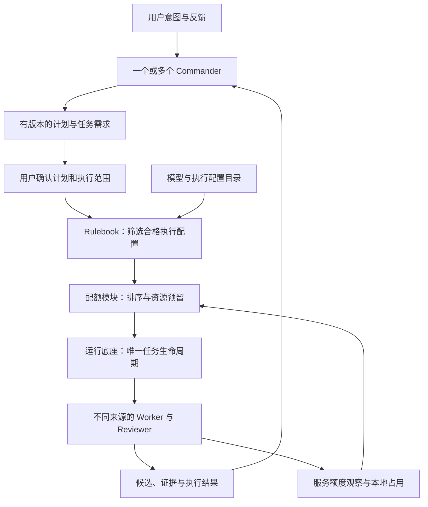

# Karajan：多来源接入、Commander、Rulebook 与配额分配

> 本文保留前期设计及 ai7-harness 参考分析。当前规范见 [完整架构设计 v1](../docs/architecture/README.md) 和 [Rulebook 与配额](../docs/architecture/02-routing-and-quota.md)，已明确唯一协调器、逐调用/逐 Attempt 控制精度、资源账本与建议默认值。

日期：2026-09-05。状态：用户已确认核心需求；具体协作与分配策略仍在讨论。本文是设计草案，示例不代表已有配置协议或已通过实测。

产品整体流程见 [第一版设计草案](karajan-design-blueprint.md)，领域用语见 [CONTEXT.md](../CONTEXT.md)。

本轮已参考 ai7-harness 的 dispatch runbook：以本地 `dev` 的 `fe2c0fecd13e597fc2728a207ff38b88ef0028b3` 为主要基线，并单独参考较早的跨供应商分层设计。来源与适用边界见第 11 节；其中的具体模型、工具绑定和操作限制不作为 Karajan 默认规则。

## 1. 用户描述对应的产品契约

Karajan 在同一个项目中组织不同服务的模型协作。一个或多个高级 Commander 负责理解意图、反馈和设计；Worker、Reviewer 等执行明确任务；用户配置 Rulebook 决定任务可以分配给哪些模型与服务，平台结合配额状态决定具体派发。

初步接入目标：ChatGPT 订阅、Claude 订阅、DeepSeek 官方 API、OpenCode Go 订阅、第三方算力 API。跨服务协作仍服务于已确认的个人单机、Web 工作台、计划确认后自动到 PR 的流程。

以下三项提升为第一版核心：

- 统一执行配置目录，支持订阅执行器与模型 API 两种形态。
- 用户可编辑、可解释、可模拟的角色与任务分配矩阵。
- 配额观察、预留、分配和按规则换源。

## 2. 两类接入，并保留各自能力

**完整 Agent 执行器**已负责工具调用、工作区和执行循环；Karajan 控制其任务、权限、模型选择及生命周期。**模型 API**提供推理结果，需要搭配可控的执行器才能承担完整代码任务。

| 来源 | 建议接入路径 | 配额观察与需要验证的边界 |
|---|---|---|
| ChatGPT 订阅 | 通过官方 Codex 客户端能力接入；自有 Web 的深度集成候选为本机 app-server，优先验证 stdio 路径 | 官方支持订阅登录与 API key 两种模式，计费分别处理。app-server 文档提供账户额度读取及变更通知，可有多个 limit ID、窗口和重置时间。具体安装版本、账户权益及字段可用性需实测。[认证](https://learn.chatgpt.com/docs/auth)、[app-server](https://learn.chatgpt.com/docs/app-server) |
| Claude 订阅 | 首先验证本机官方 Claude Code 的 `-p` 无交互路径，输出转为平台事件 | 当前官方帮助页说明个人 SDK/`-p` 使用仍计入订阅额度。CLI 官方认证与环境优先级必须显式管理，避免订阅任务误走 API 计费。[程序化运行](https://code.claude.com/docs/en/headless)、[当前订阅说明](https://support.claude.com/en/articles/15036540-use-the-claude-agent-sdk-with-your-claude-plan)、[认证](https://code.claude.com/docs/en/authentication) |
| DeepSeek 官方 API | 通过适配对应协议的执行器访问官方 API | 可查询余额；并发限制按账户计量，增加 API key 不会创建新的账户容量。余额和并发分别记录。[余额接口](https://api-docs.deepseek.com/api/get-user-balance/)、[并发说明](https://api-docs.deepseek.com/quick_start/rate_limit/) |
| OpenCode Go 订阅 | 可经 OpenCode 执行器，或通过满足其要求的编码 Agent 接官方 Go API | 有多重时间窗口，按服务定义的使用价值计量，模型消费规则不同；协议随模型变化，提供模型目录。控制台可查看额度，本轮未证实可用的公开配额查询 API。[Go 官方说明](https://opencode.ai/docs/go/) |
| 第三方算力 API | 每个实际服务注册独立通道及协议能力 | 服务商尚未指定；模型版本、计量、工具调用、限流反馈和取消行为均待核查，不能仅凭“兼容 API”判断可替换 |

Claude 与 Claude Code 的订阅使用可能共享账户限制。官方 statusline 文档描述了窗口使用百分比与重置时间，但不能由此推断纯 `-p` 场景一定能持续读到这些数据；缺失时以估算或未知处理。[订阅使用](https://support.claude.com/en/articles/11145838-use-claude-code-with-your-pro-or-max-plan)、[statusline](https://code.claude.com/docs/en/statusline)

个人本机接入与对外提供登录是不同的产品形态。Claude SDK 文档对第三方产品提供 claude.ai 登录或订阅额度有单独要求；本方案让官方执行器管理个人订阅认证。订阅访问凭据不被抽取成通用模型代理的 API key。[SDK 说明](https://code.claude.com/docs/en/agent-sdk/overview)

OpenCode Go 要求工具标识及 `x-opencode-session` 等请求信息；其 `Use balance` 设置可能在订阅限额后转扣付费余额。接入时核对该设置，并把额外费用路径纳入现金预算。Go 的美元计量额度与用户实付现金分别记录。[Go 官方说明](https://opencode.ai/docs/go/)

**统一的是任务与事件契约。** 适配器仍需验证工具调用、结构化输出、上下文、会话恢复、取消和费用报告。DeepSeek 的 Responses 兼容说明明确列出不支持或忽略的参数，例如服务端会话关联；名称相同的协议也不能推导能力完全相同。[协议兼容范围](https://api-docs.deepseek.com/guides/responses_api/)

## 3. 模型目录应包含哪些概念

| 概念 | 记录内容 | 为什么单独存在 |
|---|---|---|
| 服务提供方 | 官方服务或第三方服务的身份 | 模型作者与实际承载服务商可能不同 |
| 调用通道 | 订阅或 API、协议、端点、认证方式 | 同名模型可以通过不同通道使用 |
| 账户 | 账户身份与凭据引用 | 多个 key 或会话可能共享同一账户限制 |
| 模型 | 服务端模型 ID、已知版本、能力与实测结果 | “高级”“快速”来自用户配置或评测，不由品牌名自动决定 |
| 执行器 | 工具、权限、工作区、事件、取消、恢复能力 | 同一模型配不同执行器会有不同代码执行能力 |
| 执行配置 | 模型＋通道＋账户＋执行器及受控参数 | 这是实际路由和派发的目标 |
| 配额池 | 共享范围、窗口、计量单位及当前观察 | 多个执行配置共享一组约束，一次调用也可能同时占用多个池 |

例如，同一个 DeepSeek 模型标识通过官方 API 和 Go 调用，应注册为两个执行配置。它们可以关联相同模型家族，但保留各自配额、协议和已知版本信息。

Commander、Worker、Reviewer 都是角色。任何执行配置在满足角色能力、工具、独立审查和预算要求时都可以承担对应工作；服务商不与角色永久绑定。

Commander 所用的执行器也不绑定整个项目的分发路线。例如，Claude Code Commander 可以提出交给 DeepSeek API Worker 的任务，Codex Commander 可以请求 Go 通道上的合格 Reviewer；实际调用均经平台路由和执行适配器完成。每个 Attempt 固定自己的执行配置，不在一次未结束的尝试中悄悄更换来源。

## 4. Commander 与确定性调度如何配合

Commander 提出任务类别、难度、领域、风险、工具需求、预期上下文和验收标准。平台根据用户规则计算实际执行配置；Commander 可以请求升级，但不能自行改写 Rulebook、扩大授权或抬高预算。

多个 Commander 的默认建议是**主 Commander＋顾问 Commander**：顾问可以并行给出设计和反驳，主 Commander 汇总。平台对同一计划版本只接受一个有效提交者，用户仍确认具体计划。

Commander 可以在明确交接后轮换。交接包保存用户目标、已确认决定、计划版本、未决问题、权限和预算、代码基准、任务产物及证据。新 Commander 能核对原始材料，无需假定不同供应商可以直接恢复彼此的内部会话。

Commander 是一个可被路由的角色，其首次选择由用户配置的入口规则完成，使用会话或项目预设的规划预算，不需要先启动另一个 Commander 来决定。顾问、Reviewer、修复和重试也必须经过相同资源准入。Commander 内部思考与底座的确定性派发分别记录。

## 5. Rulebook 矩阵：先确定资格，再决定优先次序

借鉴 ai7-harness 的职责与绑定分离，将 Rulebook 分成三层。它们是规则的不同职责，可在同一个路由模块中实现。

| 层 | 决定什么 | 稳定性 |
|---|---|---|
| 协作契约 | 任务是否准备好、角色权限、修改范围、验收条件、何时交回 Commander | 换模型、换来源时保持不变 |
| 能力映射 | 某类任务和角色可用的执行配置、最低能力、原生推理设置及允许的升级/换源范围 | 由用户配置并版本化 |
| 资源分配 | 当前合格候选中选谁、何时派发、预留多少、何时等待 | 按可观察配额与预算动态计算 |

任务先判断派发准备度，再判断工作类别。建议借用 T0–T3 作为讨论标签，保留难度和风险两个独立字段：

| 类别 | 判断标准 | Karajan 的派发建议 |
|---|---|---|
| T0：需要澄清或决定 | 目标、方案取舍、范围或授权仍有未决事项 | 留在 Commander 的意图与设计流程，形成可执行简报后再派发实现 |
| T1：机械工作 | 目标和修改位置明确，正确性主要可机械检查 | 从合格快速配置中选择；保持严格的修改范围 |
| T2：有界实现 | 简报、现有接口和验收标准已明确，需要常规实现判断 | 从满足实现能力的配置中按配额、费用和速度选择 |
| T3：复杂或关键变更 | 涉及复杂判断，或权限、数据含义、恢复、协议等关键要求 | 使用满足相应能力与风险门槛的配置，并采用对应审查要求 |

T0 表示尚未满足实现派发条件，不是最低难度。一行鉴权修改也可能需要 T3 要求。并行是任务图与资源决策，不另设更高的任务等级。资源紧张不能使原任务被重新贴成较低类别；若工作被真正拆成具有独立验收的新任务，则可分别评估。

Commander 使用设计与复杂推理达标的配置。Reviewer 按被审候选的复杂性、风险与审查能力选配，使用独立上下文；不强制使用作者的型号或相同价格档位。低成本 Reviewer 也必须达到对应的审查门槛。

不同执行器的 `high`、`xhigh` 等原生设置分别保存在执行配置中，跨服务比较依据任务能力要求与实测结果，不做字符串等级对齐。Go、DeepSeek、高级订阅和第三方 API 的具体型号及顺序仍由用户配置。

可以提供一个可选的快速通道：已有明确简报、已知修改位置、单一小产物和确定性检查时，优先合格快速配置。该通道是规则条件，不与某个模型品牌绑定，也不会降低原任务验收要求。

每个可派发任务都有版本化简报，至少说明目标和完成条件、允许修改的职责/接口与路径、明确不包含的工作、代码基准、验收方法、停止条件及交回谁处理。修改范围按职责和接口表达；文件数少不意味着工作范围小。Worker 遇到简报失效、需要扩权或新增范围时交回 Commander 重新判断，不自行扩大任务。

规则匹配过程：

1. 固定计划、任务与 Rulebook 版本；根据可信项目策略校验范围和风险下限。Commander 的分类保留理由，用户可以纠正。
2. 匹配规则并形成候选集合。规则优先级与同级冲突处理必须明确；没有匹配规则或存在无法消解的冲突时，不派发并显示原因。
3. 先过滤硬条件：能力、工具、上下文容量、数据去向、实际可用模型、认证/计费方式、审查独立性及预算约束。
4. 在合格候选中，根据用户选择的策略比较配额压力、现金成本、预计延迟和任务适配度。评分依据、估计来源和同分顺序固定且可查。
5. 原子预留并发及可估算资源，再绑定执行配置启动一个 Attempt。失去预留或状态过期时重新判断。
6. 记录命中规则、候选及淘汰原因、最终选择、配额快照、成本估计与可观察结果。将请求的执行配置、执行器接受的配置、运行中报告的模型变化和证据来源分别记录。

启动被接受或模型自报身份，都不能证明供应商内部实际执行了指定权重。平台界面标明“请求”“启动接受”“供应商报告”“未知”等来源，不把这些字段合并成无条件可信的“实际模型”。发现不符合已授权配置的变化时，停止该 Attempt 并按允许策略重新准入。

独立 Reviewer 至少使用独立上下文。是否要求不同模型家族或不同服务商由风险规则决定；同一模型换了转售商，不自动满足“不同模型”的条件。模型能力的等级应按任务类别校准，不能用参数量或服务商广告替代。

Rulebook 编辑器提供“用这个任务试跑规则”：展示将选择谁、排除谁、原因是什么及何时会改选，全程不发起付费推理。规则修改形成新版本，默认作用于新的 Run。已有 Run 只有经过显式重新评估才采纳新版本，扩大已确认的来源、权限或费用范围时取得相应确认；已运行任务绑定的规则不会被悄悄替换。安全性收紧若需立即生效，走明确撤销/取消过程。

## 6. 配额平衡是任务分配策略

不同服务的额度保留原生计量方式，不能把订阅使用百分比、Go 使用价值和 DeepSeek 余额相加成一个总 token 数。

每个配额约束至少包含：

- 账户与共享范围、受约束的模型/执行配置；
- 单位与窗口：token、请求、百分比、服务使用价值、现金或并发槽位；
- 已报告或估算的消耗、重置时间及重置语义；
- 本地在途预留、Commander 保留策略、允许平台占用的上限；
- 信息来源、观察时间、新鲜度和 `reported / estimated / unknown` 标记。

一次派发必须满足其全部适用约束：例如账户共享池、模型专属池、短窗口、周窗口、平台预算与并发限制。身份或共享关系不明时不能把多个 key 当作独立额度重复计算。

建议默认策略供用户选择：**在质量门槛内，先保护 Commander 的可用余量，再按其他池的剩余空间、重置时间和负载分配 Worker/Reviewer。** 订阅优先和最快完成可以作为可切换的偏好，但仍须遵守所有硬约束。

实际分配包括五个动作：

1. **观察**：优先读取官方可用数据，并结合本地执行记录；未知不能显示为零消耗或无限容量。
2. **预留**：将并发占用与预计消耗写入一份原子记录，阻止平台内多个任务重复分配同一份可用空间。
3. **平衡**：比较每个池自己的窗口压力与任务适配度。将接近重置且有可用空间的合格资源列入优先候选，同时考虑较长窗口是否已经紧张。
4. **结算**：确认执行退出后释放并发槽位；实际发生而尚未被服务端报告覆盖的消耗继续保留本地记账，核对后再消除相应预留。重试、review、修复和 Commander 顾问调用都计入同一运行预算。
5. **调整**：额度不足或服务失效时，按允许的换源规则重选；无法满足质量和预算则等待或请求用户决定。

本地关闭连接不证明服务端停止推理或停止计费。取消结果未知时保留未结算记录和保守占用，待核对后调整；不能因重试就把原尝试的费用归零。平台预留与服务商报告的消耗需按观察时间和已核对记录对齐，避免把同一笔消耗既计入服务端已用量又重复计作未结算预留。

预留只约束 Karajan 自己。用户同时在官方客户端手动使用、其他应用用量和服务端延迟计量仍会改变余额，因此“Commander 保留量”是平台调度目标，不能保证服务商永远留有同样额度。

缺少可靠配额数据时，使用保守并发上限、用户设置的消费上限和限流反馈；注明估算置信度。没有经过校准的数据，不把一次请求消耗的百分比推导为精确剩余 token 数。

订阅固定费、服务计量额度、额外 API 现金分别展示。API 额度充足不等于本次运行现金预算允许使用；服务端自动转付费余额也必须纳入预先获准的收费路径。

## 7. 换源时保持执行与证据的一致性

| 触发条件 | 处理原则 |
|---|---|
| 暂时速率限制或拥塞 | 根据已知原因退避、降并发或换源，不把所有 429 都视作订阅耗尽 |
| 已确认配额耗尽 | 根据 Rulebook 选择其他合格配置或等待窗口重置 |
| 余额不足或预算不够 | 独立判断服务余额与平台预算；未获准的现金支出不自动发生 |
| 认证失败或实际计费方式不符 | 阻塞该通道，修复认证/执行环境后再试 |
| 质量失败 | 形成更明确任务或请求更高能力档位，仍遵守修复次数与总预算 |
| 执行中需要切换 | 终止或撤销旧 Attempt 的有效执行权，核对产物，再创建新 Attempt 与交接包 |
| 所有候选不合格 | 阻塞受影响任务并显示可操作原因；独立任务可按依赖继续 |

换源保持任务目标、类别、能力下限、权限与验收条件，只改变获准的执行配置。可预设“固定配置”“同要求换源”“满足条件时优先快速配置”等规则模式。其默认选择尚待用户确认，不继承参考仓库的禁止自动回退或固定订阅优先顺序。

跨服务交接使用平台保存的任务说明、代码基准、候选和证据。工具调用 ID、内部会话 ID、私有推理状态不假定可移植；不能把在另一执行器重新运行描述为原会话无损恢复。

执行配置还必须控制底层执行器的内部自动选模、fallback 和子 Agent。默认把平台任务作为分配单位；执行器内部若可独立派发额外模型调用，须能继承允许集合和预算并报告用量，否则关闭该能力或将该执行配置标记为不满足严格规则要求。

## 8. UI 与底座各增加什么

Web 增加资源与 Rulebook 设置区：登记可用执行配置、查看配额、设置角色矩阵、模拟规则、设置现金上限和保留策略。每个任务显示当前角色、请求与启动接受的模型/通道、运行观察及其来源、选模原因、换源记录和已知费用。

运行底座继续负责依赖、Attempt 生命周期、隔离工作区与恢复。Karajan 的路由模块负责选择执行配置和资源准入，通过同一个派发入口衔接；本地资源预留需关联底座 Attempt，跨进程故障后能核对并释放或接续。

启动前核对任务简报版本、执行配置、权限与工作区基准；开始编辑前必须完成这一验证。若执行器要先启动才返回 session/workspace 身份，使用只读预检后激活的过程；能提前准备全部资源的执行器可用更直接的程序化校验。无需所有来源都复制桌面任务“两轮对话＋GitHub 评论”的载体。

单个可写工作区同时只有一个有效 writer。互相独立的任务可以并行，各自产物在受管集成点汇集并重新验证。Karajan 可以让多个子任务共同形成一个需求级 PR，不继承参考仓库“一 Issue 一 PR”的固定粒度。运行活跃状态、Attempt 结果和 PR 状态仍由各自拥有者提供，`idle` 不表示验收通过。

Bernstein 的采用资格增加三项：允许在每次 Attempt 开始前绑定具体执行配置；底座的 fallback/子 Agent 不绕过 Rulebook；恢复时能与 Karajan 的预留记录协调。如果这三项无法实现，应重新选择底座或增加必要扩展点。

## 9. 第一个验收原型

用一个真实小功能验证以下流程，服务与模型身份是示例角色，最终以实际接入情况为准：

1. 一个高级订阅模型担任 Commander，另一高级模型可参与方案复核。
2. 用户确认计划与资源策略后，一个 Worker 经 DeepSeek 官方 API，另一个经 Go 或另一已验收通道完成独立子任务。
3. 集成后由矩阵选出的 Reviewer 作独立审查，通过测试后形成 PR。
4. 注入某配额池受限，证明只在允许集合中换源，并显示原因；保留其他任务和既有产物。
5. 两个并发任务争用同一个池时，不重复分配本地预留；外部用量使观察失效时，能重新评估或正确阻塞。
6. Commander 保留策略生效时，Worker 不能挤占平台为 Commander 设置的保留空间。
7. 没有合格 Reviewer、配额未知、通道误走 API 计费、底层自动 fallback 和进程中断，都有明确验收结果。

按阶段接入可以先覆盖一个订阅执行器与一个 API 执行器，再接其余来源。第一版验收最终覆盖用户计划使用的全部来源；单个最小原型只是尽早检验关键契约。

## 10. 待收敛的产品选择

正在询问用户：多个 Commander 的决策结构、配额分配的默认优化目标、Worker/Reviewer 自动换源范围。

后续再填写：具体订阅档位与可用模型、第三方服务商、Commander 是否及何时自动换源、保留额度目标、现金预算、超时和质量分级样例。

本轮核查是官方文档与现有设计阅读，没有读取账户凭据、发起模型调用、购买或切换订阅，也没有验证任何账户的实际额度。来源事实需在接入验收时根据固定版本和用户账户重新核对。

## 11. ai7-harness 参考边界与来源

2026-09-05 只读检查了本地仓库与 Git 对象，未更新远端引用或切换源仓库分支。源工作目录位于冻结分支，HEAD 为 `2b71db36aa99f0f85cd1748748d25192fedeb789`；该快照的 Codex-only 规则不是本次最终采用的参考版本。

主要参考是本地 `dev` 的 `fe2c0fecd13e597fc2728a207ff38b88ef0028b3`。其 ADR 0061 支持 Codex、Claude Code 两条路线，按 Commander 自己的 harness 选择，保持固定绑定且不自动回退。它治理的是 AI7 仓库开发流程，不是已实现的通用跨模型调度平台。[该提交的 dispatch runbook](https://github.com/zhouy1017/ai7-harness/blob/fe2c0fecd13e597fc2728a207ff38b88ef0028b3/kick-in/27-repository-development-dispatch.md)、[ADR 0061](https://github.com/zhouy1017/ai7-harness/blob/fe2c0fecd13e597fc2728a207ff38b88ef0028b3/docs/adr/0061-route-repository-dispatch-by-commander-harness.md)

历史参考是 `4746bb15b96cc76afee2b450746c8fb069f3229e` 的 Layer A/B 设计。它分离通用操作规则与供应商绑定，并在回退时保持任务等级；但其 Claude-first 消耗顺序、指定快速模型通道和不为保留 Claude 额度而平衡的规则，是当时的个人策略，不能作为 Karajan 的通用配额算法。[历史 dispatch runbook](https://github.com/zhouy1017/ai7-harness/blob/4746bb15b96cc76afee2b450746c8fb069f3229e/kick-in/27-repository-development-dispatch.md)

| 参考中的机制 | Karajan 吸收的原则 | Karajan 的适配 |
|---|---|---|
| 通用角色规则与模型绑定分离 | 换模型不改变权限与工作要求 | 扩展为协作契约、能力映射、资源分配三层 |
| T0–T3 与有界简报 | 未决事项先由 Commander 处理；实现任务有范围和停止条件 | 将准备度、难度、风险分别表达，模型矩阵由用户配置 |
| Commander harness 决定整条路线 | 不同执行器有不同能力与操作语义 | 每任务独立选择执行配置，Commander 可以跨来源组织协作 |
| 固定模型与 no-fallback | 请求配置要明确，不能静默改变要求 | 同一 Attempt 固定配置；获准换源创建新 Attempt |
| Launch/Return Receipt | 冻结任务身份，区分请求与可观察事实 | 用平台记录关联任务、规则、资源预留、工作区及结果 |
| GitHub Issue 正文字节哈希 | 执行依据需要版本与完整性 | 使用规范化的可执行任务契约；展示文字可独立版本化 |
| 单 writer、并行编写与串行集成 | 隔离可变状态，组合结果必须验证 | 允许需求下多任务汇集成一个 PR |
| Reviewer 可选且只提供建议 | 独立、只读、非作者的审查上下文 | 是否必需及如何阻断交付按 Karajan 自己的质量策略处理 |
| 不建数据库或 daemon | 避免多个状态所有者互相竞争 | 按平台持久化配额和 Web 需求选择存储，不继承工具规模限制 |

参考仓库的具体模型表、推理设置、并发数量、桌面操作步骤、提交署名、分支名称、测试限制和手工批准规则均不自动成为 Karajan 的产品要求。
