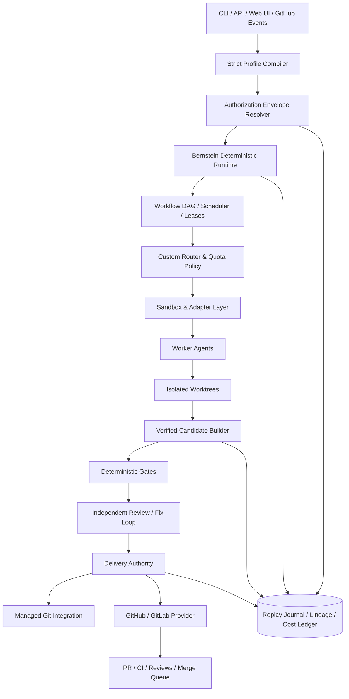

# 重度 Toil 类 Agent 框架：底座选型与 Bernstein-first 设计报告

> 日期：2026-09-04  
> 结论版本：Bernstein-first  
> 核查基线：Bernstein `3.19.1`，提交 `3596346879c3ea26505273248eaa240aa7342c69`；Toil 提交 `b5e7baf43bae2eda9c9cc98118a6810a178e3015`

## 1. 结论

如果目标是构建一个功能非常重的 Toil 类系统，而不是延续 Toil 本身，推荐顺序是：

1. **以 [Bernstein](https://github.com/sipyourdrink-ltd/bernstein) 为运行和治理底座**；
2. 建立独立的“个人发行版/策略扩展包”，承载模型路由、项目准入、owner 授权和交付策略；
3. 对 Bernstein 固定版本和提交，不直接跟随 `main`；
4. 优先使用 Bernstein 的 plugin、gate、adapter、trigger、sandbox 和 workflow 扩展点；
5. 只有无法通过公开扩展点实现的安全关键能力，才维护一组尽可能小的 core patch，并优先向上游提交；
6. 将 Toil 作为**需求样板和安全回归测试来源**，而不是代码底座。

不建议直接重写，也不建议一开始就深度 fork Bernstein。Bernstein 已经覆盖重度系统中最昂贵的公共基础设施；但其当前代码规模大、单人维护、处于 beta，深度 fork 会带来高昂的长期同步成本。

推荐的工程形态：

```text
Pinned Bernstein Runtime
        +
Strict Policy / Routing / Delivery Extension
        +
Golden Compatibility & Security Harness
        +
Small, Explicit Upstream Patch Queue
```

## 2. 为什么改为 Bernstein-first

### 2.1 重度系统真正昂贵的部分

重度 Agent 控制平面不只是“选择模型并创建 worktree”。它通常还需要：

- 声明式工作流和任务 DAG；
- 大量 CLI、SDK 和自托管模型适配器；
- 多 Agent 并行、租约、心跳、取消、重试和崩溃恢复；
- 预算、费用、配额、模型可用性和降级策略；
- Worktree、Docker、远程 sandbox 或 microVM；
- 确定性质量门禁和跨模型 review；
- commit、push、PR、CI、merge queue 和自动 merge；
- API、MCP、TUI、Web UI、事件与通知；
- replay journal、lineage、签名 receipt、审计和合规输出；
- 插件、扩展协议、schema、升级和兼容性治理。

从 Toil 的轻量标准库内核逐项实现这些能力，最终会重新建造 Bernstein 已经存在的大量基础设施。

### 2.2 Bernstein 已经具备的底座能力

根据其[项目说明](https://github.com/sipyourdrink-ltd/bernstein)、[能力文档](https://github.com/sipyourdrink-ltd/bernstein/blob/main/docs/reference/capabilities.md)和源码核查，Bernstein 已包含：

- 无 LLM 参与调度循环的确定性 Python scheduler；
- YAML 工作流、阶段、条件依赖、循环节点和恢复；
- 每个代码任务独立 Git worktree；
- Codex、Claude、Gemini、OpenCode、Aider、Ollama 等大量适配器和通用 wrapper；
- role/model policy、成本感知路由、预算、quota envelope 和 provider availability；
- worktree、Docker 和多种云 sandbox backend 的确定性选择器；
- janitor、质量 gate、跨模型 verifier、投票与 merge queue；
- `auto`、`review`、`pr` 审批模式以及 `auto_merge`；
- GitHub App、GitLab App、issue-to-PR、CI 修复和 PR review receipt；
- 本地文件状态、任务 server、MCP、API、TUI 和 Web UI；
- replay journal、lineage spine、HMAC 审计、Ed25519 receipt 和离线验证；
- Pluggy 插件以及 adapter、gate、trigger、sandbox、reporter 等 entry point。

这些能力使它更像一个可以裁剪和加固的平台，而不是单一 Agent Skill。

### 2.3 许可证和可用性

Bernstein 使用 Apache-2.0 许可证，允许修改、分发和建立派生产品，但需要保留许可证、NOTICE 及相关声明。项目自述状态是 beta、单人维护、接口可能在小版本变化，因此生产使用必须固定版本并建立自己的兼容性测试。[许可证与状态说明](https://github.com/sipyourdrink-ltd/bernstein)

## 3. 候选底座比较

| 候选 | 重度功能覆盖 | 安全/证据能力 | 扩展性 | 主要问题 | 结论 |
|---|---|---|---|---|---|
| [Bernstein](https://github.com/sipyourdrink-ltd/bernstein) | 极高 | 极高 | 高 | beta、代码庞大、上游变化快 | **首选底座** |
| [Agent Workspace Fabric](https://github.com/dimileeh/agent-workspace-fabric) | 高 | 中 | 中 | 偏 DevOps/PR 平台，治理和离线证据弱于 Bernstein | 备选 |
| [Claim Plane](https://github.com/SkeinRank/claim-plane) | 中 | 极高 | 中 | 是控制/证据层，不是完整多 Agent 平台 | 可借鉴或作为额外验证层 |
| [Agentplane](https://github.com/basilisk-labs/agentplane) | 中 | 高 | 中 | 任务编排、适配器、UI 和成本层较轻 | 不适合作为重度唯一底座 |
| [Vigla](https://github.com/Kilbex/Vigla) | 中 | 中 | 低到中 | 产品较新，平台和 provider 覆盖有限 | 借鉴 UI |
| [Toil](https://github.com/zhouy1017/toil) | 低到中 | 高 | 中 | 内核可靠但大量平台能力需要新建 | 作为需求与测试样板 |
| Greenfield | 取决于投入 | 可自定义 | 极高 | 成本、周期和隐藏故障面最大 | 不推荐 |

### 3.1 其他项目的正确角色

- [Claim Plane](https://github.com/SkeinRank/claim-plane)：借鉴精确 base、ChangeIntent、路径权限、hash patch 和签名证据。
- [DeepSeek and Destroy](https://github.com/frozenpepper/deepseek-and-destroy)：借鉴强控制者—廉价实现者—独立 reviewer/fixer 循环。
- [Warden](https://github.com/Gentoflakes/warden)：借鉴新鲜上下文审计和逐候选 merge train。
- [Agent Worktree Orchestrator](https://github.com/ystepanoff/awo)：借鉴 proof pack 和保守候选交付。
- [delegate-skills](https://github.com/amElnagdy/delegate-skills)：借鉴统一跨 CLI 结果协议。
- [sudocode](https://github.com/sudocode-ai/sudocode)：借鉴 repo-native specs/issues 和长期依赖图。
- [Vigla](https://github.com/Kilbex/Vigla) / [Agetor](https://github.com/alamops/agetor)：借鉴 Mission Control、任务卡和人工接管体验。

它们适合作为 Bernstein 扩展设计的参考，不需要再并列引入多个调度内核。

## 4. Bernstein 的现实风险

Bernstein 更适合做底座，不代表可以不经验证直接依赖全部能力。

### 4.1 规模与维护风险

本次核查的快照包含约：

- `2,156` 个 `src/bernstein` 文件、`819,185` 行；
- `3,245` 个测试文件、`802,404` 行；
- 多个单文件超过 5,000 行，最大安全审计模块超过 10,000 行。

其中包含协议、生成代码和大量独立功能面，但仍说明深度 fork 的理解与维护成本很高。

对策：

- 固定 PyPI 版本和 Git commit；
- 自有代码放在独立扩展包；
- 建立 upstream compatibility suite；
- 禁止在没有测试覆盖时修改大核心模块；
- 每次升级先在隔离分支运行能力验收和故障注入。

### 4.2 上游已知限制

Bernstein 官方[已知限制](https://github.com/sipyourdrink-ltd/bernstein/blob/main/docs/reference/KNOWN_LIMITATIONS.md)包括：

- 不同 CLI adapter 的能力和进程语义不完全一致；
- 默认仍以单机编排为主，多节点属于高级路径；
- 部分观测接近实时而非严格实时；
- 路由和 retry 不能预知所有 provider 故障；
- 验证质量受项目测试质量限制；
- 成本预测是估算；
- 文档可能短期落后于实现；
- 协议协商是 best-effort。

这些限制必须进入底座资格测试，不能只记录在风险章节。

### 4.3 与目标需求仍有差距

| 目标需求 | Bernstein 当前能力 | 需要的改造 |
|---|---|---|
| 项目默认 fail closed | 有 policy、permission 和 admission | 增加严格 overlay；安全字段禁止 unknown key |
| 精确 job/base/path 授权 | 有 worktree、path scope、intent 等组件 | 统一成每任务不可变 Authorization Envelope |
| owner 一次性授权 | 有 approval 文件和多种审批能力 | 增加绑定 repo/job/base/path/mode/expiry/nonce 的 grant |
| 六级交付模式 | 有 direct/PR、auto/review/pr 和 auto-merge | 统一为 `candidate/apply/commit/push/pr/merge` 状态机 |
| worker 无远端权限 | 有 credential scoping 和 sandbox | 做强制验收，确保所有 adapter 都符合；交付凭据独立 |
| Sol/DeepSeek/Luna 固定拓扑 | 有 role/model policy 与 router | 增加自有 routing profile 和不可降级角色 |
| 配额耗尽不静默 fallback | 有 retry/fallback/provider availability | 新增 `on_quota: pause` 且优先于 fallback |
| PR 与自动 merge 一致策略 | 一般 approval gate 可 auto-merge；issue-to-PR 明确不 auto-merge | 建立单一 Delivery Authority，统一所有入口 |
| 不信任 worker 成功 claim | 有 janitor/gates/review | 强制所有交付只接受 Verified Candidate |
| 脱敏账本 | 有 journal、lineage 和 audit | 追加严格字段白名单和秘密文件名测试 |

## 5. 推荐的采用方式

### 5.1 不建议：直接深度 fork

直接在 Bernstein core 中持续开发会遇到：

- 上游大量改动难以合并；
- 安全修复需要手动搬运；
- 代码面太大，Agent 容易跨边界修改；
- 自有策略与通用上游能力混在一起；
- 难以判断问题来自上游还是定制层。

### 5.2 推荐：Pinned Runtime + Distribution Extension

建立一个独立仓库，例如：

```text
agent-control-distribution/
  pyproject.toml                 # bernstein==3.19.1 + exact compatibility metadata
  src/control_distribution/
    profile_compiler.py          # 高层策略编译为 Bernstein config/workflow
    authorization.py             # Authorization Envelope / OwnerGrant
    routing.py                   # 自有模型、配额和升级拓扑
    gates/                       # 必需质量与安全门禁
    delivery/                    # 六级交付状态机与远端授权
    adapters/                    # 必要的 provider 特化
    sandbox/                     # 沙箱最低能力与凭据隔离
    receipts/                    # 自有证据投影
    cli.py                       # 面向个人工作流的简化命令
  profiles/
  workflows/
  schemas/
  tests/
    golden/
    security/
    fault_injection/
    upstream_compat/
  patches/
    manifest.yaml                # 只有确实无法外置的最小上游补丁
```

利用 Bernstein 已存在的 entry point：

- `bernstein.plugins`
- `bernstein.adapters`
- `bernstein.gates`
- `bernstein.triggers`
- `bernstein.sandbox_backends`
- `bernstein.reporters`

质量 gate 可以硬阻断 merge；custom router 可以通过 routing hints 影响调度；工作流可以用 YAML DAG 表达。无法通过这些 seam 实现的交付状态转移，再进入最小 patch queue。

### 5.3 何时转为正式 fork

只有同时满足以下条件才建议正式 fork：

1. 核心安全语义必须修改；
2. 上游没有稳定扩展点；
3. 上游拒绝或长期无法接受所需 seam；
4. 补丁连续多个版本都产生严重冲突；
5. 团队愿意承担安全修复、release 和兼容性维护责任。

在此之前，使用“上游依赖 + 补丁构建”比永久 fork 更可控。

## 6. 目标系统架构



### 6.1 Bernstein Runtime

保留并使用：

- 确定性 scheduler；
- task/agent lifecycle；
- YAML workflows；
- worktree manager；
- adapters 与 agent roles；
- quality pipeline；
- task server、API、MCP、TUI/Web；
- replay、lineage、audit 和成本账本。

### 6.2 Strict Profile Compiler

用户不直接编辑 Bernstein 全量配置，而是编辑更小、更严格的发行版 policy。Compiler 完成：

- schema 严格校验；
- 禁止未知安全字段；
- 展开默认值；
- 生成 Bernstein config、workflow manifests、permission rules 和 gate config；
- 输出 canonical JSON/YAML 与 SHA-256；
- 把版本、上游 commit、策略 digest 写入 run manifest。

这使上游复杂配置成为“编译目标”，而不是用户直接依赖的长期 API。

### 6.3 Authorization Envelope

每个任务都生成不可变 envelope：

- repository identity；
- base commit；
- 目标与约束；
- task type、risk floor；
- allowed paths；
- network/sandbox policy；
- provider/model allowlist；
- budget/quota envelope；
- requested delivery mode；
- target branch/remote；
- owner grant reference；
- policy digest、expiry、nonce。

所有 worker、gate、review 和 delivery 事件引用同一个 envelope digest。

### 6.4 Custom Router

模型名称不写死到业务逻辑，使用稳定角色别名：

| 角色别名 | 职责 | 示例映射 |
|---|---|---|
| `control` | 规划、架构、风险和最终裁决 | Sol/high |
| `worker_fast` | 模板、机械修改、普通实现 | DeepSeek V4 Flash/OpenCode |
| `worker_complex` | 有界复杂实现和困难调试 | Luna/max |
| `reviewer` | 新鲜上下文独立复审 | 与 writer 不同 provider/model |
| `security` | 高风险只读审计 | control 或专用安全模型 |

路由必须支持：

- 按任务类型、风险、路径和预算选择角色；
- role/model pinning；
- writer 与 reviewer 分离；
- provider health preflight；
- `on_quota: pause | fallback | escalate`；
- 禁止对 control/security 角色静默降级；
- 每次路由形成可回放 decision receipt。

### 6.5 Sandbox 与凭据域

Worktree 只是并发隔离，不是安全沙箱。发行版应声明最低 sandbox tier：

| Tier | 后端 | 用途 |
|---|---|---|
| 0 | Worktree | 可信仓库、只读或低风险本地任务 |
| 1 | Docker | 默认写任务 |
| 2 | E2B/Modal/Daytona 等 | 不可信依赖、外部贡献任务 |
| 3 | microVM/专用远程 worker | 高风险、强隔离或合规任务 |

worker credential set 与 delivery credential set 必须完全分开。GitHub App token、SSH 写密钥、签名密钥只在 Delivery Authority 进程中解析。

## 7. 自动 commit、push、PR 和 merge

### 7.1 统一交付状态

```text
candidate < apply < commit < push < pull_request < merge
```

- `candidate`：仅保留 diff、worktree 和证据；
- `apply`：应用到用户干净工作树，保持未提交；
- `commit`：在受管任务分支创建 commit；
- `push`：push 受管分支；
- `pull_request`：幂等创建或更新 PR/MR；
- `merge`：远端规则满足后进入 merge queue 或完成 merge。

Bernstein 当前存在 direct/PR、approval mode 和 auto-merge 等多套相关语义。扩展层应建立一个 Delivery Authority，把普通任务、issue-to-PR、autofix 和 review-responder 的远端交付统一到同一策略和状态模型。

### 7.2 长期授权与一次性授权

允许两条路径：

1. 仓库 policy 预先允许指定风险、任务和路径自动到达某一级；
2. owner 为单个 job 签发有限、可过期、可撤销的一次性 grant。

OwnerGrant 至少绑定：

- owner identity；
- repository identity；
- job ID；
- base commit；
- allowed paths digest；
- 最大 delivery mode；
- remote 和 target branch；
- expiry、nonce、use count；
- policy digest；
- 签名或本机受保护凭证。

owner 授权可以放宽软风险限制，但不能绕过以下硬条件：

- 候选与 base、envelope、paths 相符；
- secret scan 没有硬阻断；
- required deterministic gates 成功；
- PR 当前 head SHA 等于被验证 commit；
- CI 结果属于当前 head SHA；
- 分支保护、required review 和 merge queue 满足；
- worker 从未获得 delivery credential；
- remote identity 和目标分支匹配授权。

### 7.3 远程副作用幂等

对 commit、push、PR 和 merge 分别保存 intent/result receipt：

```text
idempotency_key = hash(repo, job, policy, candidate, target, action)
```

恢复时先查询实际 Git/远端状态：

- 已有等价 commit：复用，不生成重复 commit；
- 分支已 push：核对 SHA，不重复或盲目 force push；
- PR 已存在：更新同一 PR；
- merge 调用超时：查询 merged 状态和 merge SHA；
- PR head 被外部修改：阻断并重新验收，不继续 merge。

## 8. 建议的严格发行版配置

```yaml
distribution_version: 1
bernstein:
  version: "3.19.1"
  commit: "3596346879c3ea26505273248eaa240aa7342c69"
  strict_compatibility: true

project:
  repository_identity: github.com/owner/repo
  sensitive: false
  allowed_tasks: [mechanical, implementation, debug, test_fix, docs, audit]
  allowed_paths: ["src/**", "tests/**", "docs/**"]

routing:
  control: {adapter: codex, model: control-model, effort: high}
  worker_fast: {adapter: opencode, model: deepseek-worker}
  worker_complex: {adapter: codex, model: complex-worker, effort: max}
  reviewer: {adapter: codex, model: reviewer-model, effort: high}
  quota:
    default_action: pause
    allow_fallback_for: []

execution:
  max_agents: 6
  max_writers: 3
  sandbox_minimum: docker
  network: direct
  worker_credentials: []

quality:
  required_commands:
    - "python -m pytest"
  independent_review: true
  max_fix_cycles: 2
  secret_scan: required
  max_changed_files: 30
  max_patch_bytes: 1000000

delivery:
  default_mode: pull_request
  max_mode: merge
  remote: origin
  target_branch: main
  managed_branch: "agent/{job_id}"
  merge_method: squash
  use_merge_queue: true
  auto_merge_risk: [low]
  require_current_head_ci: true
  allow_owner_grant: true
```

Compiler 将该配置转换为 Bernstein 的 `bernstein.yaml`、workflow、permission rules、quality gates、role model policy、sandbox policy 和 approval settings。

## 9. 底座资格测试

在写正式功能前，先对固定 Bernstein 版本完成一次 qualification。以下属于必须通过项，而不是可选评估：

### 9.1 调度与恢复

- 固定 manifest 两次运行产生相同任务图；
- 六个并发任务互不共享可变 worktree；
- supervisor 被强制终止后，可从 journal/ledger 恢复已完成任务；
- 重试不会丢失 budget、attempt 和依赖状态；
- 任务取消可以可靠终止子进程树。

### 9.2 Adapter

- Codex、OpenCode/DeepSeek 和目标 reviewer adapter 分别通过 conformance test；
- session、超时、取消、结构化输出和退出码语义一致；
- adapter 不支持某能力时必须显式拒绝，不能伪装支持；
- provider quota 错误可以稳定分类。

### 9.3 Git 与隔离

- 每个 writer 固定到预期 base；
- 路径越界、symlink、submodule、rename、binary 和 untracked 文件均被检测；
- worker 环境中不存在 remote write credential；
- Docker/指定 sandbox 不可用时 fail closed，不退化为 worktree；
- worker 尝试 commit/push/修改 Git refs 时被拦截或不产生效果。

### 9.4 Gate 与 review

- worker 声称成功但测试失败时不能 merge；
- required gate plugin 失败会硬阻断；
- reviewer 与 writer 使用不同上下文和所需的不同模型；
- reviewer 输出格式错误不会被当作通过；
- fixer 循环到达上限后停止。

### 9.5 远程交付

- commit、push、PR、merge 重试幂等；
- PR head 被外部更新后阻断；
- 旧 SHA 的绿色 CI 不能授权当前 head merge；
- merge queue 对组合分支重跑 CI；
- owner grant 过期、撤销、跨 job 或跨 repo 重放时被拒绝。

### 9.6 审计

- replay/lineage 校验可以检测证据篡改；
- 日志、receipt、PR body 不包含 token、原始 session ID 或秘密内容；
- 能从一次 merge SHA 反查 job、policy、candidate、checks、review 和 owner authorization。

如果其中任何安全关键项只能通过大范围修改 Bernstein core 才能实现，应暂停功能开发，先决定增加上游 seam 还是建立正式 fork。

## 10. 实施路线

### Phase 0：Qualification 与冻结

- 固定 Bernstein 版本、commit 和依赖 lock；
- 建立上述 qualification suite；
- 跑三个真实仓库、三种 adapter、三种风险级别；
- 做 kill、quota、timeout、dirty tree、stale CI 和 API timeout 故障注入；
- 输出 pass/fail 与必要 core patch 清单。

交付物：`BASELINE.md`、锁文件、golden fixtures、qualification report。

### Phase 1：发行版骨架

- 创建独立 Python 包；
- 注册 Bernstein plugin/gate/adapter/trigger entry points；
- 实现 profile compiler 和严格 schema；
- 记录上游 capability/version manifest；
- 增加 `doctor` 检查固定版本与 adapter posture。

### Phase 2：Authorization Envelope

- 定义 canonical envelope 和 digest；
- 从受信任 base 读取项目 policy；
- 实现 owner grant 的创建、签名、撤销、过期和原子消费；
- 将 envelope 传递到 scheduler、worker、gate、review 和 delivery。

### Phase 3：模型路由与配额

- 实现 role aliases 与自有 routing plugin；
- 配置 control/fast/complex/reviewer/security；
- 增加 task/risk/path 规则；
- 实现 `pause/fallback/escalate` quota policy；
- 保护 control/security 角色不被静默降级。

### Phase 4：候选、门禁与审查

- 生成 Verified Candidate；
- 增加 base/path/size/secret/diff gates；
- 强制验证后重新快照；
- 建立 reviewer/fixer 有界循环；
- 把证据投影进 Bernstein lineage/receipt。

### Phase 5：Delivery Authority

- 实现六级交付状态机；
- 统一普通 task、issue-to-PR、autofix 的交付入口；
- 将 delivery credential 移出所有 worker 环境；
- 实现 GitHub commit/push/PR/current-head CI/merge queue/merge；
- 加入幂等 intent/result receipt 和崩溃恢复。

### Phase 6：重度运营能力

- 多项目注册与项目池；
- 依赖 DAG、路径冲突预检和 merge train；
- schedule、webhook、GitHub issue/PR、chat triggers；
- 成本、配额、吞吐、失败和风险 dashboard；
- TUI/Web UI 中的 Pause、Approve、Escalate、Merge、Revert；
- 多主机或远程 sandbox pool。

### Phase 7：上游治理

- 建立 weekly upstream compatibility CI；
- 自动生成 API/config/schema diff；
- 为 core patch 建立 `patches/manifest.yaml`；
- 每个补丁记录原因、覆盖测试、上游 issue/PR 和删除条件；
- 安全升级先进入隔离验证，再升级固定版本。

## 11. 给实现 Agent 的工作包

| 包 | 工作内容 | 依赖 | 是否允许并行 |
|---|---|---|---|
| A | Bernstein qualification harness | 无 | 与 B 部分并行 |
| B | 独立发行版包与 entry point 骨架 | 无 | 是 |
| C | 严格 policy/profile compiler | B | 是 |
| D | Authorization Envelope 与 OwnerGrant | C | 否 |
| E | 自有 router、role aliases、quota pause | B、C | 与 D 并行 |
| F | sandbox floor 与 credential separation | A、B | 与 E 并行 |
| G | Verified Candidate 与 required gates | C、F | 否 |
| H | independent reviewer/fixer loop | E、G | 否 |
| I | Delivery Authority 与本地 commit | D、G | 否 |
| J | GitHub push/PR/merge/queue 与幂等恢复 | I | 否 |
| K | 统一 issue/autofix/task 交付入口 | J | 否 |
| L | UI、DAG、multi-project 与运营能力 | A–K | 后续 |

所有工作包固定要求：

- 先读目标子目录的 `AGENTS.md` 和 Bernstein module map；
- 不删除、跳过或弱化现有安全测试；
- 不把自有策略散落到 Bernstein 大核心模块；
- 新权限默认关闭；
- 每个远程副作用有失败注入和幂等测试；
- worker 永远不能获得 delivery credential；
- 任何 core patch 必须进入 patch manifest；
- 用户可见行为、配置和架构改变必须同步文档。

## 12. MVP 验收流程

MVP 应完成一次端到端场景：

1. 项目 policy 允许 low-risk test fix 自动 merge；
2. control 模型生成 Authorization Envelope 和任务 DAG；
3. DeepSeek/OpenCode worker 在强制 sandbox 和固定 worktree 中修改；
4. 系统重新提取 diff、检查路径、运行测试和 secret scan；
5. 不同模型的 reviewer 在新鲜上下文中审查；
6. Delivery Authority 在受管分支 commit；
7. 系统 push 并幂等创建 PR；
8. 系统确认 required checks 属于当前 PR head；
9. PR 进入 merge queue，对组合 SHA 重跑门禁；
10. 条件满足后自动 merge；
11. 从 merge SHA 可以离线追溯 policy、owner authorization、模型、候选、测试、review 和交付事件；
12. 重放同一 delivery command 不产生重复 commit、PR 或 merge。

失败演示必须包括：

- PR head 被外部修改；
- owner grant 过期；
- worker 尝试读取 push credential；
- provider quota 耗尽；
- merge 调用超时但远端实际上已经完成。

## 13. 最终建议

### 建议采用

**Bernstein 固定版本作为重度 runtime，独立扩展发行版作为你的产品与策略层。**

Bernstein 负责通用且昂贵的基础设施：DAG、scheduler、agents、worktrees、sandbox backends、cost、gates、API、UI、replay、lineage 和 adapters。

自有发行版负责真正体现个人需求的部分：

- Sol/DeepSeek/Luna 或未来模型的固定角色拓扑；
- 无静默 fallback 的 quota policy；
- 项目显式准入；
- 每任务精确授权 envelope；
- owner 一次性 grant；
- `candidate/apply/commit/push/PR/merge` 统一交付权限；
- worker 与 Delivery Authority 的凭据隔离；
- 更严格的日志脱敏和失败关闭语义。

### 不建议采用

- 从 Toil 开始逐项补齐 Bernstein 级别的平台能力；
- 直接把整个 Bernstein 深度 fork 后随意修改；
- 同时运行多个相互竞争的 scheduler/control plane；
- 因为 Bernstein 已有 `auto_merge` 就跳过自己的 owner grant、当前 SHA 校验和幂等测试；
- 把 worktree 当成安全 sandbox；
- 让 Agent 自己决定最终权限或远程副作用。

### 第一项真实开发工作

不要立刻实现新 UI 或新 router。第一项工作应是 **Phase 0 Bernstein Qualification**。只有在真实机器、真实 GitHub sandbox 仓库和目标 Agent CLI 上验证底座能力后，才能知道哪些需求可以外置为插件，哪些需要最小 core patch，以及是否真的需要正式 fork。

这条路线既利用 Bernstein 的重度能力，也避免把个人框架的命运完全绑定到一个快速变化的超大 beta 代码库。
